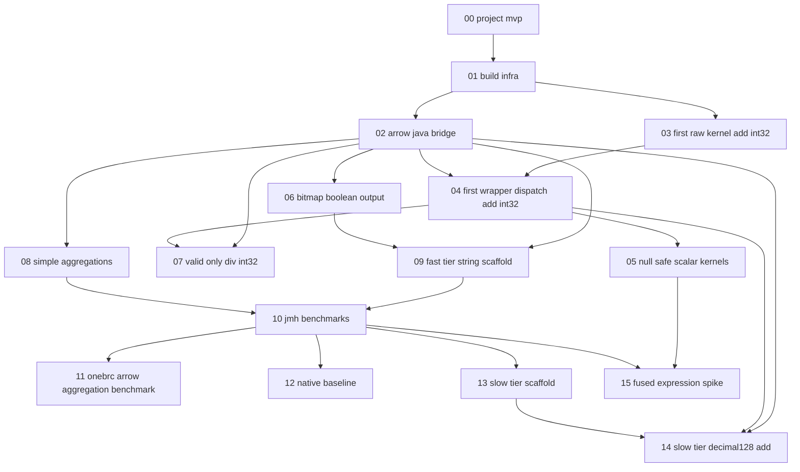

# DEVELOPMENT_PLAN.md

## Purpose

This file is the planning source of truth for iteration sequencing in
`spdd_requirements/requirements/`.

It defines:

- dependency relationships between iterations;
- recommended execution order;
- which tracks can run in parallel;
- readiness/done criteria for iteration-level sync.

Technical rules still live in foundation docs:

- `AGENTS.md`
- `CORE_DESIGN.md`
- `BENCHMARKS.md`
- `ARROW_JAVA_API_USAGE.md`

If this file conflicts with technical semantics in those files, the
technical foundation docs win.

## Iteration dependency graph



## Iteration table

| Iteration | Purpose | Hard prerequisites | Suggested prerequisites | Main artifacts |
|---|---|---|---|---|
| 00 | MVP scope and constraints | none | none | project scope and acceptance envelope |
| 01 | build, test, benchmark skeleton | 00 | none | Gradle, Java 25, JUnit, JMH setup |
| 02 | Arrow wrapper bridge and safety utilities | 01 | 00 | `SegmentViews`, `BufferRefs`, `Checks`, `Errors`, `Validity`, `Bitmap` |
| 03 | first raw kernel pattern | 01 | 02 | `raw/AddInt32Raw.computeAll(...)` |
| 04 | first end-to-end wrapper and dispatch | 02, 03 | 01 | `Compute.add(...)`, `dispatch/AddDispatch`, `wrapper/safe/AddInt32` |
| 05 | safe primitive kernel expansion | 04 | 02, 03 | additional safe `raw/` + `wrapper/safe/` kernels |
| 06 | bitmap and bit-packed boolean rigor | 02 | 05 | hardened bitmap rules, boolean output handling |
| 07 | first valid-only checked kernel | 02, 04 | 05, 06 | `DivInt32` raw/wrapper/dispatch + precheck contract |
| 08 | simple aggregation kernels | 02 | 04, 05 | first agg raw + wrapper + dispatch paths |
| 09 | fast-tier utf8 scaffold | 02, 06 | 04, 05 | `StartsWithUtf8` raw/wrapper/dispatch |
| 10 | consolidated benchmark suites | 08, 09 | 04, 05, 06, 07 | benchmark matrix and reporting conventions |
| 11 | onebrc-style macrobenchmark | 10 | 08 | macro benchmark scenarios |
| 12 | native boundary baseline | 10 | 11 | JNI/FFM comparison benchmarks |
| 13 | slow-tier scaffold pattern | 10 | 02, 04, 06 | `wrapper/slow/` interface + default impl pattern |
| 14 | slow-tier Decimal128 add | 02, 04 | 10, 13 | `AddDecimal128` wrapper and decimal dispatch |
| 15 | fused expression benchmark spike | 10, 05 | 06, 12 | fused raw/wrapper and chain baselines |

## Recommended execution order

Primary linear path:

```text
00 -> 01 -> 02 -> 03 -> 04 -> 05 -> 06 -> 07 -> 08 -> 09 -> 10
```

After 10, parallel tracks are allowed:

```text
11, 12, 13
```

Then continue:

```text
14 -> 15
```

## Ambiguities and resolution policy

- 05 vs 06 comparisons: if comparison kernels are introduced in 05,
  06 still owns bit-packed boolean-output validation rules.
- 14 uses 13 as a pattern reference, not a strict technical dependency;
  hard dependencies for 14 remain 02 and 04.
- 15 chain baseline requires `Compute.mul`, `Compute.add`,
  `Compute.subtract`, and `Compute.max`; if any are missing, add a
  predecessor iteration or narrow the benchmark baseline before coding.

## Definition of ready (start an iteration)

- hard prerequisites in this file are complete;
- acceptance criteria in the iteration file are concrete and testable;
- required benchmark layer/baseline is clear per `BENCHMARKS.md`;
- any ambiguity in naming/contracts is resolved in the requirement text
  before implementation starts.

## Definition of done (sync an iteration)

- implementation and tests satisfy the iteration acceptance criteria;
- benchmark requirement (if present) is runnable and reported with named
  question and baseline;
- iteration file remains aligned with foundation docs;
- dependency/status updates are reflected in this file.

## Iteration status tracker (template)

| Iteration | Title | Status | Owner | Last Updated | Blocking Dependency | Notes |
|---|---|---|---|---|---|---|
| 00 | project-mvp | Planned | | | | |
| 01 | build-infra | Planned | | | | |
| 02 | arrow-java-bridge | Planned | | | | |
| 03 | first-raw-kernel-add-int32 | Planned | | | | |
| 04 | first-wrapper-dispatch-add-int32 | Planned | | | | |
| 05 | null-safe-scalar-kernels | Planned | | | | |
| 06 | bitmap-boolean-output | Planned | | | | |
| 07 | valid-only-div-int32 | Planned | | | | |
| 08 | simple-aggregations | Planned | | | | |
| 09 | fast-tier-string-scaffold | Planned | | | | |
| 10 | jmh-benchmarks | Planned | | | | |
| 11 | onebrc-arrow-aggregation-benchmark | Planned | | | | |
| 12 | native-baseline | Planned | | | | |
| 13 | slow-tier-scaffold | Planned | | | | |
| 14 | slow-tier-decimal128-add | Planned | | | | |
| 15 | fused-expression-spike | Planned | | | | |

Status values used in this template:

- `Planned`
- `In Progress`
- `Done`
- `Blocked`
