# Build Infrastructure Foundation for Arrow Compute JVM

## Requirements
Implement a minimal, reproducible Java 25 build foundation that enables safe incremental delivery of Arrow compute kernels, tests, and benchmarks with enforced runtime flags and memory-safety checks, while explicitly excluding compute/business feature implementation.

## Entities

```mermaid
classDiagram
direction TB

class BuildInfraService {
    <<interface>>
    +BuildInfraResponse provision(BuildInfraRequest)
}

class BuildInfraServiceImpl {
    +BuildInfraResponse provision(BuildInfraRequest)
}

class BuildInfraRequest {
    +String jiraId
    +String requirementSource
    +boolean includeJmh
}

class BuildInfraResponse {
    +boolean testRunnable
    +boolean jmhRunnable
    +boolean packageLayoutReady
    +List~String~ verificationResults
}

class GradleBuildConfigWriter {
    +configureToolchain()
    +configureDependencies(String arrowVersion)
    +configureJvmFlags(List~String~ sharedJvmArgs)
}

class PackageSkeletonCreator {
    +Path basePath
    +createPackageSkeleton(List~String~ packages)
    +createTestSourceSkeleton(Path testRootPackagePath)
}

class ReadmeCommandWriter {
    +documentBuildAndBenchmarkCommands(Path readmePath, List~String~ requiredCommands)
}

class SmokeTestGenerator {
    +ensureSmokeTestExists()
}

class BuildVerifier {
    +verify(boolean includeJmh)
}

class ArrowAllocatorSmokeTest {
    +String ALLOCATOR_NAME
    +int SAMPLE_SIZE
    +smoke_should_allocate_validate_and_close_resources()
    +assertAllocatorDebugModeEnabled()
}

class BuildConstraintException {
    +String errorCode
    +String errorMessage
}

class BuildValidationException {
    +String errorCode
    +String errorMessage
}

class SystemException {
    +String errorCode
    +String errorMessage
}

class GlobalExceptionHandler {
    <<interface>>
    +ErrorResponse handleBuildConstraintException(BuildConstraintException)
    +ErrorResponse handleBuildValidationException(BuildValidationException)
}

class ErrorResponse {
    +String errorCode
    +String errorMessage
    +String context
}

BuildInfraService <|.. BuildInfraServiceImpl
BuildInfraServiceImpl --> GradleBuildConfigWriter : uses
BuildInfraServiceImpl --> PackageSkeletonCreator : uses
BuildInfraServiceImpl --> ReadmeCommandWriter : uses
BuildInfraServiceImpl --> SmokeTestGenerator : uses
BuildInfraServiceImpl --> BuildVerifier : uses
BuildInfraServiceImpl --> BuildInfraRequest : consumes
BuildInfraServiceImpl --> BuildInfraResponse : returns

BuildConstraintException --|> RuntimeException
BuildValidationException --|> RuntimeException
SystemException --|> RuntimeException

GlobalExceptionHandler --> BuildConstraintException : handles
GlobalExceptionHandler --> BuildValidationException : handles
GlobalExceptionHandler --> ErrorResponse : maps to
```

## Approach
1. Baseline Build Contract:
   - Establish a single Gradle Kotlin DSL baseline (`settings.gradle.kts`, `build.gradle.kts`, wrapper scripts, source-set defaults) as the canonical build entry point.
   - Preserve existing simple structures and package topology from design docs instead of introducing new abstraction layers.
   - Prioritize deterministic command behavior for `clean test`, `check`, and `jmh` to unblock iterative SPDD delivery.

2. Technical Implementation:
    - Use Java 25 toolchain with Arrow Java, JUnit 5, and JMH plugin only; pin one Arrow version across all Arrow modules.
    - Apply common JVM arguments (`--add-modules jdk.incubator.vector`, `--enable-native-access=ALL-UNNAMED`, `--add-opens=java.base/java.nio=ALL-UNNAMED`) consistently to compile/test/benchmark execution paths.
    - Add `-Darrow.memory.debug.allocator=true` for test JVM by default; define a `GlobalExceptionHandler` strategy placeholder for future API layer without introducing web framework dependencies in this iteration.

3. Business Logic and Safety Flow:
   - Implement package skeleton creation exactly as documented (`compute`, `dispatch`, `wrapper.safe`, `wrapper.validonly`, `wrapper.agg`, `wrapper.slow`, flat `raw`, `memory`).
   - Add allocator lifecycle smoke test that allocates, writes, validates, and closes Arrow resources to enforce memory discipline early.
   - Keep non-goals explicit: no compute kernels, no function registry, no JNI, no framework wiring.

## Structure

### Inheritance Relationships
1. `BuildInfraService` interface defines infrastructure provisioning and verification workflow.
2. `BuildInfraServiceImpl` implements `BuildInfraService` using Gradle configuration and filesystem scaffolding.
3. `BuildConstraintException` extends `RuntimeException` for dependency/rules violations.
4. `BuildValidationException` extends `RuntimeException` for failed acceptance checks.
5. `SystemException` extends `RuntimeException` for unexpected infrastructure/runtime failures.
6. `GlobalExceptionHandler` interface defines exception-to-`ErrorResponse` mapping contract.

### Dependencies
1. `BuildInfraServiceImpl` calls `GradleBuildConfigWriter` to generate/update Gradle Kotlin DSL files.
2. `BuildInfraServiceImpl` depends on `PackageSkeletonCreator` and `ReadmeCommandWriter` for project scaffolding.
3. `BuildInfraServiceImpl` depends on `SmokeTestGenerator` and `BuildVerifier` to enforce acceptance criteria.
4. `BuildInfraServiceImpl` consumes `BuildInfraRequest` and returns `BuildInfraResponse`.
5. `GlobalExceptionHandler` maps `BuildConstraintException` and `BuildValidationException` to `ErrorResponse`.

### Layered Architecture
1. Controller Layer: not introduced in this iteration; command-line and Gradle task entry points are sufficient.
2. Service Layer: orchestrates build infrastructure creation, validation, and rule enforcement.
3. Repository Layer: not required; project files on disk act as persistence target.
4. Data Access Layer: filesystem and Gradle task execution interactions only.
5. Exception Handling Layer: local runtime exceptions now; `GlobalExceptionHandler` contract reserved for future API-facing layers.

## Operations

### Create/Update Build Configuration - Gradle Kotlin DSL Baseline
1. Responsibility: Define a reproducible Java 25/JMH/JUnit/Arrow build contract.
2. Attributes:
   - `projectName`: `String` - must be `arrow-compute`.
   - `rootPackage`: `String` - must be `io.github.semyonsinchenko.arrowcompute`.
   - `arrowVersion`: `String` - single pinned version for all Arrow dependencies.
3. Methods:
    - `configureToolchain(): void`
      - Logic:
        - Configure Java toolchain to 25.
        - Configure compile task options for incubator/native-access compatibility.
        - Fail fast when incompatible local runtime is used.
    - `configureDependencies(String arrowVersion): void`
      - Logic:
        - Add `arrow-vector`, `arrow-memory-core`, `arrow-memory-unsafe` (preferred), `arrow-algorithm`.
        - Add JUnit Jupiter API/Engine and JUnit Platform launcher.
        - Reject forbidden dependency categories (framework/DI/logging/reflection libs) in direct declared dependencies for core scopes (`implementation`, `api`, `compileOnly`, `runtimeOnly`).
    - `configureJvmFlags(List<String> sharedJvmArgs): void`
      - Logic:
        - Apply shared JVM args to relevant compile/test/jmh runtime paths.
        - Apply test-only allocator debug property.
        - Verify effective args in Gradle task graph during check.
        - Include `--add-opens=java.base/java.nio=ALL-UNNAMED` in shared args.
4. Annotations: none required (build script configuration).
5. Constraints: keep configuration minimal; no framework bootstrap or plugin sprawl.

### Create/Update Project Structure - Package Skeleton
1. Responsibility: Materialize package topology required by design contracts.
2. Attributes:
   - `basePath`: `Path` - `src/main/java/io/github/semyonsinchenko/arrowcompute`.
   - `requiredPackages`: `List<String>` - package list from requirement.
3. Methods:
   - `createPackageSkeleton(List<String> packages): void`
     - Logic:
       - Create missing directories only.
       - Keep `compute/raw` flat; do not create `raw/safe` or `raw/validonly`.
       - Ensure `compute/wrapper/slow` exists as slow-tier home.
    - `createTestSourceSkeleton(Path testRootPackagePath): void`
      - Logic:
        - Create `src/test/java` mirror with root package.
        - Prepare location for smoke tests.
        - Avoid introducing placeholder classes unless needed for compilation.
4. Annotations: none.
5. Constraints: backward-compatible directory creation; do not rename existing paths.

### Implement Validation Test - ArrowAllocatorSmokeTest
1. Responsibility: Prove allocator/vector lifecycle correctness under debug allocator mode.
2. Attributes:
   - `allocatorName`: `String` - deterministic allocator naming for diagnostics.
   - `sampleSize`: `int` - small fixed value count for smoke behavior.
3. Methods:
    - `smoke_should_allocate_validate_and_close_resources(): void`
      - Logic:
        - Create `RootAllocator` and child allocator.
        - Create `IntVector`, call `allocateNew`, write several values, set value count.
        - Write deterministic sample values `11`, `22`, `33`, `44`.
        - Call `validate()` and `validateFull()`.
        - Close vector and allocators in strict reverse order.
        - Let debug allocator fail test on leaks.
    - `assertAllocatorDebugModeEnabled(): void`
      - Logic:
        - Check `arrow.memory.debug.allocator` is true for test JVM.
        - Fail test early if property is absent/misconfigured.
        - Emit exact actionable failure message: `Rule[allocator-debug]: expected -Darrow.memory.debug.allocator=true in test JVM`.
4. Annotations: `@Test`, optional `@DisplayName`.
5. Constraints: no compute-kernel logic; no per-row dynamic allocations in loops.

### Create Documentation - README Build Commands
1. Responsibility: Provide executable developer instructions.
2. Attributes:
   - `requiredCommands`: `List<String>` - `./gradlew clean test`, `./gradlew check`, `./gradlew jmh`.
3. Methods:
    - `documentBuildAndBenchmarkCommands(Path readmePath, List<String> requiredCommands): void`
      - Logic:
        - Add command block with purpose of each command.
        - State Java toolchain and required JVM module/native-access behavior.
        - Keep content concise and implementation-focused.

### Create Service Orchestration - BuildInfraService and BuildInfraServiceImpl
1. Responsibility: Provide a single orchestration entry point to provision build infrastructure and return verification state.
2. Methods:
   - `provision(BuildInfraRequest request): BuildInfraResponse`
     - Logic:
       - Reject null request with `BuildConstraintException` code `constraint.request.missing` and message `BuildInfraRequest must be provided`.
       - Execute build configuration steps through `GradleBuildConfigWriter`.
       - Create package skeleton and test-root skeleton through `PackageSkeletonCreator`.
       - Ensure smoke-test presence through `SmokeTestGenerator`.
       - Write README commands through `ReadmeCommandWriter`.
       - Run verifier and return `BuildInfraResponse` with deterministic booleans and verification result list.
3. Constraints: constructor wiring only; no DI framework.

### Create Build Verification Helper - BuildVerifier
1. Responsibility: Provide deterministic verification-result entries for provision workflow.
2. Methods:
   - `verify(boolean includeJmh): List<String>`
     - Logic:
       - Always include `check:test-runnable:pass` and `check:package-layout-ready:pass`.
       - Include `check:jmh-wired:pass` only when `includeJmh == true`.

### Create Placeholder Smoke Test Generator - SmokeTestGenerator
1. Responsibility: Keep service dependency explicit while smoke test source is checked-in.
2. Methods:
   - `ensureSmokeTestExists(): void`
     - Logic:
       - No-op placeholder; smoke test is maintained as source file.
4. Annotations: none.
5. Constraints: no CI policy expansion in this iteration.

### Create Exception Handler Contract - GlobalExceptionHandler (Future-Facing)
1. Responsibility: Define unified exception response contract for future API entry points without adding framework runtime now.
2. Exception Types:
   - `BuildConstraintException`: dependency and architecture guardrail violations.
   - `BuildValidationException`: acceptance-criteria verification failures.
   - `SystemException`: unexpected infrastructure/runtime failures.
3. Methods:
   - `handleBuildConstraintException(BuildConstraintException): ErrorResponse`
   - `handleBuildValidationException(BuildValidationException): ErrorResponse`
4. Annotations: none in this iteration; reserve `@RestControllerAdvice`, `@ExceptionHandler` for future web module.
5. Response Format: `ErrorResponse { errorCode, errorMessage, context }`.

### Create Business Exception - BuildConstraintException
1. Inheritance: extends `RuntimeException`.
2. Attributes:
   - `errorCode`: `String` - stable machine-readable code.
   - `errorMessage`: `String` - human-readable actionable reason.
3. Constructors: `(String errorCode, String errorMessage)`, `(String errorCode, String errorMessage, Throwable cause)`.
4. Usage Scenarios: forbidden dependency detected, invalid package topology, missing required JVM flag contract.

### Create Business Exception - BuildValidationException
1. Inheritance: extends `RuntimeException`.
2. Attributes:
   - `errorCode`: `String` - stable machine-readable code.
   - `errorMessage`: `String` - human-readable actionable reason.
3. Constructors: `(String errorCode, String errorMessage)`, `(String errorCode, String errorMessage, Throwable cause)`.
4. Usage Scenarios: acceptance-criteria verification failures.

### Create System Exception - SystemException
1. Inheritance: extends `RuntimeException`.
2. Attributes:
   - `errorCode`: `String` - stable machine-readable code.
   - `errorMessage`: `String` - human-readable actionable reason.
3. Constructors: `(String errorCode, String errorMessage)`, `(String errorCode, String errorMessage, Throwable cause)`.
4. Usage Scenarios: unexpected infrastructure/runtime failures.

### Create Benchmark Wiring Smoke - BuildInfraBaselineBenchmark
1. Responsibility: Ensure JMH task wiring executes successfully with at least one benchmark.
2. Methods:
   - `baselineIncrement(): int`
     - Logic:
       - Run a tiny deterministic integer loop and return the aggregate.
3. Annotations: `@Benchmark`, `@BenchmarkMode(Mode.Throughput)`, `@OutputTimeUnit(TimeUnit.MILLISECONDS)`.
4. Constraints: no compute-kernel business logic.

## Norms
1. Annotation Standards: Use JUnit 5 test annotations only in this iteration; avoid framework annotations in production code.
2. Dependency Injection: Use explicit constructor wiring and direct object creation; no DI container/framework.
3. Exception Handling:
   - Define custom unchecked exceptions for business-rule and validation failures.
   - Business exception classes include `errorCode` and `errorMessage` with multiple constructors.
   - Use a unified `ErrorResponse` DTO shape for future API alignment.
   - Log through standard test/build output only; do not add logging frameworks.
4. Data Validation: Validate toolchain version, dependency whitelist, package layout, required JVM flags, and allocator debug property before accepting completion.
   - Dependency whitelist enforcement is applied to direct declared dependencies in core scopes.
5. Logging: Keep diagnostics concise and deterministic; include command and failing rule identifiers in error messages.
6. Documentation Standards: README must include runnable commands and JVM constraints; code comments explain why only when behavior is non-obvious.

## Safeguards
1. Functional Constraints: Deliver build/test/benchmark scaffolding only; no kernel computation, registry, compiler, JNI, or CI pipeline implementation.
2. Performance Constraints: `./gradlew test` completes as a smoke-level suite without benchmark-scale workload; JMH task wiring must execute successfully.
3. Security Constraints: Enable native access only via explicit required flag; avoid adding external frameworks or reflection-heavy libraries.
4. Integration Constraints: Keep Arrow modules on one pinned version; prefer `arrow-memory-unsafe` while allowing controlled switch to netty backend if required by environment.
5. Business Rule Constraints: Preserve documented package layout exactly, especially flat `compute/raw` and `compute/wrapper/slow` placement.
6. Exception Handling Constraints:
   - Business exceptions include explicit error codes and clear messages.
   - Exception taxonomy is domain-specific (`constraint`, `validation`, `system`).
   - Exception messages must not expose sensitive local environment details.
   - All future API-surface business exceptions must be handled by `GlobalExceptionHandler`.
7. Technical Constraints: Apply `--add-modules jdk.incubator.vector` and `--enable-native-access=ALL-UNNAMED` across compile/test/jmh paths consistently.
   - Also apply `--add-opens=java.base/java.nio=ALL-UNNAMED` consistently where Arrow runtime access requires it.
8. Data Constraints: Smoke test writes deterministic primitive values to `IntVector`, validates both `validate()` and `validateFull()`, and closes all resources.
9. API Constraints: Keep contracts explicit and small (`BuildInfraService`, verifier, exception DTOs); avoid over-abstraction and preserve backward compatibility for future SPDD iterations.
