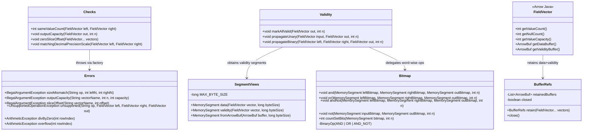

# Arrow Java Bridge and Memory Utilities

## Requirements
Implement minimal, auditable memory-bridge utilities that safely convert Arrow Java vector buffers into bounded `MemorySegment` views and enforce wrapper-boundary lifetime, validation, validity propagation, and unchecked error policies without introducing compute kernels or registry abstractions.

## Entities

## Approach
1. Safety-Critical Bridge Utilities:
   - Implement a thin `memory` utility layer between wrappers and raw kernels, keeping raw kernels Arrow-free and scope-limited.
   - Centralize `MemorySegment.ofAddress(addr).reinterpret(byteSize)` in `SegmentViews` so unsafe address bridging is auditable and grep-verifiable.
   - Preserve existing simple Arrow-first structures; extend the current `memory` package without introducing wrappers around already-sufficient Arrow types.

2. Technical Implementation:
   - Use Arrow Java lifecycle and bitmap helpers first (`FieldVector`, `ArrowBuf`, `BitVectorHelper`) and add project-local code only for bounded segment bridging and word-wise bitmap algebra.
   - Use try-with-resources retain scopes via `BufferRefs.retain(FieldVector...)` that always retain and release both data and validity buffers symmetrically.
   - Enforce global unchecked exception taxonomy through `Errors` and propagate through wrapper calls; map future API-facing failures through existing `GlobalExceptionHandler` contract.

3. Business Logic and Validation:
   - Validate row-count equality, output capacity, and zero slice offset before creating any memory segment to prevent partial execution on invalid inputs.
   - Apply explicit null semantics through `Validity` (`markAllValid`, unary copy, binary AND) with LSB-first Arrow bit ordering and tail-bit-safe writes.
   - Keep this iteration infrastructure-only: no compute kernels, no function registry, no interface hierarchy expansion beyond listed utilities.

## Structure

### Inheritance Relationships
1. `GlobalExceptionHandler` interface defines future exception-to-response mapping contract.
2. `SystemException` extends `RuntimeException` for unexpected system failures already present in codebase.
3. `Errors` static utility provides unchecked exception factory methods; no inheritance chain required.
4. `BufferRefs` implements `AutoCloseable` to guarantee symmetric retain/release scope.

### Dependencies
1. Wrapper classes call `Checks` first, then enter `BufferRefs.retain(...)`, then request segments from `SegmentViews`.
2. `SegmentViews` depends on Arrow `FieldVector`/`ArrowBuf` addresses and checked byte-size validation.
3. `Validity` depends on `SegmentViews` for validity-buffer segment views and `MemorySegment.copy` for unary propagation.
4. `Validity` depends on `Bitmap` for bulk word-wise bitmap operations in binary propagation.
4. `Checks` and wrappers depend on `Errors` for standardized unchecked exception messages and types.
5. Tests depend on Arrow allocator debug mode and child allocators to verify leak-free behavior.

### Layered Architecture
1. Controller Layer: not introduced; this iteration is library-internal and invoked from wrappers/tests.
2. Service Layer: wrapper orchestration logic performs boundary validation and utility composition.
3. Repository Layer: not required; no persistence.
4. Data Access Layer: Arrow vector buffers and FFM segment views only.
5. Exception Handling Layer: `Errors` for library exceptions and `GlobalExceptionHandler` compatibility for future API boundaries.

## Operations

### Create Utility Class - SegmentViews
1. Responsibility: Convert validated Arrow buffer addresses to bounded `MemorySegment` views via a single unsafe gateway.
2. Attributes:
   - `MAX_BYTE_SIZE`: `long` - constant upper-bound guard (`Long.MAX_VALUE`) for reinterpret sizing.
3. Methods:
    - `fromArrowBuf(ArrowBuf buffer, long byteSize): MemorySegment`
      - Logic:
        - Reject null buffer and non-positive `byteSize` with `IllegalArgumentException`.
        - Error message for non-positive size: `byteSize must be > 0`.
        - Reject `byteSize > buffer.capacity()`.
        - Error message for oversized view: `byteSize exceeds buffer capacity`.
        - Read `buffer.memoryAddress()` and create `MemorySegment.ofAddress(address).reinterpret(byteSize)`.
        - Return segment without storing it in fields.
    - `data(FieldVector vector, long byteSize): MemorySegment`
      - Logic:
        - Reject null vector.
        - Obtain `vector.getDataBuffer()`.
        - Delegate to `fromArrowBuf`.
    - `validity(FieldVector vector, long byteSize): MemorySegment`
      - Logic:
        - Reject null vector.
        - Obtain `vector.getValidityBuffer()`.
        - Delegate to `fromArrowBuf`.
4. Annotations: none.
5. Constraints: segment must never escape wrapper `try (var refs = BufferRefs.retain(...))` scope.

### Create Utility Class - BufferRefs
1. Responsibility: Retain and release data+validity Arrow buffers for all wrapper vectors in one lifecycle scope.
2. Attributes:
   - `retainedBuffers`: `List<ArrowBuf>` - ordered retained buffers for reverse-order release.
   - `closed`: `boolean` - idempotent close guard.
3. Methods:
   - `retain(FieldVector... vectors): BufferRefs`
     - Logic:
       - Validate vectors are non-null.
       - For each vector retain `getDataBuffer()` and `getValidityBuffer()` exactly once.
       - If any retain fails, release already-retained buffers before rethrow.
       - Return new `BufferRefs` instance.
   - `close(): void`
     - Logic:
       - Release retained buffers in reverse retain order.
       - Ensure idempotent behavior on repeated close.
4. Annotations: none.
5. Constraints: no split retain API; always retain both data and validity buffers.

### Create Utility Class - Checks
1. Responsibility: Enforce wrapper preconditions before any raw-memory operation.
2. Methods:
    - `sameValueCount(FieldVector left, FieldVector right): int`
      - Input Validation: vectors must be non-null.
      - Business Logic: compare `getValueCount()` and return shared `n`.
      - Exception Handling: throw `Errors.sizeMismatch("binary op", leftN, rightN)` when counts differ.
    - `outputCapacity(FieldVector out, int n): void`
      - Input Validation: `n >= 0`.
      - Business Logic: ensure `out.getValueCapacity() >= n`.
      - Exception Handling: throw `IllegalArgumentException("row count must be >= 0")` for negative `n`.
      - Exception Handling: throw `Errors.outputCapacity(...)` when capacity is insufficient.
    - `zeroSliceOffset(FieldVector... vectors): void`
      - Business Logic:
        - For variable-width vectors (`BaseVariableWidthVector`) ensure `offsetBuffer.getInt(0) == 0`.
        - For fixed-width vectors treat as no-op under current MVP assumption.
      - Exception Handling: throw `Errors.sliceOffset(...)` on non-zero slice offset.
   - `matchingDecimalPrecisionScale(FieldVector left, FieldVector right): void`
     - Business Logic: optional stub now; full strict check activated with Decimal128 add iteration.
3. Dependency Injection: none (static utility).
4. Transaction Management: not applicable.

### Create Utility Class - Errors
1. Responsibility: Provide consistent unchecked exception construction across wrappers/dispatch.
2. Methods:
    - `sizeMismatch(...)`, `outputCapacity(...)`, `sliceOffset(...)` return `IllegalArgumentException`.
    - `unsupported(...)` returns `UnsupportedOperationException` with minor-type names (`getMinorType().name()`) and null-safe fallback `"null"`.
    - `divByZero(int rowIndex)`, `overflow(int rowIndex)` return `ArithmeticException`.
3. Constraints:
   - Include first offending row index for domain failures when available.
   - Messages must avoid leaking internal memory addresses or sensitive runtime internals.

### Create Utility Class - Bitmap
1. Responsibility: Execute word-wise bitmap operations required by nullable kernels and validity propagation.
2. Methods:
   - `and(left, right, out, n): void`
   - `or(left, right, out, n): void`
   - `andNot(left, right, out, n): void`
   - `not(input, out, n): void`
    - `countSetBits(bitmap, n): int`
      - Logic:
        - Compute full-word (`long`) loop first, then byte-level tail handling for remaining bits.
        - Preserve Arrow LSB-first bit order.
        - For writes (`and`, `or`, `andNot`, `not`), mask final tail byte bits explicitly.
        - Use internal operation mode dispatch (`AND`, `OR`, `AND_NOT`) for binary ops.
3. Constraints: do not duplicate equivalent `BitVectorHelper` scalar/sizing helpers without measurable hot-path need.

### Create Utility Class - Validity
1. Responsibility: Provide high-level null-propagation modes for wrappers.
2. Methods:
    - `markAllValid(FieldVector out, int n): void`
      - Logic: fill validity bytes with `0xFF`, then apply final-byte tail mask for non-multiple-of-8 row counts.
    - `propagateUnary(FieldVector input, FieldVector out, int n): void`
      - Logic: copy input validity bitmap into output for `n` rows using `MemorySegment.copy` on bounded validity segments.
   - `propagateBinary(FieldVector left, FieldVector right, FieldVector out, int n): void`
     - Logic: compute `left_validity & right_validity` word-wise via `Bitmap.and`.
3. Constraints: do not inspect or assert data values in null slots.

### Create Test Suite - Memory Utilities Boundary and Bitmap Correctness
1. Responsibility: Prove safety, correctness, and leak-discipline under allocator debug mode.
2. Core Methods:
   - `segmentViews_rejectsInvalidByteSizes()`
   - `checks_outputCapacity_throwsOnInsufficientCapacity()`
   - `checks_zeroSliceOffset_rejectsVariableWidthOffsetStart()`
   - `bufferRefs_retainAndClose_balancedUnderDebugAllocator()`
   - `validity_propagateBinary_matchesExpectedBitmap_randomized()`
   - `bitmap_tailBits_nonMultipleOf8HandledCorrectly()`
   - `errors_factory_returnsExpectedUncheckedTypesAndMessages()`
3. Exception Handling: assert exact exception class and message shape for all failure paths.
4. Constraints: use child allocators and `vector.validateFull()` where applicable; no kernel logic in these tests.

### Create Exception Handler Compatibility Task - GlobalExceptionHandler Integration Note
1. Responsibility: Keep memory utility exception taxonomy compatible with existing API-level error handling contracts.
2. Methods:
   - `handleSystemException(SystemException): ErrorResponse`
   - `handleBuildValidationException(BuildValidationException): ErrorResponse`
3. Constraints:
   - No framework runtime required in this iteration.
   - Ensure memory utility exceptions can be mapped consistently if surfaced through public APIs later.

## Norms
1. Annotation Standards: keep memory utilities annotation-free; use `@Test` for test cases and existing project test conventions.
2. Dependency Injection: no DI framework; static utility methods and constructor wiring only where needed.
3. Exception Handling:
   - Keep unchecked taxonomy: `IllegalArgumentException`, `UnsupportedOperationException`, `ArithmeticException`.
   - Use domain-specific helper methods in `Errors` to avoid ad hoc throwing.
   - Preserve compatibility with `GlobalExceptionHandler` and `ErrorResponse` contracts for future API boundaries.
4. Data Validation: perform value-count, capacity, and slice checks before retain/segment creation; fail fast before compute.
5. Logging: avoid logging in hot/near-hot paths; rely on deterministic exceptions and test assertions.
6. Documentation Standards: add concise class-level javadocs documenting operation, null policy interaction, aliasing assumptions, and lifetime invariants.
7. Guard Style: use `Objects.requireNonNull(...)` for reference preconditions and explicit `IllegalArgumentException` for numeric bounds.

## Safeguards
1. Functional Constraints: implement only `SegmentViews`, `BufferRefs`, `Checks`, `Errors`, `Validity`, `Bitmap`; exclude compute kernels and registry APIs.
2. Performance Constraints: each utility class stays under 200 lines and avoids per-row object allocation in bitmap loops.
3. Security Constraints: exception messages must not expose raw memory addresses, allocator internals, or unsafe runtime details.
4. Integration Constraints: utilities must remain Arrow-first and compatible with existing wrapper->raw layering and future dispatch usage.
5. Business Rule Constraints: retain/release must be symmetric for both data and validity buffers for every passed vector.
6. Exception Handling Constraints:
   - Business/domain errors include clear row index when known.
   - Exception types remain categorized by boundary, unsupported, and arithmetic failure classes.
   - All surfaced exceptions are compatible with `GlobalExceptionHandler` mapping strategy.
7. Technical Constraints: only `SegmentViews` may perform `MemorySegment.ofAddress(...).reinterpret(byteSize)`.
8. Data Constraints: validity operations obey Arrow polarity (`1=valid`, `0=null`) and LSB-first bit order with explicit tail-bit masking correctness.
9. API Constraints: preserve existing simple types (`FieldVector`, `ArrowBuf`, primitive params) and avoid unnecessary entity wrappers/refactors.
