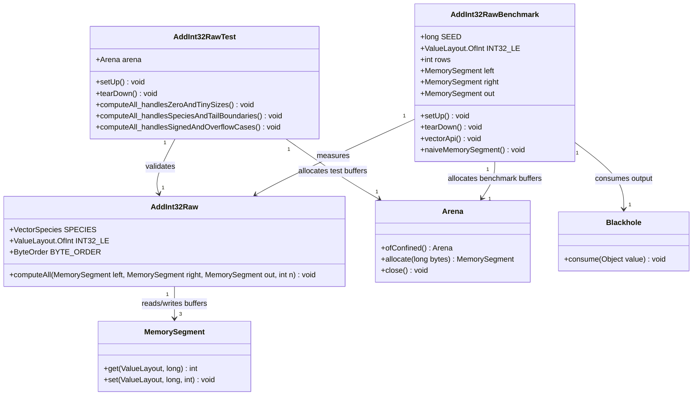

# First Raw Kernel AddInt32

## Requirements
Implement an Arrow-free int32 SIMD raw kernel and supporting raw-only validation assets to prove the project hot-path design with deterministic wraparound semantics, strict raw-layer boundaries, and measurable vector-vs-naive benchmark evidence.

## Entities

## Approach
1. Raw Kernel Delivery:
   - Implement one focused `final` raw kernel class in `compute/raw` with `static` `computeAll` entry point only.
   - Use Vector API main loop (`loopBound`) plus scalar tail loop to preserve correctness for all `n` sizes.
   - Keep raw contract explicit: no Arrow imports, no ownership/lifetime logic, no defensive invariant checks inside hot path.

2. Technical Implementation:
   - Use `jdk.incubator.vector.IntVector` with `SPECIES_PREFERRED`, `ByteOrder.LITTLE_ENDIAN`, and int32 `ValueLayout` constants as `static final` fields.
   - Integrate with existing JUnit and JMH project setup; benchmark compares vector kernel against an intentionally anti-vectorized `MemorySegment` scalar baseline.
   - Prevent benchmark dead-code elimination via deterministic consumption (`Blackhole.consume(tail)` and `Blackhole.consume(out)`); no `GlobalExceptionHandler` is introduced because this iteration is raw/test/benchmark only and does not expose HTTP or wrapper exceptions.
   - Configure JMH runtime for reproducible runs with warmup=3, iterations=4, forks=2, shared Vector API JVM flags on forked benchmark JVMs, and regex filtering via `-PjmhInclude` / `-PjmhExclude`.

3. Business Logic and Validation:
   - Enforce deterministic arithmetic semantics: output equals Java int wraparound sum of corresponding lanes.
   - Cover boundary and overflow behavior through Arrow-free tests using `Arena.ofConfined()` lifecycle per test.
   - Keep scope limited to proof-of-pattern iteration: no wrapper, dispatch, API expansion, or abstraction frameworking.

## Structure

### Inheritance Relationships
1. `AddInt32Raw` class defines raw int32 vectorized addition behavior.
2. `AddInt32RawTest` uses JUnit test class conventions and validates `AddInt32Raw` contract.
3. `AddInt32RawBenchmark` is a JMH benchmark class measuring raw compute variants.
4. No business exception hierarchy is added in this iteration; errors remain test assertions and build-time failures.

### Dependencies
1. `AddInt32RawTest` calls `AddInt32Raw.computeAll`.
2. `AddInt32RawBenchmark` calls `AddInt32Raw.computeAll` and a local anti-vectorized scalar implementation used as a scalar baseline.
3. Raw kernel depends only on JDK FFM + Vector API types (`MemorySegment`, `ValueLayout`, `IntVector`).

### Layered Architecture
1. Raw Kernel Layer: Pure compute over contiguous int32 segments with preallocated output.
2. Test Validation Layer: Verifies semantic correctness, edge cases, and non-aliasing fixture assumptions.
3. Benchmark Evidence Layer: Quantifies vector vs naive MemorySegment throughput under reproducible inputs.
4. Build Verification Layer: Enforces no-Arrow raw boundary, runnable benchmark/test workflow, and required JMH fork JVM flags for Vector API execution.

## Operations

### Create/Update Raw Kernel Class - AddInt32Raw
1. Responsibility: Compute lane-wise int32 addition from `left` and `right` buffers into `out` using vectorized hot path and scalar tail.
2. Attributes:
   - `SPECIES`: `VectorSpecies<Integer>` - preferred SIMD species for int32 operations.
   - `INT32_LE`: `ValueLayout.OfInt` - little-endian unaligned int32 layout.
   - `BYTE_ORDER`: `ByteOrder` - fixed to little-endian for vector memory operations.
3. Methods:
   - `computeAll(MemorySegment left, MemorySegment right, MemorySegment out, int n): void`
     - Logic:
       - Compute `upper = SPECIES.loopBound(n)` and iterate vector loop from `i=0` to `upper` by species length.
       - Convert row index to byte offset `off = (long) i * Integer.BYTES`.
       - Load `IntVector` from `left` and `right`, add vectors, store result into `out`.
       - Execute scalar tail loop for `i` from `upper` to `n-1` using layout `get`/`set` and Java int addition.
       - Avoid allocation, exception-driven row control, and any Arrow dependency.
4. Annotations: None required.
5. Constraints: Class remains small/readable (<200 lines), no alias checks, no null semantics, no wrapper-level invariants enforcement.

### Implement Raw Tests - AddInt32RawTest
1. Interface Definition: JUnit 5 test class with `@BeforeEach` arena setup and `@AfterEach` cleanup.
2. Core Methods:
   - `computeAll_handlesZeroAndTinySizes(): void`
     - Input Validation: Use explicit `n=0` and `n=1` fixtures with separate segments.
     - Business Logic: Execute kernel and verify exact expected outputs.
     - Exception Handling: Fail test on mismatch; no runtime exception contract expected.
     - Return Value: Test pass/fail via assertions.
   - `computeAll_handlesSpeciesAndTailBoundaries(): void`
     - Input Validation: Include `n < species`, `n == species`, and `n` non-multiple of species.
     - Business Logic: Fill deterministic values, run kernel, compare every row to scalar expected value.
     - Exception Handling: Assertion failures identify first divergent index.
     - Return Value: Pass/fail.
   - `computeAll_handlesSignedAndOverflowCases(): void`
     - Input Validation: Include positive/negative/mixed signs and extremes (`MIN_VALUE`, `MAX_VALUE`).
     - Business Logic: Assert wraparound cases (`MAX+1`, `MIN-1`) match Java int semantics.
     - Exception Handling: Assertion-driven.
     - Return Value: Pass/fail.
3. Dependency Injection: Not used; construct fixtures directly.
4. Transaction Management: Not applicable.

### Implement JMH Benchmark - AddInt32RawBenchmark
1. Interface Definition: JMH class with parameterized row counts (`4096`, `16384`, `65536`, `262144`) and setup/teardown for deterministic data.
2. Core Methods:
   - `vectorApi(Blackhole bh): void`
     - Input Validation: Ensure preallocated segments and valid row count before benchmark iteration.
     - Business Logic: Call `AddInt32Raw.computeAll(left, right, out, rows)`.
     - Exception Handling: None in hot path; setup failures terminate benchmark.
     - Return Value: Consume output segment or reduction through `bh`.
    - `naiveMemorySegment(Blackhole bh): void`
      - Input Validation: Same dataset and output shape as vector variant.
      - Business Logic: Scalar `for` loop over rows with `get/set` and identical arithmetic semantics, plus an intentional loop-carried scalar dependency (`tail`) to discourage SuperWord auto-vectorization of the baseline:
        - Initialize `tail = 0`.
        - Compute `y = right.get(INT32_LE, off) ^ (tail & 0)`.
        - Compute `s = x + y`, store to output, then assign `tail = s`.
      - Exception Handling: None in measured loop.
      - Return Value: Consume both `tail` and output through `bh`.
3. Dependency Injection: Not used.
4. Transaction Management: Not applicable.

### Create Exception Handler - GlobalExceptionHandler
1. Responsibility: Not created for this iteration by design.
2. Exception Types:
   - BusinessException: Out of scope.
   - ValidationException: Out of scope.
   - SystemException: Out of scope.
3. Methods:
   - `handleBusinessException(BusinessException): ResponseEntity<ErrorResponse>` - not applicable in raw kernel scope.
   - `handleValidationException(ValidationException): ResponseEntity<ErrorResponse>` - not applicable in raw kernel scope.
4. Annotations: Not applicable.
5. Response Format: Not applicable.

### Create Business Exception - RawKernelContractException
1. Inheritance: Not implemented in this iteration; raw kernel assumes wrapper-enforced contracts.
2. Attributes:
   - `errorCode`: `String` - intentionally omitted in current scope.
   - `errorMessage`: `String` - intentionally omitted in current scope.
3. Constructors: Not applicable.
4. Usage Scenarios: Defer until wrapper/API layers require domain-level error reporting.

## Norms
1. Annotation Standards: Use JUnit annotations in tests and JMH annotations in benchmarks; raw kernel classes remain annotation-free.
2. Dependency Injection: Avoid DI frameworks; instantiate fixtures directly in test/benchmark setup.
3. Exception Handling:
   - No custom business exception classes in raw layer.
   - No per-row exceptions in compute loop; failures belong in tests or wrapper prechecks.
   - Keep benchmark/test failures explicit via assertions and harness-level errors.
4. Data Validation: Validate expected outputs row-by-row in tests, including overflow and tail rows; do not add runtime checks in raw hot path.
5. Logging: No logging in raw kernel or measured benchmark loops.
6. Documentation Standards: Add concise class-level javadoc documenting operation, input/output type, null policy, overflow semantics, and aliasing assumptions.
7. Benchmark Baseline Standards: When scalar-vs-vector comparison is the goal, document whether the scalar path is intentionally anti-vectorized; if anti-vectorized, explicitly state the loop-carried dependency technique and expected overhead tradeoff.

## Safeguards
1. Functional Constraints: Implement only vector/vector int32 addition with `computeAll`; no scalar overloads, wrappers, dispatch hooks, or API additions.
2. Performance Constraints: Kernel must execute Vector API loop plus scalar tail with zero allocations in measured path.
3. Security Constraints: Do not expose arbitrary memory addresses or unsafe lifetime escape patterns; use confined arenas in tests/benchmarks.
4. Integration Constraints: Raw kernel must compile and run without Arrow imports; wrapper invariants remain external.
   - Benchmark runtime must pass required Vector API JVM flags to forked JMH JVMs.
5. Business Rule Constraints: Arithmetic must preserve Java int wraparound for all lanes including overflow boundaries.
6. Exception Handling Constraints:
   - No business exception types in this iteration.
   - No row-level throw/catch logic in kernel loop.
   - Errors surface through test assertion failures or benchmark setup failures.
7. Technical Constraints: Keep class under 200 lines, use `static final` constants, and use little-endian memory access paths.
8. Data Constraints: Inputs and output are contiguous int32 buffers; output is caller-preallocated; row count `n` defines active element range.
9. API Constraints: Entry-point name remains exactly `computeAll(MemorySegment, MemorySegment, MemorySegment, int)` and returns `void`.
10. Benchmark Config Constraints: JMH benchmark selection may be narrowed via regex properties (`-PjmhInclude`, `-PjmhExclude`) without changing source files.
