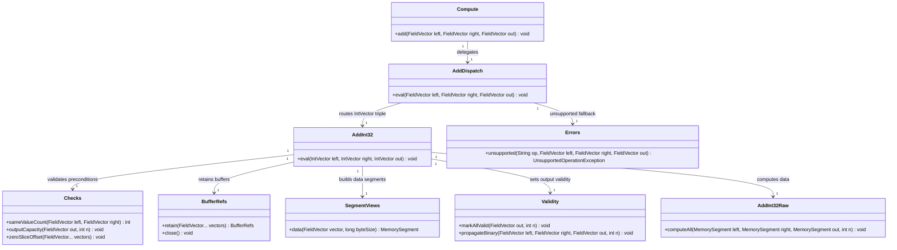

# First Wrapper Dispatch Add Int32

## Requirements
Implement the first production compute vertical slice for int32 addition by exposing a stable public `Compute.add(...)` API that routes through explicit Arrow-aware dispatch and wrapper safety boundaries into the existing raw SIMD kernel, while preserving null semantics, memory lifetime guarantees, and extensibility constraints.

## Entities

## Approach
1. Public API and dispatch vertical slice:
   - Implement `Compute.add(FieldVector, FieldVector, FieldVector)` as a thin static facade with no compute logic.
   - Keep `AddDispatch` public and explicit (`instanceof` chain) to preserve documented extension points and grep-friendly routing.
   - Route only `(IntVector, IntVector, IntVector)` to `AddInt32.eval`; reject all other combinations via `Errors.unsupported("add", ...)`.

2. Arrow wrapper orchestration:
    - Implement `AddInt32.eval(IntVector, IntVector, IntVector)` as the only safety boundary for this op.
    - Execute checks in strict order before any segment creation: `sameValueCount` -> `outputCapacity` -> `zeroSliceOffset`.
    - Use `try (var refs = BufferRefs.retain(left, right, out))` and create `SegmentViews.data(...)` only inside this scope.
    - Use runtime null branching: all-valid uses `Validity.markAllValid(out, n)`, otherwise `Validity.propagateBinary(left, right, out, n)`.
    - Run `AddInt32Raw.computeAll(...)` for all rows when `n > 0` (safe-on-null-data) and finalize with `out.setValueCount(n)`.

3. Validation and failure strategy:
   - Enforce unsupported combinations through `UnsupportedOperationException`; enforce shape/capacity/slice issues with `IllegalArgumentException`.
   - Preserve no-mutation contract for inputs; output is caller-owned and preallocated.
   - Keep global exception translation consistent with existing `GlobalExceptionHandler` for non-kernel entrypoints (library-side wrappers throw unchecked exceptions directly).

## Structure

### Inheritance Relationships
1. `AddDispatch` class defines explicit add type-routing extension surface (public, non-final extension point by policy).
2. `AddInt32Raw` is a `final` static-kernel class providing int32 SIMD compute implementation.
3. `BufferRefs` implements `AutoCloseable` for deterministic retain/release lifetime scoping.
4. `UnsupportedOperationException`, `IllegalArgumentException`, and `ArithmeticException` remain unchecked exception hierarchy for compute boundary errors.

### Dependencies
1. `Compute.add(...)` calls `AddDispatch.eval(...)` only.
2. `AddDispatch.eval(...)` depends on Arrow vector runtime types and calls `AddInt32.eval(...)` for int32 triples.
3. `AddInt32.eval(...)` depends on `Checks`, `BufferRefs`, `SegmentViews`, `Validity`, and `AddInt32Raw`.
4. `AddDispatch.eval(...)` depends on `Errors.unsupported(...)` for unsupported combinations.

### Layered Architecture
1. API Layer (`compute`): stable static facade methods for consumers.
2. Dispatch Layer (`compute.dispatch`): explicit type routing and unsupported fallthrough.
3. Wrapper Layer (`compute.wrapper.safe`): Arrow-aware validation, retain/release, validity orchestration.
4. Raw Kernel Layer (`compute.raw`): tight SIMD/scalar-tail loops over `MemorySegment`.
5. Exception Handling Layer (`memory.Errors` and project `GlobalExceptionHandler`): unified unchecked error shapes and optional external translation.

### Package Paths
1. API Layer: `io.github.semyonsinchenko.arrowcompute.compute.Compute`.
2. Dispatch Layer: `io.github.semyonsinchenko.arrowcompute.compute.dispatch.AddDispatch`.
3. Wrapper Layer: `io.github.semyonsinchenko.arrowcompute.compute.wrapper.safe.AddInt32`.
4. Raw Kernel Layer: `io.github.semyonsinchenko.arrowcompute.compute.raw.AddInt32Raw`.
5. Memory Utilities: `io.github.semyonsinchenko.arrowcompute.memory.*`.
6. Exception Mapping Contract: `io.github.semyonsinchenko.arrowcompute.exception.GlobalExceptionHandler` (interface).

## Operations

### Create/Update API Component - `Compute`
1. Responsibility: expose public entrypoint for binary add without embedding type routing or compute logic.
2. Attributes:
   - none: static utility facade.
3. Methods:
   - `add(FieldVector left, FieldVector right, FieldVector out): void`
     - Logic:
       - Delegate directly to `AddDispatch.eval(left, right, out)`.
       - Do not add allocation, null handling, or mutation logic here.
       - Preserve unchecked exception propagation from lower layers.
4. Annotations: none.
5. Constraints: must remain thin and deterministic; no branch expansion for type logic in this layer.

### Create/Update Dispatch Component - `AddDispatch`
1. Responsibility: route Arrow vector triples to concrete wrapper implementations.
2. Attributes:
   - none: stateless dispatch utility.
3. Methods:
   - `eval(FieldVector left, FieldVector right, FieldVector out): void`
     - Logic:
       - If `left instanceof IntVector && right instanceof IntVector && out instanceof IntVector`, call `AddInt32.eval((IntVector) left, (IntVector) right, (IntVector) out)`.
       - Else throw `Errors.unsupported("add", left, right, out)`.
       - Keep branch ordering explicit and readable; avoid registries or maps.
4. Annotations: none.
5. Constraints: class visibility must be `public`; implementation must stay as straightforward `instanceof` dispatch.

### Create/Update Safe Wrapper - `AddInt32`
1. Responsibility: enforce wrapper invariants and bridge Arrow buffers to raw kernel for int32 add.
2. Attributes:
   - `INT32_BYTES`: `long` - constant `Integer.BYTES`-based sizing helper (optional, only if existing style requires).
3. Methods:
    - `eval(IntVector left, IntVector right, IntVector out): void`
      - Input Validation:
        - `int n = Checks.sameValueCount(left, right)`.
        - `Checks.outputCapacity(out, n)`.
        - `Checks.zeroSliceOffset(left, right)`.
      - Business Logic:
        - Enter retain scope `try (var refs = BufferRefs.retain(left, right, out))`.
        - If both `getNullCount()==0`, call `Validity.markAllValid(out, n)`; else `Validity.propagateBinary(left, right, out, n)`.
        - If `n > 0`, build `leftData`, `rightData`, `outData` using `SegmentViews.data(vector, (long) n * Integer.BYTES)`.
        - If `n > 0`, call `AddInt32Raw.computeAll(leftData, rightData, outData, n)`.
        - Set `out.setValueCount(n)` before leaving method.
     - Exception Handling:
       - Let validation failures throw `IllegalArgumentException`.
       - Let memory/type path failures throw unchecked exceptions; no per-row exception logic.
     - Return Value:
       - `void`; writes to caller-provided `out`.
4. Dependency Injection: none; static utility pattern.
5. Transaction Management: not applicable; method is in-memory deterministic compute.

### Create/Update Tests - Wrapper and Dispatch Validation
1. Responsibility: verify correctness, safety boundary behavior, and unsupported routing.
2. Test Cases:
    - `AddInt32Test`:
      - all-valid inputs, null profiles (left-only 10%, right-only 10%, both sparse 1%, both dense 30%), all-null.
      - output `valueCount` equals input `n`.
      - output validity equals row-wise `leftValid && rightValid`.
      - valid-lane output equals Java `int` addition reference.
      - input vectors are not mutated.
    - `AddDispatchTest`:
      - int32 triple routes and computes successfully.
      - unsupported combinations throw `UnsupportedOperationException`.
3. Execution Constraints:
   - run tests with `-Darrow.memory.debug.allocator=true`.
   - do not assert data bytes in null slots.

### Create/Update Benchmarks - Wrapper vs Dispatch Overhead
1. Responsibility: quantify incremental overhead across raw, wrapper, and public API path.
2. Benchmark Units:
    - `AddInt32PathBenchmark.rawComputeAll` (`AddInt32Raw.computeAll` path).
    - `AddInt32PathBenchmark.wrapperEval` (`AddInt32.eval` path, null profiles 0%, 1%, 10%, 30%).
    - `AddInt32PathBenchmark.apiComputeAdd` (`Compute.add` end-to-end dispatch path).
    - `AddInt32RawBenchmark.vectorApi` and `AddInt32RawBenchmark.naiveMemorySegment` for raw-kernel baseline context.
3. Constraints:
    - use shared fixtures to avoid setup-dominated measurements.
    - report throughput and allocation rate.

### Create Exception Handler - `GlobalExceptionHandler` Integration Policy
1. Responsibility: unified handling for application modules that expose compute through HTTP/service boundaries.
2. Exception Types:
   - `UnsupportedOperationException`: unsupported vector combinations.
   - `IllegalArgumentException`: size/capacity/slice invariant failures.
   - `ArithmeticException`: future checked arithmetic failures.
3. Methods:
   - `handleBusinessException(RuntimeException): ErrorResponse` mapping by domain code.
   - `handleValidationException(IllegalArgumentException): ErrorResponse`.
4. Annotations: reuse existing project exception handler conventions.
5. Response Format: keep `ErrorResponse` shape consistent and avoid internal memory-address leakage.

## Norms
1. Annotation standards: keep compute, dispatch, wrapper, and raw classes annotation-free; use plain final/static patterns for hot paths.
2. Dependency injection: do not introduce DI frameworks in compute path; use static method calls and explicit dependencies.
3. Exception handling:
   - Use `Errors` factory for standardized unchecked exceptions at wrapper/dispatch boundaries.
   - If domain-specific compute exceptions are introduced later, inherit `RuntimeException`, include stable error code/message mapping at external boundaries.
   - Keep `ErrorResponse` mapping in `GlobalExceptionHandler` for service-facing layers only.
4. Data validation: perform prechecks before retain/segment creation; never bypass `Checks` in wrappers.
5. Logging: avoid logging in hot loops; if needed, log only at boundaries and include operation name, vector types, and row counts.
6. Documentation standards: document each kernel/wrapper with operation, type support, null policy, overflow behavior, validity rule, aliasing assumptions, and input mutation contract.
7. Empty-input handling: wrappers may skip raw-kernel invocation when `n == 0`, but must still produce a valid output state (`out.setValueCount(0)` and consistent validity handling).

## Safeguards
1. Functional constraints: support only `IntVector + IntVector -> IntVector` for this iteration; no scalar inputs, no generic registry, no multi-type add.
2. Performance constraints: wrapper adds minimal orchestration overhead; raw kernel remains allocation-free in loop; wrapper/dispatch benchmark paths must show zero per-row allocations.
3. Security constraints: exception messages must not expose memory addresses or allocator internals; only vector types, operation name, and row indices where applicable.
4. Integration constraints: `AddDispatch` remains public and explicit for downstream extension; no breaking signature changes to `Compute.add(...)`.
5. Business rule constraints: validity propagation must be `out_validity = left_validity & right_validity`; output data computed for all rows; null-slot data treated as don't-care.
6. Exception handling constraints:
   - unsupported combinations throw `UnsupportedOperationException` via `Errors.unsupported`.
   - precondition failures throw `IllegalArgumentException` before compute.
   - all compute-boundary unchecked exceptions remain compatible with `GlobalExceptionHandler` mappings where externally surfaced.
7. Technical constraints: `MemorySegment` views must be created only within `BufferRefs` scope and must not escape method scope; wrappers must enforce zero slice offset before compute; segment creation and raw invocation are gated by `n > 0`.
8. Data constraints: `out.getValueCapacity() >= n` is mandatory; `out.setValueCount(n)` must always be called on success; inputs are read-only and must not be mutated.
9. API constraints: `Compute.add` is a thin delegation API; dispatch routing must stay grep-friendly (`instanceof` chain) and deterministic.
