# Null-Safe Scalar Kernel Expansion

## Requirements
Implement and ship a bounded expansion of fixed-width null-safe arithmetic kernels that compute all rows while propagating validity correctly, preserving the existing raw-wrapper-dispatch architecture and delivering layer-specific tests plus benchmark evidence for at least one integer and one floating kernel.

## Entities

```mermaid
classDiagram
direction TB

class AddInt64Raw {
    +VectorSpecies~Long~ SPECIES
    +ValueLayout.OfLong INT64_LE
    +ByteOrder BYTE_ORDER
    +computeAll(MemorySegment left, MemorySegment right, MemorySegment out, int n)
}

class AddFloat64Raw {
    +VectorSpecies~Double~ SPECIES
    +ValueLayout.OfDouble FLOAT64_LE
    +ByteOrder BYTE_ORDER
    +computeAll(MemorySegment left, MemorySegment right, MemorySegment out, int n)
}

class MulInt32Raw {
    +VectorSpecies~Integer~ SPECIES
    +ValueLayout.OfInt INT32_LE
    +ByteOrder BYTE_ORDER
    +computeAll(MemorySegment left, MemorySegment right, MemorySegment out, int n)
}

class MulFloat64Raw {
    +VectorSpecies~Double~ SPECIES
    +ValueLayout.OfDouble FLOAT64_LE
    +ByteOrder BYTE_ORDER
    +computeAll(MemorySegment left, MemorySegment right, MemorySegment out, int n)
}

class AddInt64 {
    +eval(BigIntVector left, BigIntVector right, BigIntVector out)
}

class AddFloat64 {
    +eval(Float8Vector left, Float8Vector right, Float8Vector out)
}

class MulInt32 {
    +eval(IntVector left, IntVector right, IntVector out)
}

class MulFloat64 {
    +eval(Float8Vector left, Float8Vector right, Float8Vector out)
}

class AddDispatch {
    +eval(FieldVector left, FieldVector right, FieldVector out)
}

class MulDispatch {
    +eval(FieldVector left, FieldVector right, FieldVector out)
}

class Compute {
    +add(FieldVector left, FieldVector right, FieldVector out)
    +mul(FieldVector left, FieldVector right, FieldVector out)
}

class Errors {
    +unsupported(String op, FieldVector left, FieldVector right, FieldVector out)
}

class Validity {
    +markAllValid(FieldVector out, int n)
    +propagateUnary(FieldVector input, FieldVector out, int n)
    +propagateBinary(FieldVector left, FieldVector right, FieldVector out, int n)
}
AddDispatch --> AddInt64 : selects typed wrapper
AddDispatch --> AddFloat64 : selects typed wrapper
AddDispatch --> AddInt32 : preserves existing typed wrapper
MulDispatch --> MulInt32 : selects typed wrapper
MulDispatch --> MulFloat64 : selects typed wrapper
AddInt64 --> AddInt64Raw : computes
AddFloat64 --> AddFloat64Raw : computes
MulInt32 --> MulInt32Raw : computes
MulFloat64 --> MulFloat64Raw : computes
AddInt64 --> Validity : applies validity rule
AddFloat64 --> Validity : applies validity rule
MulInt32 --> Validity : applies validity rule
MulFloat64 --> Validity : applies validity rule
AddDispatch --> Errors : unsupported fallback
MulDispatch --> Errors : unsupported fallback
Compute --> AddDispatch : delegates add
Compute --> MulDispatch : delegates mul
```

## Approach
1. Kernel Vertical-Slice Expansion:
   - Extend the proven `AddInt32Raw` -> `wrapper/safe/AddInt32` -> `AddDispatch` pattern to the four mandatory kernels only.
   - Keep raw kernels Arrow-free and null-agnostic, wrappers responsible for shape checks, slice checks, retain/release, validity propagation, and valueCount.
   - Preserve package and naming contracts (`raw/<Op><Type>Raw`, `wrapper/safe/<Op><Type>`, `dispatch/<Op>Dispatch`) to minimize risk and retain grepability.

2. Technical Implementation:
   - Use Vector API species-per-type with `loopBound` + scalar tail in each raw kernel; enforce little-endian layouts.
   - Reuse existing memory helpers (`Checks`, `BufferRefs`, `SegmentViews`, `Validity`, `memory.Errors`) with no new abstraction layers.
   - Add `MulDispatch` and `Compute.mul(...)` only if absent; route supported triples explicitly and reject unsupported with `Errors.unsupported(...)`.
   - Global exception handling strategy: no `GlobalExceptionHandler` is introduced in kernel internals; wrappers and dispatch throw unchecked exceptions (`IllegalArgumentException`, `UnsupportedOperationException`, `ArithmeticException`) through existing project error contracts.

3. Business Logic and Verification:
   - Enforce safe-kernel semantics: always compute output data for all rows; validity controls observability.
   - Branch in wrappers by runtime null counts: all-valid path uses `Validity.markAllValid(out, n)`, otherwise `Validity.propagateBinary(...)`.
   - Validate behavior via layer-specific tests and benchmark matrix alignment (raw vs naive, wrapper vs raw, dispatch vs wrapper) using fixed seed `0xC0FFEEL`.

## Structure

### Inheritance Relationships
1. `AddDispatch` class defines explicit add type-routing functionality.
2. `MulDispatch` class defines explicit multiply type-routing functionality.
3. Raw kernel classes (`AddInt64Raw`, `AddFloat64Raw`, `MulInt32Raw`, `MulFloat64Raw`) are `final` utility classes with static methods.
4. Unsupported dispatch combinations throw `UnsupportedOperationException` via `Errors.unsupported(...)`.

### Dependencies
1. `Compute` calls `AddDispatch` and `MulDispatch`.
2. `AddDispatch` depends on `AddInt32`, `AddInt64`, and `AddFloat64`; `MulDispatch` depends on `MulInt32` and `MulFloat64`.
3. Safe wrappers depend on `Checks`, `BufferRefs`, `SegmentViews`, `Validity`, and their paired raw kernel.
4. Dispatch classes use `io.github.semyonsinchenko.arrowcompute.memory.Errors` for unsupported type triples.

### Layered Architecture
1. Controller Layer: none in scope for this compute-library task.
2. Service Layer: `Compute` + dispatch classes provide operation-level service entrypoints.
3. Repository Layer: none (in-memory Arrow vectors only).
4. Data Access Layer: Arrow buffers bridged through `SegmentViews` into `MemorySegment` for raw kernels.
5. Exception Handling Layer: centralized error factories in `io.github.semyonsinchenko.arrowcompute.memory.Errors`; no framework-level `GlobalExceptionHandler` in this module.

## Operations

### Create Raw Kernel - AddInt64Raw
1. Responsibility: Perform unchecked int64 vector+vector addition over `n` rows.
2. Attributes:
   - `SPECIES`: `VectorSpecies<Long>` - preferred species for vector loop.
   - `INT64_LE`: `ValueLayout.OfLong` - little-endian scalar tail access.
   - `BYTE_ORDER`: `ByteOrder` - little-endian order for vector memory-segment load/store.
3. Methods:
   - `computeAll(MemorySegment left, MemorySegment right, MemorySegment out, int n): void`
     - Logic:
        - Compute `upper = SPECIES.loopBound(n)` and run SIMD loop by `Long.BYTES` offsets.
        - Use `LongVector.fromMemorySegment(..., BYTE_ORDER)` and `intoMemorySegment(..., BYTE_ORDER)`.
        - Execute scalar tail for remaining rows.
        - Preserve Java wraparound semantics; no validity handling and no per-row throw.
4. Annotations: none.
5. Constraints: raw layer stays Arrow-free and assumes non-aliasing, little-endian, bounded segments.

### Create Raw Kernel - AddFloat64Raw
1. Responsibility: Perform float64 vector+vector addition for all rows.
2. Attributes:
   - `SPECIES`: `VectorSpecies<Double>`.
   - `FLOAT64_LE`: `ValueLayout.OfDouble`.
   - `BYTE_ORDER`: `ByteOrder`.
3. Methods:
   - `computeAll(MemorySegment left, MemorySegment right, MemorySegment out, int n): void`
     - Logic:
        - SIMD add across `loopBound` rows, scalar tail for remainder.
        - Use `DoubleVector.fromMemorySegment(..., BYTE_ORDER)` and `intoMemorySegment(..., BYTE_ORDER)`.
        - Preserve IEEE-754 behavior for NaN/Infinity naturally.
4. Annotations: none.
5. Constraints: exact elementwise operation ordering must support bit-exact tests.

### Create Raw Kernel - MulInt32Raw
1. Responsibility: Perform unchecked int32 vector+vector multiplication for all rows.
2. Attributes:
   - `SPECIES`: `VectorSpecies<Integer>`.
   - `INT32_LE`: `ValueLayout.OfInt`.
   - `BYTE_ORDER`: `ByteOrder`.
3. Methods:
   - `computeAll(MemorySegment left, MemorySegment right, MemorySegment out, int n): void`
     - Logic:
        - SIMD multiply across vector lanes with scalar tail.
        - Use `IntVector.fromMemorySegment(..., BYTE_ORDER)` and `intoMemorySegment(..., BYTE_ORDER)`.
        - Preserve int32 wraparound on overflow.
4. Annotations: none.
5. Constraints: no allocation, no Arrow API calls, no branch-heavy control flow in loop.

### Create Raw Kernel - MulFloat64Raw
1. Responsibility: Perform float64 vector+vector multiplication for all rows.
2. Attributes:
   - `SPECIES`: `VectorSpecies<Double>`.
   - `FLOAT64_LE`: `ValueLayout.OfDouble`.
   - `BYTE_ORDER`: `ByteOrder`.
3. Methods:
   - `computeAll(MemorySegment left, MemorySegment right, MemorySegment out, int n): void`
     - Logic:
        - SIMD multiply + scalar tail.
        - Use `DoubleVector.fromMemorySegment(..., BYTE_ORDER)` and `intoMemorySegment(..., BYTE_ORDER)`.
        - Preserve IEEE-754 NaN and Infinity behavior.
4. Annotations: none.
5. Constraints: bit-exact match with scalar reference in tests.

### Implement Safe Wrappers - AddInt64, AddFloat64, MulInt32, MulFloat64
1. Interface Definition: `eval(<TypedVector> left, <TypedVector> right, <TypedVector> out): void` per type.
2. Core Methods:
   - Input Validation: `Checks.sameValueCount`, `Checks.outputCapacity`, `Checks.zeroSliceOffset`.
   - Business Logic:
     - Retain buffers via `BufferRefs.retain(left, right, out)`.
     - Branch null handling by runtime counts and apply `Validity.markAllValid` or `Validity.propagateBinary`.
     - Build data segments with `SegmentViews.data(...)` and call matching raw kernel for `n > 0`.
     - Call `out.setValueCount(n)` exactly once before return.
   - Exception Handling: propagate unchecked validation/unsupported exceptions; no per-row exceptions.
   - Return Value: in-place write to preallocated output vector.
3. Dependency Injection: not applicable (static utility style).
4. Transaction Management: not applicable.

### Extend Dispatch/API - AddDispatch, MulDispatch, Compute
1. Responsibility: Route operation/type triples explicitly and keep unsupported behavior deterministic.
2. Methods:
    - `AddDispatch.eval(FieldVector left, FieldVector right, FieldVector out): void`
      - Branch order includes existing `IntVector` triplet plus `BigIntVector` and `Float8Vector` triplets.
   - `MulDispatch.eval(FieldVector left, FieldVector right, FieldVector out): void`
     - Add branches for `IntVector` and `Float8Vector` triplets.
   - `Compute.mul(FieldVector left, FieldVector right, FieldVector out): void`
     - Delegate to `MulDispatch.eval(...)`.
3. Constraints:
   - Unsupported combinations must throw `Errors.unsupported("add"|"mul", ...)` with clear types.
   - No registry or reflection-based dispatch.

### Add Layer-Specific Tests and Benchmarks
1. Raw Tests:
   - Add/extend per-kernel tests for zero/tiny inputs, species boundaries, scalar tail, negatives, overflow wraparound (int), and NaN/Infinity (float).
2. Wrapper Tests:
   - Add profile matrix checks: all-valid, sparse nulls (1%), dense nulls (30%), all-null; assert output valueCount and validity; assert values only on valid rows.
3. Dispatch Tests:
   - Assert successful routing for supported triples and unsupported fallback via `UnsupportedOperationException` from `Errors.unsupported(...)`.
4. Float Exactness Tests:
   - Assert bit-exact equality against scalar Java reference for `AddFloat64` and `MulFloat64`.
5. Benchmarks:
   - Current benchmark coverage in codebase includes integer (`AddInt32RawBenchmark`, `AddInt32PathBenchmark`) and floating (`MulFloat64RawBenchmark`, `MulFloat64PathBenchmark`) families covering raw vector vs naive `MemorySegment`, wrapper vs raw, dispatch vs wrapper.
   - Use fixed seed `0xC0FFEEL` and retain benchmark labels aligned with baseline matrix goals.

## Norms
1. Annotation Standards: keep compute kernels annotation-light; use JMH annotations only in benchmark classes.
2. Dependency Injection: use static utility classes and explicit method wiring; no DI framework, no service locator.
3. Exception Handling:
   - Use `io.github.semyonsinchenko.arrowcompute.memory.Errors` factory methods for wrapper/dispatch boundary failures.
   - Keep unchecked exceptions only (`IllegalArgumentException`, `UnsupportedOperationException`, `ArithmeticException`).
   - No custom business exception hierarchy is added in this kernel module.
   - Keep exception messages explicit and type-aware; avoid leaking low-level internals.
4. Data Validation: always validate valueCount parity, output capacity, and zero slice offset before segment creation.
5. Logging: no logging in hot loops or wrappers; benchmarks/tests may use assertions only.
6. Documentation Standards: class-level javadocs must state operation, input types, null policy, overflow/IEEE behavior, validity rule, and aliasing assumptions.

## Safeguards
1. Functional Constraints: implement mandatory four kernels (`AddInt64`, `AddFloat64`, `MulInt32`, `MulFloat64`) before any optional kernel; preserve existing `AddInt32` behavior.
2. Performance Constraints: raw kernels must use species `loopBound` vector loops with scalar tails and zero per-row allocation; wrapper overhead must remain separated in path benchmarks.
3. Security Constraints: no untrusted input parsing; no reflective dispatch; no memory view escape beyond retained-buffer lifetime.
4. Integration Constraints: keep package layout and naming conventions unchanged; maintain backward compatibility of existing public `Compute.add(...)` and add-only dispatch behavior.
4. Integration Constraints: keep package layout and naming conventions unchanged; maintain backward compatibility of existing public `Compute.add(...)` behavior and `IntVector` add dispatch path while exposing `Compute.mul(...)`.
5. Business Rule Constraints: safe-kernel rule is mandatory (`out_data` computed for all rows, `out_validity = left & right`), based on runtime null counts only.
6. Exception Handling Constraints:
   - Unsupported type triples must throw `UnsupportedOperationException` via `Errors.unsupported(...)`.
   - Validation failures must throw `IllegalArgumentException` via existing checks.
   - No per-row throw in raw compute loops.
   - All exception messages must remain deterministic and actionable.
7. Technical Constraints: no checked variants, no valid-only kernels, no expression fusion, no registry additions in this iteration.
8. Data Constraints: output vectors must be caller-allocated with sufficient capacity; wrappers must set `out.setValueCount(n)` and not assert null-lane data bytes.
9. API Constraints: dispatch remains explicit by Arrow vector types; compute facade exposes operation-level static methods only.
