# Bitmap and Boolean Output Support

## Requirements
Implement Arrow-compatible bit-packed boolean output and validity propagation for comparison-ready compute paths, ensuring tail-bit correctness, lifecycle-safe buffer access, and verifiable behavior across bitmap operations without introducing unnecessary structural refactoring.

## Entities

```mermaid
classDiagram
direction TB

class Bitmap {
    +and(MemorySegment leftBitmap, MemorySegment rightBitmap, MemorySegment outBitmap, int n) void
    +or(MemorySegment leftBitmap, MemorySegment rightBitmap, MemorySegment outBitmap, int n) void
    +andNot(MemorySegment leftBitmap, MemorySegment rightBitmap, MemorySegment outBitmap, int n) void
    +not(MemorySegment inputBitmap, MemorySegment outBitmap, int n) void
    +countSetBits(MemorySegment bitmap, int n) int
}

class Validity {
    +markAllValid(FieldVector out, int n) void
    +propagateUnary(FieldVector input, FieldVector out, int n) void
    +propagateBinary(FieldVector left, FieldVector right, FieldVector out, int n) void
}

class CompareInt32GreaterRaw {
    +computeAll(MemorySegment leftData, MemorySegment rightData, MemorySegment outValueBitmap, int n) void
}

class CompareInt32Greater {
    +eval(IntVector left, IntVector right, BitVector out) void
}

class GlobalExceptionHandler {
    +handleBusinessException(RuntimeException exception) ErrorResponse
    +handleValidationException(IllegalArgumentException exception) ErrorResponse
    +handleSystemException(RuntimeException exception) ErrorResponse
}

class DefaultGlobalExceptionHandler {
    +handleBusinessException(RuntimeException exception) ErrorResponse
    +handleValidationException(IllegalArgumentException exception) ErrorResponse
    +handleSystemException(RuntimeException exception) ErrorResponse
}

class BufferRefs {
    +retain(FieldVector... vectors) BufferRefs
    +close() void
}

class SegmentViews {
    +data(FieldVector vector, long byteSize) MemorySegment
    +validity(FieldVector vector, long byteSize) MemorySegment
    +fromArrowBuf(ArrowBuf buffer, long byteSize) MemorySegment
}

class BitmapTailViolationException {
    +String errorCode
    +String errorMessage
}

Bitmap "1" -- "1..N" Validity : used by
CompareInt32Greater "1" -- "1" CompareInt32GreaterRaw : delegates to
CompareInt32Greater "1" -- "1" BufferRefs : retains buffers
CompareInt32Greater "1" -- "1" SegmentViews : creates segments
CompareInt32Greater --> BitmapTailViolationException : throws
DefaultGlobalExceptionHandler ..|> GlobalExceptionHandler : implements
BitmapTailViolationException <|-- RuntimeException : extends
```

## Approach
1. Boolean Output Contract:
   - Standardize comparison-ready boolean output as two independent bitmaps: value bitmap (`BitVector` data buffer) and validity bitmap (`BitVector` validity buffer).
   - Preserve existing memory utility boundaries: continue using `Bitmap` for word-wise operations and `BitVectorHelper` for sizing/scalar assertions/tests.
   - Adopt wrapper finalization pattern `setValueCount(n)` after writes to normalize out-of-range tail bits and reduce drift risk.

2. Technical Implementation:
    - Implement/extend safe wrapper paths under existing compute wrapper conventions (`Checks` -> `BufferRefs` -> `SegmentViews` -> raw kernel -> `setValueCount`).
    - Keep raw kernels static and allocation-free; write directly to bit-packed output buffers with LSB-first semantics.
    - Add targeted unit and benchmark coverage for AND/OR/AND_NOT/NOT, non-multiple-of-8, non-multiple-of-64, and packing throughput.
    - Use plain-Java `GlobalExceptionHandler` strategy for integration-facing layers; in current compute module, throw unchecked domain exceptions with stable error messages and codes.

3. Business Logic:
   - Enforce null propagation as `left_validity & right_validity` for binary operations; never infer nullability from value bytes.
   - Treat null-lane value bits as don't-care but guarantee structural correctness via `BitVector.validateFull()` after wrapper output finalization.
   - Keep comparison kernel delivery scoped to minimally required integration points; do not redesign dispatch/type system when existing `Compute` and dispatch classes are sufficient.

## Structure

### Inheritance Relationships
1. `AddDispatch`/`MulDispatch` style dispatch classes define public explicit operation routing for compute functions.
2. `CompareInt32Greater` implements the same wrapper pattern used by current safe wrappers (no new framework base class).
3. `BitmapTailViolationException` extends `RuntimeException` (or extends existing project business exception base if introduced later).
4. `DefaultGlobalExceptionHandler` implements `GlobalExceptionHandler` with framework-free POJO exception mapping.
5. Test fixtures extend existing JUnit 5 test architecture and Arrow allocator lifecycle conventions.

### Dependencies
1. `CompareInt32Greater` calls `Checks`, `BufferRefs`, `Validity`, `SegmentViews`, then `CompareInt32GreaterRaw`.
2. `Validity` depends on `BitVectorHelper` for buffer sizing and on `Bitmap` for binary word-wise validity operations.
3. `Compute`/dispatch layer depends on wrapper classes; wrappers depend on memory utility components and raw kernels.
4. `CompareInt32Greater` performs explicit tail-integrity validation and throws `BitmapTailViolationException` on deterministic violations.
5. Benchmarks depend on raw kernels and scalar baselines to validate performance boundaries.
6. `DefaultGlobalExceptionHandler` depends on module exception types and maps them to `ErrorResponse` without framework annotations.

### Layered Architecture
1. Adapter Layer: optional external adapter layer maps client requests to compute API and relies on unified exception handling.
2. Service Layer: `Compute` facade and dispatch classes select operation/type-specific wrappers.
3. Repository Layer: not applicable for this in-memory compute task; no persistence changes required.
4. Data Access Layer: Arrow `FieldVector`/`BitVector` buffers accessed through `BufferRefs` and `SegmentViews`.
5. Exception Handling Layer: wrapper/domain exceptions are normalized by plain-Java `GlobalExceptionHandler` in integrating applications; module preserves consistent unchecked exception contracts.

## Operations

### Create/Update Utility Component - Bitmap Operation Coverage
1. Responsibility: Complete correctness support for `Bitmap.and`, `Bitmap.or`, `Bitmap.andNot`, `Bitmap.not`, and tail masking behavior.
2. Attributes:
   - `LONG_LE`: `ValueLayout.OfLong` - unaligned little-endian long layout using explicit `withOrder(ByteOrder.LITTLE_ENDIAN)`.
3. Methods:
   - `and(MemorySegment leftBitmap, MemorySegment rightBitmap, MemorySegment outBitmap, int n): void`
     - Logic:
       - Validate non-null inputs and `n >= 0`.
       - Apply full-word bitwise AND for `n >>> 6` words.
       - Mask last-byte tail bits when `n % 8 != 0`.
       - Preserve output only in `[0, n-1]` range.
   - `or(...)`, `andNot(...)`, `not(...)`: void
     - Logic:
       - Reuse same full-word + masked-tail strategy.
       - Ensure unary `not` also masks out-of-range bits.
   - `countSetBits(MemorySegment bitmap, int n): int`
     - Logic:
       - Count set bits in full words plus masked tail bytes.
       - Return exact in-range cardinality.
4. Annotations: none (final utility class).
5. Constraints: zero allocations in loops; no API behavior change for existing callers.

### Implement Wrapper Component - CompareInt32Greater
1. Interface Definition: `public static void eval(IntVector left, IntVector right, BitVector out)`.
2. Core Methods: `eval(IntVector left, IntVector right, BitVector out): void`
   - Input Validation:
     - `Checks.sameValueCount(left, right)`; `Checks.outputCapacity(out, n)`; `Checks.zeroSliceOffset(left, right)`.
    - Business Logic:
      - Branch on runtime null counts.
      - If both inputs have no nulls, call `Validity.markAllValid(out, n)`.
      - Else call `Validity.propagateBinary(left, right, out, n)`.
      - Build data segments via `SegmentViews.data(left/right, n * Integer.BYTES)`.
      - Build output value segment via `SegmentViews.data(out, BitVectorHelper.getValidityBufferSize(n))`.
      - Invoke `CompareInt32GreaterRaw.computeAll(...)` to write packed value bits.
      - Run explicit tail-integrity validation on output value bitmap before finalization.
      - Finalize with `out.setValueCount(n)` after all writes.
    - Exception Handling:
      - Throw `IllegalArgumentException` for shape/capacity/slice violations.
      - Throw `BitmapTailViolationException` with error code `BITMAP_TAIL_VIOLATION` for deterministic tail-integrity violations found in explicit validation checks.
   - Return Value:
     - `void`; caller reads data and validity through `out`.
3. Dependency Injection: static utility composition; no DI framework.
4. Transaction Management: not applicable; single-batch in-memory operation.

### Implement Raw Kernel - CompareInt32GreaterRaw
1. Responsibility: Compute `left[i] > right[i]` and write bit-packed boolean values (LSB-first) to output value bitmap.
2. Attributes:
   - `INT_BYTES`: `long` - `Integer.BYTES`.
3. Methods:
   - `computeAll(MemorySegment leftData, MemorySegment rightData, MemorySegment outValueBitmap, int n): void`
     - Logic:
      - Zero/initialize output bitmap bytes for row-count span.
      - Iterate rows; compare scalar ints and write packed bits directly.
      - Set bit `i` when `left > right`; keep bit clear otherwise.
      - Ensure out-of-range tail bits remain deterministic for `setValueCount(n)` cleanup.
      - Handle `n=0` fast exit.
4. Annotations: none.
5. Constraints: no boxing, no per-row allocation, no exceptions in hot loop.

### Create/Update Test Suite - Bitmap and Boolean Output Matrix
1. Responsibility: Enforce acceptance criteria and regressions for bit layout and tails.
2. Attributes:
   - `FIXED_SEED`: `long` - `0xC0FFEEL`.
3. Methods:
   - `bitmapOps_coverAndOrAndNotNot_withTailEdges(): void`
     - Logic:
       - Validate all four ops across row counts including 0, 1, 7, 8, 9, 63, 64, 65, 257.
    - `booleanOutput_allFalse_allTrue_alternating_random(): void`
      - Logic:
        - Assert packed value bits and validity bits independently.
        - Assert value bits only on valid lanes for nullable profiles.
   - `wrapperOutput_validateFull_passesAfterSetValueCount(): void`
     - Logic:
       - Execute wrapper path and assert `out.validateFull()`.
    - `tailCorruption_regression_detectedBeforeFinalization(): void`
      - Logic:
        - Intentionally flip out-of-range bits pre-finalization, invoke wrapper guard phase, assert expected `BitmapTailViolationException`.
4. Annotations: `@Test`, `@DisplayName`.
5. Constraints: run under `-Darrow.memory.debug.allocator=true`; avoid flaky randomness.

### Create Benchmark Task - Bitmap and Packing Performance
1. Responsibility: Quantify performance boundaries and prevent accidental slow-path regressions.
2. Interface Definition:
   - `BitmapAndBenchmark`: `bitmapAndWordWise()`, `bitmapAndScalarBaseline()`.
   - `BooleanPackingBenchmark`: `packedWriteKernel()`, `bytePerBoolThenPackBaseline()`.
3. Core Methods:
   - Input Validation: preallocated vectors, fixed row counts, deterministic seeds.
   - Business Logic: compare throughput and allocation rate across `no nulls` and nullable scenarios.
   - Exception Handling: fail benchmark setup fast on invalid allocator/vector state.
   - Return Value: JMH metrics only.
4. Dependency Injection: benchmark state objects only.
5. Transaction Management: not applicable.

### Create Exception Handler - GlobalExceptionHandler
1. Responsibility: Unified handling of compute module exceptions in API integration layers.
2. Exception Types:
   - `BuildConstraintException` (or domain business runtime exceptions): domain-level processing violations.
   - `IllegalArgumentException`: vector shape/capacity/slice validation errors.
   - `SystemException`: unexpected runtime failures.
3. Methods:
   - `handleBusinessException(RuntimeException): ErrorResponse`
   - `handleValidationException(IllegalArgumentException): ErrorResponse`
   - `handleSystemException(RuntimeException): ErrorResponse`
4. Implementation: `DefaultGlobalExceptionHandler` POJO implementation; no framework annotations.
5. Response Format: `{ errorCode, errorMessage, context }`.

### Create Business Exception - BitmapTailViolationException
1. Inheritance: extends `RuntimeException` (or shared `BusinessException` base class).
2. Attributes:
   - `errorCode`: `String` - e.g., `BITMAP_TAIL_VIOLATION`.
   - `errorMessage`: `String` - detailed integrity failure context.
3. Constructors: `(String message)`, `(String errorCode, String message)`, `(String errorCode, String message, Throwable cause)`.
4. Usage Scenarios: throw when explicit integrity checks detect illegal tail state at wrapper boundary.

## Norms
1. Annotation Standards: keep raw kernels and exception handlers annotation-free in compute module; use JUnit annotations in tests only.
2. Dependency Injection: use explicit static dispatch/wrapper calls in compute core; avoid DI frameworks in kernel and memory layers.
3. Exception Handling:
    - Define custom unchecked exceptions by domain and preserve stable message format.
    - Business exception classes include `errorCode` and `errorMessage` and multiple constructors.
    - Return unified `ErrorResponse` in integration-facing handlers; keep sensitive internals out of messages.
    - Ensure centralized handling path through plain-Java `GlobalExceptionHandler` when exposed via service APIs.
4. Data Validation: always validate value counts, output capacity, and zero slice offsets before retain/segment creation; validate runtime null mode via `getNullCount()`.
5. Logging: log only at wrapper/entry boundaries on failure paths with operation name, row count, and vector type; no logging inside hot loops.
6. Documentation Standards: each wrapper/raw kernel javadoc must state operation, physical types, null policy, overflow/error behavior, output validity rule, tail policy, and aliasing assumptions.

## Safeguards
1. Functional Constraints: support only Arrow LSB-first bit-packed boolean values with separate validity bitmap; only two-valued boolean semantics are in scope.
2. Performance Constraints: zero allocations inside kernel loops; benchmarked regressions must not exceed 10% throughput drop against current baseline for bitmap AND at equivalent row counts.
3. Security Constraints: exception payloads must not expose memory addresses, allocator internals, or JVM process-sensitive state.
4. Integration Constraints: preserve current `Compute` + dispatch extension model; avoid introducing registry/UDF/type-system refactors.
5. Business Rule Constraints: output validity for binary operations is strict `left & right`; null-lane data bytes are never interpreted as business values.
6. Exception Handling Constraints:
    - Business exceptions include explicit error codes and user-safe messages.
    - Exception categories remain domain-classified.
    - Sensitive internals are excluded from returned messages.
    - All integration-surface business exceptions are processed by framework-agnostic `GlobalExceptionHandler`.
7. Technical Constraints: wrappers must use `BufferRefs` and `SegmentViews` for lifetime-safe memory access; `MemorySegment` views must not escape retain scope.
8. Data Constraints: handle row counts including `0`, non-multiple-of-8, and non-multiple-of-64 with deterministic tail behavior and `validateFull()` pass condition.
9. API Constraints: maintain backward-compatible static method signatures for existing bitmap/validity utilities; any new comparison API follows current dispatch and naming conventions.
