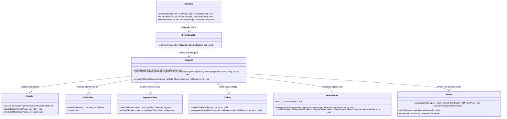

# First Valid-Only Int32 Division Kernel

## Requirements
Implement checked int32 vector division that executes only on active rows, enforces precheck-before-loop failure atomicity, and integrates into the existing `Compute -> Dispatch -> Wrapper -> Raw` architecture without introducing unnecessary data-model refactors.

## Entities

## Approach
1. Checked valid-only division slice:
   - Add a dedicated divide vertical slice that mirrors current `add`/`mul` integration patterns.
   - Keep raw kernel Arrow-free and mode-specific (`noNulls`, `validOnly`) while keeping checked semantics in wrapper orchestration.
   - Enforce active-row semantics so null lanes are never inspected for divisor checks or compute.

2. Technical implementation:
   - Extend `Compute` with `divide(...)`, add public `DivideDispatch`, and route `IntVector/IntVector/IntVector` explicitly via `instanceof`.
   - In wrapper, reuse `Checks`, `BufferRefs`, `SegmentViews`, `Validity`, and `Errors` rather than introducing new abstractions.
   - Apply two-pass nullable flow: build active validity then precheck active rows for `divisor == 0` and `MIN_VALUE / -1`, then run raw compute.
    - Exception handling strategy: wrapper throws `ArithmeticException` through `Errors.divByZero(...)` and `Errors.overflow(...)`; compute-path behavior remains consistent with unchecked boundary exceptions.

3. Business logic:
   - Rule 1: `out_validity = left_validity & right_validity` for nullable input.
   - Rule 2: fail fast on first active offending row before any compute starts; no partial writes and no value-count bump on failure.
   - Rule 3: inactive rows are don't-care for output data and must not trigger validation errors.

## Structure

### Inheritance Relationships
1. `Compute` remains a final static facade for public operation entry points.
2. `DivideDispatch` follows existing public dispatch-class contract (no interface inheritance required by current architecture).
3. `DivInt32` is a final wrapper class under `wrapper.validonly`, parallel to existing safe wrappers.
4. Domain arithmetic failures continue using `ArithmeticException` factories in `Errors` rather than introducing new exception hierarchies.

### Dependencies
1. `Compute.divide(...)` calls `DivideDispatch.eval(...)`.
2. `DivideDispatch.eval(...)` depends on Arrow vector runtime types and routes to `DivInt32.eval(...)`.
3. `DivInt32.eval(...)` depends on `Checks`, `BufferRefs`, `SegmentViews`, `Validity`, `Errors`, and `DivInt32Raw`.
4. `DivInt32Raw` depends only on JDK `MemorySegment`/`ValueLayout` with LSB-first validity-bit checks for active-row gating in `validOnly(...)`.

### Layered Architecture
1. API Layer (`compute/Compute`): exposes stable public methods and preserves thin-facade pattern.
2. Dispatch Layer (`compute/dispatch`): explicit type routing and unsupported-combination rejection.
3. Wrapper Layer (`compute/wrapper/validonly`): boundary checks, active validity management, precheck-before-loop contract, and output value-count ownership.
4. Raw Layer (`compute/raw`): tight per-row arithmetic loops with no Arrow object access and no exception policy decisions.
5. Memory Utility Layer (`memory/*`): retain/release safety, segment creation, bitmap/validity propagation, and error factories.

## Operations

### Create/Update API Facade - `Compute`
1. Responsibility: expose public divide operation without changing existing add/mul behavior.
2. Attributes:
   - none (static utility class pattern).
3. Methods:
   - `divide(FieldVector left, FieldVector right, FieldVector out): void`
     - Logic:
       - Delegate directly to `DivideDispatch.eval(left, right, out)`.
       - Keep method side-effect free apart from delegated computation.
       - Preserve existing no-allocation facade pattern.
4. Annotations: none.
5. Constraints: method signature and style must remain consistent with existing `add` and `mul` methods.

### Create Dispatch - `DivideDispatch`
1. Responsibility: route divide calls by Arrow vector physical types.
2. Attributes:
   - none (static dispatch class).
3. Methods:
   - `eval(FieldVector left, FieldVector right, FieldVector out): void`
     - Logic:
       - If all are `IntVector`, call `DivInt32.eval((IntVector) left, (IntVector) right, (IntVector) out)`.
       - Otherwise throw `Errors.unsupported("divide", left, right, out)`.
       - Keep explicit `instanceof` branch ordering deterministic.
4. Annotations: none.
5. Constraints: do not introduce generic registry or reflection-based dispatch.

### Create Valid-Only Wrapper - `DivInt32`
1. Responsibility: enforce checked preconditions and orchestrate no-null vs valid-only raw paths.
2. Attributes:
   - `INT32_BYTES: long` - row-byte stride constant (`Integer.BYTES`).
3. Methods:
   - `eval(IntVector left, IntVector right, IntVector out): void`
     - Logic:
       - Validate counts/capacity/slice offsets with `Checks`.
       - Retain buffers via `try (var refs = BufferRefs.retain(left, right, out))`.
        - If both inputs have `nullCount == 0`:
          - `Validity.markAllValid(out, n)`.
          - Precheck all rows in row order for `right[i] == 0` first, then `left[i] == Integer.MIN_VALUE && right[i] == -1`; throw first offender via `Errors`.
          - Implement precheck via `precheckAllRows(...)` helper before any raw call.
          - Build data segments and call `DivInt32Raw.noNulls(...)`.
       - Else nullable path:
         - Write `out_validity = left & right` via `Validity.propagateBinary(left, right, out, n)`.
         - Create `activeValidity` segment from `out` validity buffer (after propagation).
         - Precheck only active rows; skip inactive rows entirely.
         - Build data segments and call `DivInt32Raw.validOnly(...)`.
        - On success, set `out.setValueCount(n)` exactly once.
        - On precheck failure, throw before raw call and do not set value count.
        - Validate slice offsets for all vectors in call scope (`Checks.zeroSliceOffset(left, right, out)`).
    - `precheckActiveRows(MemorySegment leftData, MemorySegment rightData, MemorySegment activeValidity, int n): void`
      - Logic:
        - Iterate rows `0..n-1` in ascending order.
        - If row inactive (`bit == 0`), continue without reading divisor.
        - Read operands only for active rows; throw `Errors.divByZero(i)` then `Errors.overflow(i)` by first encountered row.
        - No writes to `out` in this method.
    - `precheckAllRows(MemorySegment leftData, MemorySegment rightData, int n): void`
      - Logic:
        - Iterate rows `0..n-1` in ascending order.
        - Read divisor first and throw `Errors.divByZero(i)` on zero.
        - Read dividend and throw `Errors.overflow(i)` on `Integer.MIN_VALUE / -1`.
        - No writes to `out` in this method.
4. Annotations: none.
5. Constraints:
   - No per-row `try/catch` in compute loops.
   - No raw memory views may escape retain scope.
   - Preserve backward-compatible wrapper style from existing safe kernels.

### Create Raw Kernel - `DivInt32Raw`
1. Responsibility: perform Arrow-free int32 division compute under wrapper-guaranteed safety.
2. Attributes:
    - `INT32_LE: ValueLayout.OfInt` - little-endian int layout.
3. Methods:
   - `noNulls(MemorySegment left, MemorySegment right, MemorySegment out, int n): void`
     - Logic:
       - Iterate contiguous rows and write `out[i] = left[i] / right[i]`.
       - Assume precheck already passed; do not repeat zero/overflow validation.
       - Handle scalar tail if vectorized prefix is used.
    - `validOnly(MemorySegment left, MemorySegment right, MemorySegment out, MemorySegment activeValidity, int n): void`
      - Logic:
        - Iterate rows and gate on active bit using LSB-first bitmap bit test helper.
        - For active rows: read left/right and write division result.
        - For inactive rows: skip divisor read and skip output write.
        - Keep output null-lane data as don't-care.
4. Annotations: none.
5. Constraints:
   - Never touch validity buffer in raw layer.
   - Never allocate inside loop.
   - Assume non-aliasing and little-endian invariants.

### Create/Update Tests - Raw, Wrapper, Dispatch, and API
1. Interface Definition: extend current JUnit style in `src/test/java/io/github/semyonsinchenko/arrowcompute/compute/...`.
2. Core Methods:
   - Raw tests (`DivInt32RawTest`): normal arithmetic, negatives, tails, boundary values, separate segments.
   - Wrapper tests (`DivInt32Test`):
     - inactive null divisor with zero data does not throw;
     - active divisor zero throws row-indexed `ArithmeticException`;
     - active `MIN_VALUE / -1` throws row-indexed `ArithmeticException`;
     - no partial write contract (value count unchanged on failure);
     - all-valid and sparse/dense null success cases with validity assertions.
   - Dispatch tests (`DivideDispatchTest`): supported int32 path and unsupported-type rejection.
   - API tests (`Compute` path): `Compute.divide` delegates and executes int32 flow.
3. Dependency Injection: none.
4. Transaction Management: not applicable.

### Create/Update Benchmarks - Division Checked Paths
1. Responsibility: quantify overhead of precheck and valid-only gating.
2. Methods:
   - `DivInt32RawBenchmark`: no-null raw divide vs naive Java baseline.
   - `DivInt32PathBenchmark`: wrapper end-to-end valid-only profiles.
3. Constraints:
   - Include null profiles 0%, 1%, 10%, 30% for wrapper path.
   - Include small/medium/large batch sizes and non-multiple-of-word tails.

## Norms
1. Annotation standards: keep kernel, wrapper, dispatch classes annotation-free and final/static patterned; reserve framework annotations for non-kernel modules only.
2. Dependency injection: use direct static invocation and constructor-free utility style; no DI framework in compute paths.
3. Exception handling:
    - Use unchecked taxonomy already established in `Errors`.
    - Throw `ArithmeticException` only from wrapper precheck for checked divide traps.
    - Keep error payload concise with first-offender row index and no sensitive internals.
    - Do not add compute-path exception wrapping; this repository enforces boundary exceptions at library-call level.
4. Data validation: perform `sameValueCount`, `outputCapacity`, and `zeroSliceOffset` checks before any segment creation; validate row count assumptions explicitly.
5. Logging: no logging in hot path or wrapper compute path; tests/assertions provide observability.
6. Documentation standards: each new class javadoc must declare operation, type support, null policy, checked behavior, output validity rule, and aliasing/lifetime assumptions.

## Safeguards
1. Functional constraints: support only `IntVector / IntVector -> IntVector` in this iteration; reject all other combinations through dispatch.
2. Performance constraints: no per-row allocation, no per-row exceptions in compute loops, and bounded additional pass cost from precheck must be benchmarked.
3. Security constraints: exception messages must contain row index only and avoid exposing addresses, buffer contents, or internal object graph details.
4. Integration constraints: preserve existing package layout (`raw/`, `wrapper/validonly/`, `dispatch/`) and current `Compute` facade style.
5. Business rule constraints: precheck applies only to active rows; inactive rows never inspected for divide traps and never trigger throws.
6. Exception handling constraints:
   - `divisor == 0` and `MIN_VALUE / -1` must throw `ArithmeticException` using `Errors` factories.
   - First offender must be deterministic by ascending row order.
   - On throw, raw kernel must not be invoked and `out.setValueCount(n)` must not execute.
   - Business arithmetic failures remain wrapper-owned and consistently typed.
7. Technical constraints: raw kernels remain Arrow-object-free and operate on little-endian `MemorySegment` views within `BufferRefs` lifetime.
8. Data constraints: validity polarity is Arrow-standard `1=valid, 0=null` with LSB-first bit ordering; nullable output validity equals input validity AND.
9. API constraints: maintain backward compatibility for existing methods and naming conventions; new public method is `Compute.divide(...)` only.
