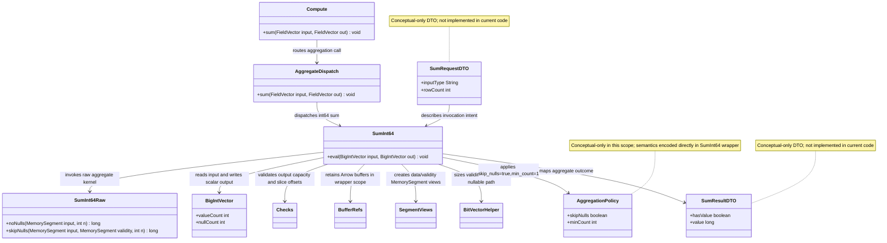

# Simple Aggregations Foundation

## Requirements
Implement first array-to-scalar aggregation capability for fixed-width Arrow primitives by delivering an end-to-end, null-correct, benchmarked `sum` path (`raw -> wrapper -> dispatch -> Compute facade`) that returns a single Arrow scalar row while preserving current MVP boundaries.

## Entities

### Implementation Status
- Implemented in code: `Compute`, `AggregateDispatch`, `SumInt64`, `SumInt64Raw`.
- Conceptual-only (documented design artifacts, not implemented in this scope): `AggregationPolicy`, `SumRequestDTO`, `SumResultDTO`.

## Approach
1. Aggregation API Extension:
   - Extend existing compute layering by adding aggregation entry points in `Compute` and a dedicated `AggregateDispatch` branch for scalar aggregations.
   - Preserve explicit type-based dispatch style already used by add/mul/div.
   - Keep wrapper as semantic boundary: raw computes primitive result; wrapper controls Arrow null result and output shape.

2. Technical Implementation:
    - Implement `SumInt64Raw` as primitive-local reduction over `MemorySegment` with two modes: `noNulls` and validity-aware `skipNulls`.
    - Implement `SumInt64` wrapper with `Checks`, `BufferRefs`, `SegmentViews`, and Arrow `BitVectorHelper` conventions; enforce single-row output contract.
   - Reuse project error/memory conventions and keep global exception posture unchanged (domain errors continue through existing `Errors` model and centralized handling layer where applicable).

3. Business Logic Semantics:
    - Enforce `skip_nulls=true` and `min_count=1` as fixed MVP semantics.
    - Empty input or all-null input returns null scalar output and bypasses raw kernel.
    - Non-all-null input returns sum over valid rows only; int64 overflow is Java wraparound and treated as expected behavior.

## Structure

### Inheritance Relationships
1. `AggregateDispatch` class defines explicit aggregation type routing (public extension surface style, same as other dispatch classes).
2. `SumInt64` final class implements Arrow-aware wrapper behavior for int64 sum.
3. `SumInt64Raw` final class provides hot-path primitive aggregation implementation.
4. Existing runtime exception hierarchy remains unchanged; aggregation uses existing `Errors` exception factories when needed.

### Dependencies
1. `Compute.sum(...)` calls `AggregateDispatch.sum(...)`.
2. `AggregateDispatch` depends on Arrow vector runtime types and routes to `SumInt64.eval(...)`.
3. `SumInt64` depends on `Checks`, `BufferRefs`, `SegmentViews`, `BitVectorHelper`, and Arrow vector APIs.
4. `SumInt64` calls `SumInt64Raw.noNulls(...)` or `SumInt64Raw.skipNulls(...)` based on runtime null profile.
5. Tests depend on raw kernel class and wrapper/dispatch surface; benchmarks depend on raw+wrapper+Compute layers.

### Layered Architecture
1. API Layer: `Compute` exposes public aggregation operation (`sum`) consistent with existing facade style.
2. Dispatch Layer: `AggregateDispatch` resolves Arrow input/output vector combinations and rejects unsupported types.
3. Wrapper Layer: `SumInt64` enforces shape checks, null semantics, lifetime management, and scalar output validity.
4. Raw Layer: `SumInt64Raw` performs primitive reduction over data/validity memory segments only.
5. Verification Layer: raw tests, wrapper tests, dispatch tests, and JMH benchmarks validate correctness and performance.

## Operations

### Create/Update Dispatch Component - `AggregateDispatch`
1. Responsibility: Route aggregate operations by vector types and connect facade to wrappers.
2. Attributes:
   - none (static utility style).
3. Methods:
    - `sum(FieldVector input, FieldVector out): void`
      - Logic:
        - Validate supported input/output type pair.
        - Route `BigIntVector -> BigIntVector` to `SumInt64.eval`.
        - Throw unsupported-operation error for unmatched combinations with explicit input/out minor-type names (or `null`).
4. Annotations: none.
5. Constraints: Keep explicit `instanceof` routing; no generic registry.

### Create/Update API Facade - `Compute`
1. Responsibility: Expose public aggregate entrypoint with same simplicity as existing arithmetic methods.
2. Attributes:
   - none.
3. Methods:
   - `sum(FieldVector input, FieldVector out): void`
     - Logic:
       - Delegate directly to `AggregateDispatch.sum(input, out)`.
       - Keep method free of compute logic and memory management.
4. Annotations: none.
5. Constraints: Preserve facade-only role and stable public API style.

### Create Wrapper Component - `SumInt64`
1. Responsibility: Enforce Arrow semantics and convert raw primitive aggregate result into nullable scalar output row.
2. Attributes:
   - `INT64_BYTES: long` - byte width constant.
3. Methods:
    - `eval(BigIntVector input, BigIntVector out): void`
      - Logic:
        - Validate output capacity for exactly one row and reject non-zero slice offsets.
        - Retain input/output buffers through `BufferRefs` scope.
        - If input is empty (`n==0`) or all rows are null, set output row 0 null, set value count to 1, and return without raw call.
        - Else branch by null profile:
          - no-null input: call `SumInt64Raw.noNulls`.
          - nullable input: call `SumInt64Raw.skipNulls`.
       - Write scalar result into output row 0, mark row 0 valid, set value count to 1.
       - Ensure no `MemorySegment` escapes retain scope.
4. Annotations: none.
5. Constraints:
   - Must implement `skip_nulls=true`, `min_count=1` semantics.
   - Must not allocate per row.
   - Must not invoke raw kernel on all-null input.

### Create Raw Kernel Component - `SumInt64Raw`
1. Responsibility: Compute int64 sum over `MemorySegment` buffers using primitive locals.
2. Attributes:
    - `INT64_LE` little-endian long layout constant (`ValueLayout.JAVA_LONG_UNALIGNED.withOrder(ByteOrder.LITTLE_ENDIAN)`).
3. Methods:
   - `noNulls(MemorySegment input, int n): long`
     - Logic:
       - Iterate all rows and accumulate into primitive local `long sum`.
       - Return `0` for `n=0`.
   - `skipNulls(MemorySegment input, MemorySegment validity, int n): long`
     - Logic:
       - Iterate rows, test Arrow validity bit (`LSB-first`, `1=valid`).
       - Accumulate only valid lanes.
       - Return `0` when no valid lanes were encountered.
3. Error Handling:
   - No all-null exception path; wrapper owns nullable-result interpretation.
4. Annotations: none.
5. Constraints:
   - Static/final primitive style only.
   - No Arrow vector APIs in raw layer.
   - No object allocation in loop.

### Implement Tests - Raw, Wrapper, Dispatch
1. Responsibility: Prove semantic correctness and AC compliance for end-to-end sum path.
2. Core Methods/Scopes:
    - Raw tests (`Arena.ofConfined`): empty, one-value, mixed signs, mixed null bitmap, boundary values, wraparound.
    - Wrapper tests (Arrow allocators): output value count = 1, all-valid sum, mixed-null sum-over-valid, all-null output null.
    - Dispatch tests: supported int64 route and unsupported-type rejection.
    - Facade test: `Compute.sum(...)` executes end-to-end int64 flow.
3. Constraints:
    - Follow existing package test layout (`compute/raw`, `compute/wrapper/agg`, `compute/dispatch`).
    - Prefer deterministic assertion strategy for all-null non-invocation in future hardening (counter/spy) if raw-call bypass must be explicitly proven.

### Implement Benchmarks - Aggregation Paths
1. Responsibility: Measure raw vs wrapper vs facade overhead for aggregation and satisfy benchmark AC.
2. Benchmark Tasks:
    - Add raw aggregation benchmark against naive Java `MemorySegment` loop.
    - Add wrapper benchmark for scalar output path.
    - Add facade benchmark through `Compute.sum` dispatch.
3. Required dimensions:
    - Path benchmark (`raw`, `wrapperEval`, `apiComputeSum`) null profiles: 0%, 10%, 50%, 100%.
    - Raw baseline benchmark focuses on no-null scan and naive-loop comparison.
    - Representative row sizes per wrapper benchmark guidance.
4. Constraints:
   - Preloaded input vectors and preallocated outputs only.
   - Ensure output consumption prevents dead-code elimination.

### Documentation Update - Aggregation Semantics
1. Responsibility: Keep semantics explicit and aligned with acceptance criteria.
2. Content to update:
   - Int64 wraparound policy.
   - `skip_nulls=true`, `min_count=1` default behavior.
   - Float semantics note (naive sum, 4 ULP tolerance) as scoped documentation baseline even if optional float kernels are deferred.
3. Constraints:
   - Keep wording consistent with `CORE_DESIGN.md` and existing kernel docs style.

## Norms
1. Annotation Standards: Keep kernel, wrapper, and dispatch classes as plain final/static Java classes; avoid framework annotations in compute paths.
2. Dependency Injection: No DI container usage in compute layer; wire through static dispatch/facade conventions.
3. Exception Handling:
   - Reuse existing unchecked exception conventions (`UnsupportedOperationException`, `IllegalArgumentException`, `ArithmeticException` categories).
   - Keep errors centralized through existing `Errors` helpers where applicable.
   - Preserve compatibility with existing global exception handling package; do not introduce new error envelope for compute kernels.
4. Data Validation:
   - Wrapper must validate capacity, slice-offset constraints, and input/output shape before segment creation.
   - Null semantics must be runtime-null-count driven, not schema-only assumptions.
5. Logging: No per-row or hot-path logging; tests/benchmarks provide observability.
6. Documentation Standards:
   - Kernel javadocs must state operation, supported types, null policy, overflow behavior, validity rule, aliasing/lifetime assumptions.
   - Benchmark classes must declare measured question and baseline alignment.

## Safeguards
1. Functional Constraints: Deliver at least `SumInt64` end-to-end (`raw + wrapper + dispatch + Compute facade`) with scalar output row semantics.
2. Performance Constraints: No allocations inside raw loops; benchmark coverage includes raw/wrapper/facade and null-profile dimensions.
3. Security Constraints: No sensitive data exposure in exception messages; retain current memory-safety discipline around Arrow buffer lifetime.
4. Integration Constraints: New aggregation path must not alter behavior of existing add/mul/div dispatch or wrapper contracts.
5. Business Rule Constraints:
    - Enforce `skip_nulls=true`, `min_count=1`.
    - Empty input and all-null input must produce null output and skip raw invocation.
    - Int64 sum must use Java wraparound semantics.
6. Exception Handling Constraints:
   - Unsupported type combinations must fail with unsupported-operation errors.
   - Input/shape misuse must fail fast via argument validation.
   - Raw kernels must not throw per-row exceptions for normal control flow.
7. Technical Constraints:
   - Raw APIs remain primitive-return signatures (`long`) and Arrow-free.
   - `MemorySegment` views remain confined to wrapper retain scope.
   - No grouped-aggregation engine, no aggregate state framework introduction in this scope.
8. Data Constraints:
   - Validity bit semantics must remain Arrow-standard (`1=valid`, LSB-first).
   - Output vector capacity must support row 0 write and value-count set to 1.
9. API Constraints:
   - Preserve explicit dispatch style; no registry abstraction.
   - Keep aggregation entrypoint naming and facade conventions consistent with existing `Compute` methods.
