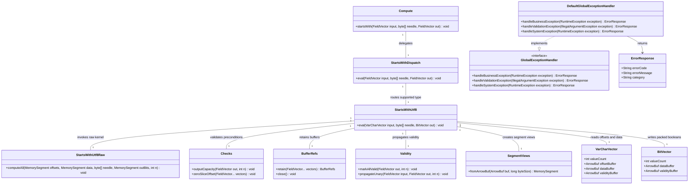

# Fast-Tier String Scaffold StartsWithUtf8

## Requirements
Implement a fast-tier UTF-8 prefix predicate vertical that delivers `VarCharVector` to `BitVector` starts-with evaluation via raw SIMD, safe wrapper orchestration, explicit dispatch, and public Compute API exposure while preserving Arrow bitmap correctness, wrapper safety invariants, and benchmark-traceable performance value.

## Entities

## Approach
1. API and Dispatch Vertical:
   - Add `Compute.startsWith(...)` as a public facade entry that mirrors existing add/mul/divide style.
   - Introduce `StartsWithDispatch` as a public explicit dispatch class with one supported combination: `VarCharVector + byte[] -> BitVector`.
   - Reject unsupported combinations via `Errors.unsupported(...)` to preserve current extension boundary behavior.

2. Raw and Wrapper Technical Implementation:
    - Implement `StartsWithUtf8Raw.computeAll(...)` using `MemorySegment` offsets/data access and `ByteVector` compare loops with scalar tail fallback.
    - Keep wrapper sequence identical to existing safe wrappers: `Checks` -> `BufferRefs.retain(...)` -> `Validity` -> `SegmentViews` -> raw call -> `out.setValueCount(n)`.
    - Use bit-packed Arrow boolean writes and enforce LSB-first bit ordering; keep non-aliasing and little-endian invariants explicit.
    - Global exception handling strategy with `GlobalExceptionHandler` / `DefaultGlobalExceptionHandler`: map unchecked `IllegalArgumentException`, `UnsupportedOperationException`, and `ArithmeticException` to `ErrorResponse` at adapter boundary; keep raw/wrapper layers framework-agnostic.

3. Business Logic and Validation:
   - Implement byte-prefix semantics exactly: empty needle always matches, shorter row than needle never matches, otherwise first `needle.length` bytes must match.
   - Treat null handling as wrapper-owned: raw may compute all lanes, output validity comes only from input validity propagation.
   - Preserve conservative entity design by reusing existing vectors/utilities and avoiding new wrapper entities where existing `byte[]`, `VarCharVector`, and `BitVector` are sufficient.

## Structure

### Inheritance Relationships
1. `StartsWithDispatch` class defines public dispatch functionality for starts-with operation
2. `StartsWithUtf8` final class implements wrapper safety orchestration contract
3. `StartsWithUtf8Raw` final class defines Arrow-free raw kernel behavior
4. `StartsWithBusinessException` extends `RuntimeException` class
5. `DefaultGlobalExceptionHandler` implements `GlobalExceptionHandler`

### Dependencies
1. `Compute` calls `StartsWithDispatch`
2. `StartsWithDispatch` depends on `StartsWithUtf8` and `Errors`
3. `StartsWithUtf8` injects `Checks`, `BufferRefs`, `Validity`, `SegmentViews`, and `StartsWithUtf8Raw` via static calls
4. `StartsWithUtf8Raw` depends on `jdk.incubator.vector` and `java.lang.foreign` only
5. `DefaultGlobalExceptionHandler` depends on `GlobalExceptionHandler`, `ErrorResponse`, and business/system exception classes
6. Tests depend on Arrow vectors, JUnit, and existing bitmap assertions

### Layered Architecture
1. Controller Layer: Optional external adapter layer may expose HTTP/RPC endpoint for starts-with compute requests
2. Service Layer: `Compute` + dispatch layer selects operation implementation by vector types
3. Repository Layer: Not applicable; compute kernels operate on caller-provided Arrow buffers in-memory
4. Data Access Layer: Wrapper bridges Arrow buffers to `MemorySegment` and raw kernel performs direct buffer reads/writes
5. Exception Handling Layer: `GlobalExceptionHandler` contract with `DefaultGlobalExceptionHandler` maps unchecked compute exceptions into `ErrorResponse`

## Operations

### Create/Update API Facade - Compute
1. Responsibility: Expose public starts-with operation aligned with existing static compute methods
2. Attributes:
   - None: `Compute` remains stateless utility facade
3. Methods:
    - `startsWith(FieldVector input, byte[] needle, FieldVector out): void`
      - Logic:
        - Validate non-null `input`, `needle`, and `out` references via `Objects.requireNonNull`
        - Delegate to `StartsWithDispatch.eval(input, needle, out)`
        - Keep no additional branching in facade
4. Annotations: None
5. Constraints: Must preserve backward compatibility and not alter existing methods

### Create/Update Dispatch - StartsWithDispatch
1. Responsibility: Route supported Arrow type combination and reject unsupported ones
2. Attributes:
   - None: static utility-style dispatch
3. Methods:
   - `eval(FieldVector input, byte[] needle, FieldVector out): void`
     - Logic:
       - If `input` is `VarCharVector` and `out` is `BitVector`, call `StartsWithUtf8.eval(...)`
       - Else throw `Errors.unsupported("startsWith", input, null, out)` or equivalent overload style used in project
       - Keep dispatch explicit and branch-light
4. Annotations: None
5. Constraints: Only one type combination in this iteration; no generic registry abstraction

### Implement Safe Wrapper - StartsWithUtf8
1. Interface Definition: `eval(VarCharVector input, byte[] needle, BitVector out): void`
2. Core Methods: `eval(VarCharVector input, byte[] needle, BitVector out): void`
   - Input Validation:
     - `n = input.getValueCount()`
     - `Checks.outputCapacity(out, n)`
     - `Checks.zeroSliceOffset(input)`
     - `needle != null`
    - Business Logic:
      - Enter `try (var refs = BufferRefs.retain(input, out))`
      - Set output validity: `Validity.markAllValid(out, n)` when `input.getNullCount()==0`, otherwise `Validity.propagateUnary(input, out, n)`
      - If `n > 0`, compute byte sizes: offsets `(n+1) * Integer.BYTES`, out bitmap `BitVectorHelper.getValidityBufferSize(n)`, data `input.getDataBuffer().capacity()`
      - Build segments with `SegmentViews.fromArrowBuf(...)` for offsets, data, and output value bitmap
      - If `n > 0`, call `StartsWithUtf8Raw.computeAll(offsetsSeg, dataSeg, needle, outValuesSeg, n)`
      - Finalize with `out.setValueCount(n)`
   - Exception Handling:
     - Throw `IllegalArgumentException` for capacity/slice/precondition violations
     - Propagate unchecked runtime failures directly
   - Return Value: in-place population of `out`
3. Dependency Injection: Static helper dependencies only; no framework DI
4. Transaction Management: Not applicable for in-memory compute

### Implement Raw Kernel - StartsWithUtf8Raw
1. Responsibility: Compute packed boolean starts-with results from offsets/data and scalar prefix bytes
2. Attributes:
   - `SPECIES`: `VectorSpecies<Byte>` static final preferred species
3. Methods:
    - `computeAll(MemorySegment offsets, MemorySegment data, byte[] needle, MemorySegment outBits, int n): void`
      - Logic:
        - Fast path: when `n == 0`, return immediately
        - Validate argument non-nulls and reject `n < 0`
        - Validate segment sizes: offsets at least `(n+1)*4` bytes and out bits at least `ceil(n/8)` bytes
        - Initialize output bytes to zero for `ceil(n/8)` to guarantee unmatched default=false
        - Validate offsets monotonicity and data bounds via `validateOffsets(...)`
        - If `needle.length == 0`, set bits 0..n-1 to 1 and mask tail bits via `maskTail(...)`
        - For each row `i`:
          - Read start/end from offsets buffer, derive `len = end - start`
          - If `len < needle.length`, keep bit cleared and continue
          - Compare bytes with vector loop (`ByteVector.fromMemorySegment`) and scalar tail
          - Set row bit when all compared bytes match
        - Ensure final output respects bit-packed layout by `maskTail(...)`; tail bits beyond `n-1` remain cleared
      - Error handling approach:
        - No per-row exceptions
        - Throw `IllegalArgumentException` for invalid top-level arguments (`n < 0`, null segments), undersized segments, and malformed offsets
4. Annotations: None
5. Constraints: No Arrow classes in raw package, no allocation inside row loop, no streams/boxing

### Create Tests - Raw/Wrapper/Dispatch
1. Responsibility: Prove semantic correctness, bitmap integrity, and dispatch behavior
2. Attributes:
   - Raw fixture datasets for ASCII and multibyte UTF-8 bytes
3. Methods:
    - `StartsWithUtf8RawTest`:
      - Covers `n=0`, empty needle, mixed ASCII/multibyte UTF-8 outcomes, species boundary and scalar tail, and non-multiple-of-8 tail masking
    - `StartsWithUtf8Test`:
      - Covers all-valid, 1% nulls, 30% nulls, all-null, `out.validateFull()`, validity propagation, and valueCount finalization
    - `StartsWithDispatchTest` and `ComputeStartsWithTest`:
      - Valid route assertions and unsupported combination rejection
4. Annotations: JUnit 5 `@Test`, `@DisplayName`
5. Constraints: Tests must pass with allocator debug mode enabled and no retain/release leaks

### Create Benchmarks - Raw and Path
1. Responsibility: Provide interpretable performance evidence for scaffold operation
2. Attributes:
   - Parameters: rows `{1024, 16384, 65536, 1048576}`, needle lengths `{2,8,16,32}`, null profiles `{0,10}` for wrapper path
3. Methods:
   - `StartsWithUtf8RawBenchmark`:
     - `vectorApi` method for raw kernel
     - `naiveMemorySegment` baseline method with straightforward scalar loop
   - `StartsWithUtf8PathBenchmark`:
     - `rawComputeAll`, `wrapperEval`, `apiComputeStartsWith`
4. Annotations: JMH `@Benchmark`, `@Param`, `@State`, `@BenchmarkMode`
5. Constraints: Baseline labels must explicitly distinguish raw SIMD vs naive scalar and wrapper/API overhead

### Create Exception Handler - GlobalExceptionHandler
1. Responsibility: Unified handling contract and default implementation for boundary exception mapping
2. Exception Types:
    - `RuntimeException` business branch (including `BuildConstraintException`, `StartsWithBusinessException`)
    - `IllegalArgumentException` validation branch
    - `RuntimeException` system branch (including `SystemException`)
3. Methods:
    - `GlobalExceptionHandler.handleBusinessException(RuntimeException): ErrorResponse`
    - `GlobalExceptionHandler.handleValidationException(IllegalArgumentException): ErrorResponse`
    - `GlobalExceptionHandler.handleSystemException(RuntimeException): ErrorResponse`
    - `DefaultGlobalExceptionHandler` implements all three methods
4. Annotations: None in compute core
5. Response Format: `ErrorResponse{errorCode, errorMessage, category}`

### Create Business Exception - StartsWithBusinessException
1. Inheritance: extends `RuntimeException`
2. Attributes:
   - `errorCode`: `String` - business error code
   - `errorMessage`: `String` - detailed error description
3. Constructors: `(String errorCode, String errorMessage)` and `(String errorCode, String errorMessage, Throwable cause)`
4. Usage Scenarios: adapter layer detects unsupported client contract or invalid operation request before invoking compute API

## Norms
1. Annotation Standards: Keep core compute packages annotation-free; only benchmark/test annotations in JMH/JUnit; use `@RestControllerAdvice` only in optional adapter module.
2. Dependency Injection: Use static utility wiring in compute core; avoid DI frameworks in raw/wrapper/dispatch layers.
3. Exception Handling:
    - Keep core exceptions unchecked and generated through existing `Errors` helpers where applicable.
   - Business exception class creation standards:
     - Inherit `RuntimeException` or a custom `BusinessException` in adapter modules
     - Include `errorCode` and `errorMessage`
     - Provide overloaded constructors with optional cause
     - Classify exception codes by domain (e.g., `STARTSWITH_*`)
    - Unified error response DTO in core is `ErrorResponse{errorCode, errorMessage, category}` and can be adapted externally at service boundary.
    - Log exceptions at adapter boundary with correlation id; avoid logging in hot raw loops.
4. Data Validation: Validate row counts, output capacity, and zero slice offset before segment creation; validate `needle` non-null and treat empty needle as valid business input.
5. Logging: No per-row logging; benchmark and tests may log setup metadata only.
6. Documentation Standards: Add class-level javadocs documenting operation, input/output types, null policy, output validity rule, overflow/domain behavior, aliasing assumptions, and in-place mutation policy.

## Safeguards
1. Functional Constraints: Support only `VarCharVector -> BitVector` with scalar `byte[]` needle in this iteration; no vector-needle, no other string predicates.
2. Performance Constraints: JMH must run across required row and needle matrices; raw SIMD throughput must be reported alongside naive scalar baseline with identical datasets.
3. Security Constraints: Do not expose raw memory addresses or internal allocator diagnostics in adapter error payloads.
4. Integration Constraints: Preserve existing `Compute`, dispatch, wrapper, and raw package patterns without introducing registry/DI frameworks.
5. Business Rule Constraints: Empty needle => always true on value bitmap; row shorter than needle => false; null observability controlled only by output validity bitmap.
6. Exception Handling Constraints:
    - Business exceptions must include clear error codes and error messages
    - Exception types must be classified by business domain
    - Exception information must not expose sensitive system internal information
    - Business/validation/system mapping must flow through `GlobalExceptionHandler` (`DefaultGlobalExceptionHandler` in core)
7. Technical Constraints: Enforce little-endian assumptions, non-aliasing preconditions, zero slice-offset checks, and no `MemorySegment` escape beyond `BufferRefs` scope.
8. Data Constraints: Offsets must be monotonic and within data buffer bounds; output bitmap bytes must match `BitVectorHelper.getValidityBufferSize(n)` sizing.
9. API Constraints: Public method naming must stay explicit (`startsWith`); unsupported type combinations must throw `UnsupportedOperationException` via `Errors.unsupported` pattern.
