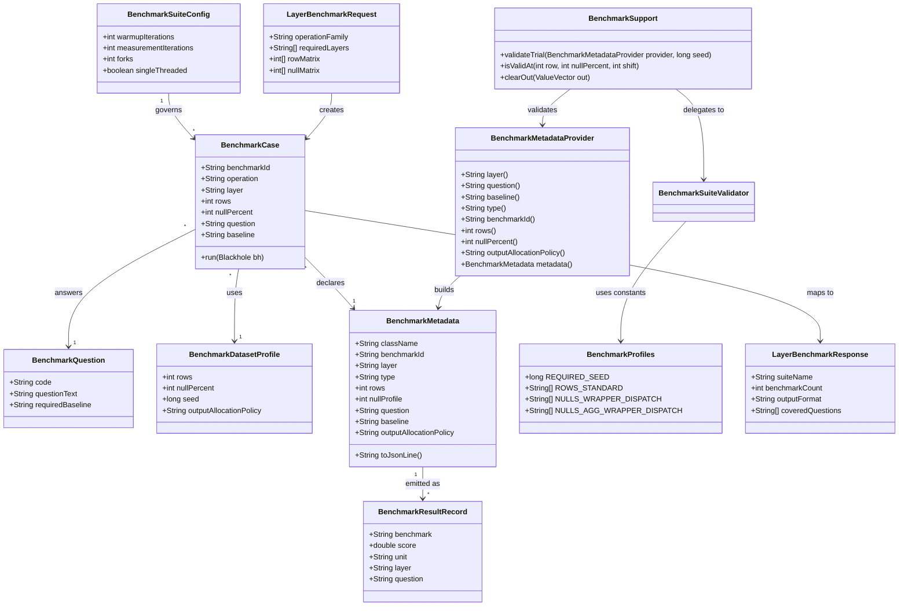

# GGQPA-010 JMH benchmark suite baseline matrix

## Requirements
Implement a policy-driven JMH benchmark suite that produces reproducible, layer-labeled, baseline-traceable performance evidence for raw kernels, wrappers, and dispatch paths across iteration-08 kernels and the fast-tier UTF-8 scaffold, without changing compute semantics or adding non-goal benchmark categories.

## Entities

## Approach
1. Benchmark Portfolio Governance:
    - Standardize each benchmark around a declared business question and required baseline pair from `BENCHMARKS.md`.
    - Keep existing per-operation benchmark classes and evolve naming from ambiguous `*PathBenchmark` to explicit layer naming (`Raw`, `Wrapper`, `Dispatch`, `Infra`).
    - Preserve existing raw/wrapper/dispatch architecture and avoid introducing new runtime abstractions in hot benchmark paths.

2. Technical Implementation:
    - Reuse JMH + Gradle plugin wiring in `build.gradle.kts`; raise suite defaults to requirement-aligned warmup/measurement/fork values.
    - Add a lightweight metadata contract (constants or annotation-driven descriptor) so layer/type/question/baseline/null-profile are report-visible and machine-readable in JSON/CSV outputs.
    - Enforce fixed seed (`0xC0FFEEL`), preallocated outputs, and output consumption in every benchmark to prevent DCE and preserve reproducibility.
    - Centralize shared setup/reset/policy checks through composition utilities (`BenchmarkProfiles`, `BenchmarkSupport`) to avoid duplicated JMH setup logic.
    - Exception handling strategy: centralize benchmark-policy violations through a single suite validator utility (project-equivalent of a global exception handler) that fails fast with actionable messages.

3. Business Logic:
   - Raw benchmarks answer Vector API value by comparing `computeAll` against naive `MemorySegment` loops; optional array baseline remains non-authoritative.
   - Wrapper benchmarks answer wrapper overhead by comparing wrapper to raw under null matrix `0/1/10/30`, with aggregation including `100` all-null profile.
   - Dispatch benchmarks answer dispatch overhead by comparing facade/dispatch entrypoints against wrapper baselines under same row and null profiles.

## Structure

### Inheritance Relationships
1. `BenchmarkMetadataProvider` interface defines benchmark question/baseline/layer metadata access.
2. Operation benchmark classes (for add/mul/div/sum/startswith families), legacy raw benchmarks (`bitmap-and`, `boolean-packing`), and infra baseline benchmark implement `BenchmarkMetadataProvider`.
3. `BenchmarkPolicyViolationException` extends `RuntimeException`.
4. Existing benchmark classes remain concrete JMH state classes; no abstract mega-benchmark base is introduced.

### Dependencies
1. `*RawBenchmark` calls raw kernels in `compute/raw/*`.
2. `*WrapperBenchmark` depends on wrapper kernels in `compute/wrapper/*` and Arrow vectors.
3. `*DispatchBenchmark` depends on `Compute` facade and dispatch classes in `compute/dispatch/*`.
4. `BenchmarkSuiteValidator` depends on metadata providers and `BenchmarkProfiles`, and enforces matrix, seed, and naming rules before execution.
5. `BenchmarkSupport` is used from benchmark setup/invocation-reset paths to centralize trial validation, null-pattern helpers, and output resets.
6. Result export depends on JMH output plus metadata join (class-level constants or tags).

### Layered Architecture
1. Benchmark Entry Layer: JMH benchmark classes and `@Param` matrices define measurable scenarios.
2. Benchmark Service Layer: setup/teardown and dataset generation enforce fixed-seed, no-allocation measured methods, with shared composition helpers for repeated setup/reset logic.
3. Compute Invocation Layer: raw/wrapper/dispatch invocation points provide isolated overhead comparisons.
4. Reporting Layer: JSON/CSV outputs include layer/question/baseline/type/row/null-profile dimensions.
5. Exception Handling Layer: `BenchmarkSuiteValidator` acts as unified policy failure gateway with consistent error shape.

## Operations

### Create/Update Metadata Contract - BenchmarkMetadataProvider
1. Responsibility: Provide a single source of truth for benchmark identity and baseline traceability.
2. Attributes/Accessors:
   - `layer()`: `String` - measured layer (`raw-vector`, `wrapper`, `dispatch`, `infra`).
   - `question()`: `String` - baseline-matrix question text.
   - `baseline()`: `String` - required comparison baseline.
   - `type()`: `String` - operation type (`int32-add`, `int64-sum`, `utf8-startswith`, etc.).
   - `benchmarkId()`: `String` - stable benchmark identifier for policy checks/reporting.
   - `rows()`: `int` - active row profile from params.
   - `nullPercent()`: `int` - active null profile from params.
3. Methods:
    - `metadata()`: `BenchmarkMetadata`
      - Logic:
        - Validate class naming through `BenchmarkSuiteValidator.validateClassMetadata(...)`.
        - Validate non-empty question and baseline.
        - Build immutable metadata from active params (`benchmarkId`, `rows`, `nullProfile`) and declared descriptors (`layer`, `type`, `question`, `baseline`, `outputAllocationPolicy`).
        - Expose metadata for report enrichment.
    - `outputAllocationPolicy()`: `String`
      - Logic:
        - Return `preallocated` by default.
4. Annotations: none required; keep plain Java interface and constants.
5. Constraints: Must not allocate inside measured benchmark methods.

### Create/Update Benchmark Classes - Layer-explicit operation suites
1. Responsibility: Replace ambiguous path naming with explicit layer-focused benchmark classes while preserving existing behavior.
2. Attributes:
   - `rows`: `int` - values `1024,16384,65536,1048576`.
   - `nullPercent`: `int` - wrapper/dispatch matrix `0,1,10,30`; aggregation adds `100`.
   - `seed`: `long` - fixed `0xC0FFEEL`.
3. Methods:
    - `setUp()`: `void`
      - Logic:
        - Call `BenchmarkSupport.validateTrial(this, seed)` before benchmark setup.
        - Allocate Arrow vectors/segments once per trial.
        - Populate deterministic data with fixed seed.
        - Retain buffers and create `MemorySegment` views.
    - `clearOut()`: `void`
      - Logic:
        - Reset output value counts or buffers per invocation without reallocating, preferably through `BenchmarkSupport.clearOut(...)`.
   - `benchmarkMethod(Blackhole bh)`: `void`
     - Logic:
       - Run only target layer call path.
       - Consume output segment/vector or reduced scalar.
       - Avoid setup allocations and side channels.
4. Annotations: `@State(Scope.Thread)`, `@BenchmarkMode(Mode.Throughput)`, `@OutputTimeUnit(TimeUnit.MILLISECONDS)`, `@Param`, `@Setup`, `@TearDown`, `@Benchmark`.
5. Constraints: Keep existing data structures (`IntVector`, `BigIntVector`, `VarCharVector`, `MemorySegment`) and extend only where coverage requires it.
6. Naming Alignment:
   - Dispatch suites use explicit `*DispatchBenchmark` names (replacing older `*PathBenchmark` naming).
   - Legacy non-kernel suites are synchronized to explicit names: `BitmapAndRawBenchmark`, `BooleanPackingRawBenchmark`, `BuildInfraBaselineInfraBenchmark`.

### Implement Suite Policy Validator - BenchmarkSuiteValidator
1. Interface Definition:
   - `validateClassMetadata(Class<?> benchmarkClass): void`
   - `validateParams(String benchmarkId, int rows, int nullPercent): void`
   - `validateSeed(long seed): void`
2. Core Methods:
    - `validateClassMetadata(...)`: `void`
      - Input Validation: Ensure class name encodes layer/scenario with accepted tokens (`Raw`, `Wrapper`, `Dispatch`, `Infra`).
      - Business Logic: Ensure question-baseline mapping exists and matches matrix.
      - Exception Handling: Throw `BenchmarkPolicyViolationException` with class name and missing field.
      - Return Value: none.
    - `validateParams(...)`: `void`
      - Input Validation: Rows in required set; null profile legal for benchmark category.
      - Business Logic: Enforce 100% null only for aggregation wrapper/dispatch; enforce `nullPercent=0` for infra baselines.
      - Exception Handling: Fail fast before benchmark trial setup.
3. Dependency Injection: Static utility usage from benchmark setup paths; no framework DI.
4. Transaction Management: Not applicable.

### Add Shared Policy Constants - BenchmarkProfiles
1. Responsibility: Provide a single source of truth for benchmark policy constants used by validators and benchmarks.
2. Attributes:
   - `REQUIRED_SEED`: `long=0xC0FFEEL`
   - `ROWS_STANDARD`: `String[]` = `1024,16384,65536,1048576`
   - `NULLS_WRAPPER_DISPATCH`: `String[]` = `0,1,10,30`
   - `NULLS_AGG_WRAPPER_DISPATCH`: `String[]` = `0,1,10,30,100`
3. Constraints: No mutable runtime state; no benchmark-loop usage.

### Add Shared Benchmark Helper - BenchmarkSupport
1. Responsibility: Remove duplicated setup/reset/validation logic across benchmark classes.
2. Methods:
   - `validateTrial(BenchmarkMetadataProvider provider, long seed): void`
     - Logic: validate seed, params, and metadata once before measured invocations.
   - `isValidAt(int row, int nullPercent, int shift): boolean`
     - Logic: shared deterministic null-pattern helper.
   - `clearOut(ValueVector out): void`
     - Logic: invocation-level output reset without reallocation.
3. Constraints: Called from setup/invocation hooks only; not from compute hot loops.

### Create Exception Handler - BenchmarkPolicyExceptionMapper
1. Responsibility: Unified handling and formatting of benchmark policy exceptions for CLI/reporting diagnostics.
2. Exception Types:
   - `BenchmarkPolicyViolationException`: naming, metadata, baseline matrix violations.
   - `IllegalArgumentException`: invalid param matrix values.
   - `IllegalStateException`: unexpected benchmark setup/report state.
3. Methods:
   - `handlePolicyViolation(BenchmarkPolicyViolationException): String`
   - `handleIllegalArgument(IllegalArgumentException): String`
4. Annotations: none (library module); plain utility class.
5. Response Format: single-line machine-parseable error text including benchmark id, rule id, and remediation hint.

### Create Business Exception - BenchmarkPolicyViolationException
1. Inheritance: extends `RuntimeException`.
2. Attributes:
   - `errorCode`: `String` - policy code (`BMK-NAMING-001`, `BMK-METADATA-002`, etc.).
   - `errorMessage`: `String` - precise violation details.
3. Constructors: `(String errorCode, String errorMessage)`, `(String errorCode, String errorMessage, Throwable cause)`.
4. Usage Scenarios: Missing question/baseline labels, invalid layer naming, non-reproducible seed, or unsupported row/null matrix.

### Update Build and Reporting Configuration - JMH suite defaults
1. Responsibility: Align runtime benchmark defaults and output schema with requirement.
2. Attributes:
   - `warmupIterations`: `int=10`
   - `measurementIterations`: `int=10`
   - `forks`: `int=3`
   - `resultFormat`: `json` primary, optional csv
3. Methods:
   - `configureJmhDefaults()`: apply consistent warmup/measurement/fork values.
   - `publishMetadataFields()`: include layer/type/rows/null/question/baseline/allocation-policy.
4. Constraints:
   - One `./gradlew jmh` run executes entire suite.
   - Do not include non-goal suites (native baseline, slow-tier, fusion, macro) in this iteration.

## Norms
1. Annotation Standards: JMH annotations are mandatory on every benchmark class; use trial-level setup/teardown and invocation-level output reset.
2. Dependency Injection: No framework injection; construct Arrow allocators and vectors explicitly in benchmark setup.
3. Exception Handling:
   - Use unchecked `BenchmarkPolicyViolationException` for benchmark-governance failures.
   - Exception class standard includes `errorCode` and `errorMessage` fields with multiple constructors.
   - Use a unified policy-exception mapper utility for deterministic diagnostic formatting.
   - Never throw per-row exceptions in measured loops.
4. Data Validation: Validate row matrix, null profile matrix, fixed seed, and metadata completeness before first measured invocation.
5. Reuse and Deduplication: Use composition utilities (`BenchmarkProfiles`, `BenchmarkSupport`) to avoid repeating trial validation, null-pattern generation, and output-reset logic across benchmark classes.
6. Logging: Keep benchmark runtime logging minimal; use setup-time warnings only for policy deprecations; avoid logging in measured methods.
7. Documentation Standards: Each benchmark class includes concise class-level Javadoc naming question and baseline; class name must encode layer/scenario.

## Safeguards
1. Functional Constraints: Every benchmark must declare question + baseline; missing declaration invalidates benchmark class.
2. Performance Constraints: Measured methods perform zero setup allocation, consume outputs, and run with warmup/measurement/fork defaults of `10/10/3` unless explicitly justified.
3. Security Constraints: No external network calls, secrets, or filesystem writes from benchmark hot paths.
4. Integration Constraints: Suite must run through existing `./gradlew jmh` task and remain compatible with Java 25 + Vector API flags.
5. Business Rule Constraints: Raw-vs-naive, wrapper-vs-raw, and dispatch-vs-wrapper comparisons are mandatory and cannot be substituted with unrelated baselines.
6. Exception Handling Constraints:
   - Policy exceptions must include stable error codes and actionable messages.
   - Exception types are grouped by benchmark-governance domain.
   - Messages must not leak irrelevant internal state.
   - All policy violations are routed through suite-level exception mapping utility.
7. Technical Constraints: Preserve current simple entities and vectors; avoid unnecessary wrapper objects or architectural refactors.
8. Data Constraints: Use fixed seed `0xC0FFEEL`; wrapper null profiles are `0/1/10/30`, aggregation additionally `100`; row matrix is `1K/16K/64K/1M`.
9. API Constraints: Benchmark class names encode operation + layer scenario and report schema includes `layer`, `type`, `rows`, `nullProfile`, `question`, `baseline`, and `outputAllocationPolicy`.
10. Naming Constraints: Layer/scenario naming accepts `Raw`, `Wrapper`, `Dispatch`, and `Infra`; legacy benchmark suites must be synchronized to explicit layer-oriented names.
