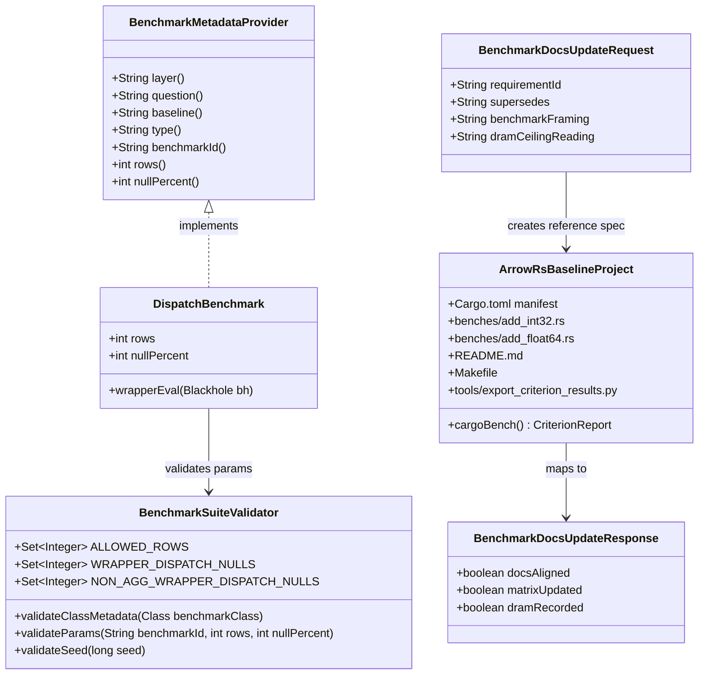

# Benchmark Suite Cleanup and Cargo Reference Realignment

## Requirements
Implement benchmark-governance cleanup that removes misleading in-process native baselines, reduces redundant JMH cells across kernel families, and establishes a reproducible out-of-process arrow-rs reference plus DRAM-ceiling context so published performance claims remain truthful, comparable, and operationally efficient.

## Entities

## Approach
1. Benchmark Topology Refactor:
   - Replace in-process JNI/FFM baseline with out-of-process `arrow-rs-baseline/` Criterion benchmarks on same host and matched dimensions.
   - Simplify JMH suite to active dispatch wrapper benchmarks plus infra sanity benchmark.
   - Preserve current simple benchmark metadata model (`BenchmarkMetadataProvider`, `benchmarkId`) and avoid introducing new registry abstractions.

2. Technical Implementation:
   - Delete `Native*` benchmark classes and FFM bridge classes from JMH source set; remove `Native` naming allowance from `BenchmarkSuiteValidator`.
   - Add Cargo subproject with stable toolchain, fixed seed (`0xC0FFEE`), row set `{1024, 16384, 65536, 1048576}`, cached inputs, and custom Criterion measurement formatting in `ops/ms`.
   - Use Makefile orchestration for native reference runs with fresh `target/criterion` cleanup and machine-readable export artifacts.

3. Business Logic and Governance:
   - Enforce truthful reporting: no fallback path that allocates exception DTOs in measured native benchmarks.
   - Enforce dispatch benchmark null profiles `{0, 30}` to reduce suite runtime and keep representative null behavior.
   - Update benchmark documentation (`BENCHMARKS.md`, requirement references) atomically with code changes and add one host-anchored DRAM ceiling value with interpretation formula.

## Structure

### Inheritance Relationships
1. `BenchmarkMetadataProvider` interface defines benchmark metadata contract.
2. `*DispatchBenchmark` classes implement `BenchmarkMetadataProvider`.
3. `BuildInfraBaselineInfraBenchmark` implements `BenchmarkMetadataProvider`.
4. `BenchmarkPolicyViolationException` extends `RuntimeException` class.

### Dependencies
1. `BenchmarkSupport` calls `BenchmarkSuiteValidator.validateTrial(...)` and `validateParams(...)`.
2. Dispatch benchmark classes depend on wrapper kernels only (e.g., `AddInt32`, `MulFloat64`, `DivInt32`, `SumInt64`, `StartsWithUtf8`).
3. Documentation artifacts (`BENCHMARKS.md`, `spdd_requirements/requirements/*.md`) depend on benchmark topology decisions from source code.

### Layered Architecture
1. Controller Layer: Not applicable for JMH runtime; entrypoint is benchmark class lifecycle (`@Setup`, `@Benchmark`, `@TearDown`).
2. Service Layer: Benchmark orchestration in benchmark classes, including data generation, invocation path, and result consumption.
3. Repository Layer: Not applicable; no persistence.
4. Data Access Layer: Arrow vectors and buffers for wrapper execution with per-invocation output allocation.
5. Exception Handling Layer: Centralized benchmark-policy exception mapping via `BenchmarkPolicyExceptionMapper` (GlobalExceptionHandler-equivalent governance role).

## Operations

### Create/Update Benchmark Module - Cargo Reference Subproject (`arrow-rs-baseline/`)
1. Responsibility: Provide out-of-process native reference results for int32/float64 add with matched benchmark dimensions.
2. Attributes:
   - `rows`: `u32[]` - `{1024, 16384, 65536, 1048576}`.
   - `seed`: `u64` - fixed `0xC0FFEE` reproducibility seed.
   - `singleThreaded`: `bool` - enforce single-thread execution path.
3. Methods:
    - `bench_add_int32(c: &mut Criterion) -> ()`
      - Logic:
        - Generate deterministic input arrays once per bench case.
        - Reuse cached inputs and run compute in `iter(...)` loop.
        - Call Arrow compute add and `black_box` output.
        - Repeat for all row sizes.
    - `bench_add_float64(c: &mut Criterion) -> ()`
      - Logic mirrors int32 benchmark with float64 data width.
    - `native_bench` / `native_bench BENCH=<name>` (Makefile target)
      - Logic:
        - Delete `target/criterion` before every run.
        - Run Criterion and stream to console.
        - Export `results/native_bench/latest/summary.json` and `summary.csv`.
4. Annotations: Criterion benchmark macros (`criterion_group!`, `criterion_main!`).
5. Constraints: Stable Rust only, no Gradle integration, manual reporting flow to `BENCHMARKS.md`.

### Create/Update Benchmark Class Family - Dispatch Benchmarks (`*DispatchBenchmark`)
1. Responsibility: Measure wrapper-level Arrow compute throughput with realistic output materialization.
2. Attributes:
   - `rows`: `int` - benchmark row matrix.
   - `nullPercent`: `int` - reduced profile `{0, 30}`.
3. Methods:
    - `wrapperEval(Blackhole bh): void`
      - Logic:
        - Allocate output vector inside measured method.
        - Execute wrapper path and consume output.
 4. Annotations: `@Benchmark`, `@Param`, `@Setup(Level.Trial)`.
 5. Constraints: No raw or smoke methods; output allocation must stay inside measured method.

### Create/Update Validator - `BenchmarkSuiteValidator`
1. Responsibility: Enforce benchmark naming and parameter policy after topology cleanup.
2. Attributes:
   - `ALLOWED_ROWS`: `Set<Integer>`.
   - `WRAPPER_DISPATCH_NULLS`: `Set<Integer>`.
   - `NON_AGG_WRAPPER_DISPATCH_NULLS`: `Set<Integer>`.
3. Methods:
    - `validateClassMetadata(Class<?> benchmarkClass): void`
      - Logic:
        - Accept only active layer naming (`Dispatch`, `Infra`).
    - `validateParams(String benchmarkId, int rows, int nullPercent): void`
      - Logic:
        - Keep row validation unchanged.
        - Enforce reduced dispatch null profiles `{0,30}`.
        - Keep infra constraint `nullPercent=0`.
4. Annotations: None.
5. Constraints: Backward-compatible with active dispatch and infra benchmark IDs.

### Create/Update Documentation Set - Benchmark Governance Docs
1. Responsibility: Align benchmark narrative and acceptance references with new topology.
2. Attributes:
   - `nativeFraming`: `String` - out-of-process arrow-rs reference language.
   - `dramCeiling`: `String` - measured host value + interpretation.
3. Methods:
   - `updateBenchmarksMd(): void`
     - Logic:
       - Remove any JMH-emitted `native_cpp_per_kernel` framing.
       - Keep explicit forbidden/allowed claim language.
       - Add measured DRAM section value and throughput conversion.
   - `updateRequirementCrossRefs(): void`
     - Logic:
       - Ensure supersession and baseline matrix links are correct (`12` superseded, stale references fixed).
4. Annotations: Markdown structure conventions.
5. Constraints: Documentation changes ship atomically with source changes.

### Create Exception Handler - BenchmarkPolicyExceptionMapper
1. Responsibility: Unified handling of benchmark policy exceptions for governance diagnostics.
2. Exception Types:
   - `BenchmarkPolicyViolationException`: policy and metadata violations.
   - `IllegalArgumentException`: invalid parameter matrix inputs.
   - `IllegalStateException`: benchmark runtime state issues.
3. Methods:
   - `map(BenchmarkPolicyViolationException): BenchmarkErrorResponse`
   - `map(IllegalArgumentException): BenchmarkErrorResponse`
4. Annotations: None (library-local mapper pattern).
5. Response Format: Stable `BenchmarkErrorResponse` with code/message/context.

## Norms
1. Annotation Standards: JMH benchmark classes must use explicit `@State(Scope.Thread)`, `@BenchmarkMode`, `@OutputTimeUnit`, `@Setup`, and `@TearDown`; Cargo benchmark uses Criterion macros.
2. Dependency Injection: No DI framework; construct dependencies explicitly in setup methods and keep lifetimes local to benchmark class.
3. Exception Handling:
   - Use unchecked exceptions (`BenchmarkPolicyViolationException`, `IllegalArgumentException`, `IllegalStateException`) with deterministic messages.
   - Custom exception classes include `errorCode` and `errorMessage` where policy-facing.
   - Keep centralized mapping through `BenchmarkPolicyExceptionMapper` and avoid per-row/per-iteration exception control flow.
   - Exclude exception-allocation fallback paths from measured benchmark methods.
4. Data Validation: Always validate `rows`, `nullPercent`, and `seed` via `BenchmarkSuiteValidator`/`BenchmarkSupport` before execution.
5. Logging: Keep benchmark path log-free in hot methods; diagnostics belong in setup/teardown or documentation.
6. Documentation Standards: Each benchmark must declare `layer`, `question`, `baseline`, and `benchmarkId`; docs must use truthful framing (`arrow-rs vectorized-interpreter reference`, not language-war claims).
7. Native Reference Run Standards: Run native benches via Makefile targets that clean `target/criterion` before execution and export latest summary artifacts.

## Safeguards
1. Functional Constraints: Remove all `Native*` JMH benchmark classes, all `apiCompute*` dispatch matrix methods, all `*RawBenchmark` classes, and all `dispatchSmoke` methods.
2. Performance Constraints: Preserve standard row matrix (`1024, 16384, 65536, 1048576`) and single-threaded execution; keep setup allocation outside timed methods in both JMH and Criterion.
3. Security Constraints: Do not load arbitrary native libraries via `arrowcompute.native.lib` in JMH path; no runtime symbol lookup in routine benchmark execution.
4. Integration Constraints: `arrow-rs-baseline/` must remain independent of Gradle and CI default JMH command; manual merge into `BENCHMARKS.md` is the approved integration mode.
5. Business Rule Constraints: Publish only same-host JVM-vs-arrow-rs comparisons with explicit interpretation against DRAM ceiling; forbidden claim is "Java faster than Rust/C++".
6. Exception Handling Constraints:
   - Business exceptions include clear error codes and messages.
   - Exception classification follows policy domain boundaries.
   - Exception responses expose no sensitive internals.
   - All benchmark-policy exceptions are centrally mapped by `BenchmarkPolicyExceptionMapper`.
7. Technical Constraints: Keep stable Rust toolchain compatibility; keep JMH metadata contract unchanged (`layer/question/baseline/benchmarkId`).
8. Data Constraints: Seed fixed to `0xC0FFEE`; deterministic input generation; dispatch null profiles fixed to `{0,30}`.
9. API Constraints: Benchmark IDs must remain parseable by validator rules and reporting scripts.
