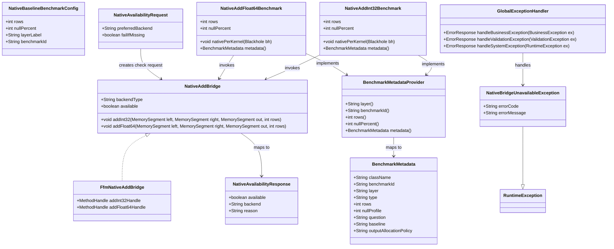

# Native Per-Kernel Baseline Benchmark (GGQPA-012)

## Requirements
Implement an optional native-per-kernel benchmark layer that truthfully measures whether JVM-native add kernels outperform JNI/FFM boundary-crossing native calls for `int32` and `float64` under the project benchmark matrix, while keeping all existing JVM benchmark workflows runnable without native artifacts.

## Entities

## Approach
1. Benchmark Layer Extension:
   - Add a native-per-kernel layer alongside existing `java_raw_vector`, `java_wrapper`, and `java_compute_dispatch` without changing current benchmark contracts.
   - Keep operation scope conservative: implement `AddInt32` first and add `AddFloat64` in the same pattern.
   - Preserve existing data structures (`BenchmarkMetadata`, `BenchmarkMetadataProvider`, row/null params) and avoid wrapper entities unless current types are insufficient.

2. Technical Implementation:
   - Use FFM downcall as MVP bridge (`Linker`, `SymbolLookup`, cached `MethodHandle`) because native-access runtime flags are already standardized.
   - Keep native integration optional: when symbols/libs are unavailable, skip native benchmarks with explicit reason while JVM suites continue to run.
   - Guarantee fair comparison through preallocated input/output buffers and identical row dimensions (`1024`, `16384`, `65536`, `1048576`) with `nullPercent=0` for native baseline.
   - Apply unified exception translation through `GlobalExceptionHandler` semantics (benchmark-level mapper for CLI/report artifacts) so failures are structured and non-ambiguous.

3. Business Logic:
   - Enforce scenario truthfulness: report only "JVM-native vs per-kernel boundary-crossing native" and forbid language-level superiority claims.
   - Include JNI/FFM boundary overhead in measured native numbers; never subtract marshalling/stub overhead.
   - Implement graceful fallback workflow: native unavailable -> emit deferred/skip artifact with reason and follow-up plan -> keep headline comparison status transparent.

## Structure

### Inheritance Relationships
1. `BenchmarkMetadataProvider` interface defines benchmark metadata contract.
2. `NativeAddInt32Benchmark` and `NativeAddFloat64Benchmark` implement `BenchmarkMetadataProvider`.
3. `FfmNativeAddBridge` implements `NativeAddBridge` interface.
4. `NativeBridgeUnavailableException` extends `RuntimeException` class.

### Dependencies
1. `NativeAddInt32Benchmark` calls `NativeAddBridge.addInt32(...)` and existing JVM add paths.
2. `NativeAddFloat64Benchmark` calls `NativeAddBridge.addFloat64(...)` and existing JVM add paths.
3. Benchmark classes depend on `BenchmarkSuiteValidator`, `BenchmarkProfiles`, and `BenchmarkSupport`.
4. Reporting layer depends on `BenchmarkMetadata` plus `GlobalExceptionHandler`/policy mapper for consistent error output.

### Layered Architecture
1. Controller Layer: Benchmark entrypoints and report-generation commands that orchestrate benchmark runs and publish comparison output.
2. Service Layer: Native bridge selection, availability checks, and benchmark scenario execution policy.
3. Repository Layer: Benchmark metadata emission and result persistence (JSON lines/markdown report artifacts).
4. Data Access Layer: FFM/JNI symbol binding and native function invocation over preallocated memory segments.
5. Exception Handling Layer: `GlobalExceptionHandler`-style unified mapping of validation/business/system failures into stable error payloads.

## Operations

### Create/Update Interface - NativeAddBridge
1. Responsibility: Provide minimal stable contract for boundary-crossing native add kernels.
2. Attributes:
   - `backendType`: `String` - active backend label (`ffm`, `jni`).
   - `available`: `boolean` - runtime availability state.
3. Methods:
   - `addInt32(MemorySegment left, MemorySegment right, MemorySegment out, int rows): void`
     - Logic:
       - Validate non-null segments and `rows >= 0`.
       - Invoke cached native symbol handle with direct segment addresses.
       - Throw `NativeBridgeUnavailableException` when bridge is disabled/unresolved.
   - `addFloat64(MemorySegment left, MemorySegment right, MemorySegment out, int rows): void`
     - Logic:
       - Mirror `addInt32` flow with `double` byte-size conventions.
       - Reuse same availability and error policy.
   - `availability(NativeAvailabilityRequest request): NativeAvailabilityResponse`
     - Logic:
       - Return backend status and machine-readable reason for missing artifact/symbol.
4. Annotations: None for raw bridge; keep final/static patterns where possible.
5. Constraints: No per-call allocation, no mutable shared global state in hot path, no input mutation.

### Implement Service - FfmNativeAddBridge
1. Interface Definition: Implements `NativeAddBridge` using FFM `Linker` and cached `MethodHandle` downcalls.
2. Core Methods:
   - `addInt32(...)` / `addFloat64(...): void`
      - Input Validation: Ensure byte-size matches `rows * elementSize`, ensure little-endian assumptions remain valid.
      - Business Logic:
        - Resolve native library once during setup.
        - Resolve symbols (`add_int32_array`, `add_float64_array`) once and cache handles.
        - Downcall with raw segment addresses and row count.
      - Exception Handling:
        - Wrap symbol/link failures in `NativeBridgeUnavailableException` with deterministic error codes.
        - Convert invocation failures to `ArithmeticException` or `IllegalStateException` based on failure domain.
      - Return Value: `void`, output written to preallocated `out` segment.
3. Dependency Injection: Constructor injection for linker/symbol resolver; default factory for production setup.
4. Transaction Management: Not applicable; setup/teardown lifecycle scoped to benchmark trial.

### Create/Update Benchmark - NativeAddInt32Benchmark
1. Responsibility: Measure `int32-add` across Java layers and `native_cpp_per_kernel` in one comparable suite.
2. Attributes:
   - `rows`: `int` - benchmark dimension.
   - `nullPercent`: `int` - fixed `0` for native baseline MVP.
   - `left`, `right`, `out`: `MemorySegment`/Arrow buffers - preallocated trial data.
3. Methods:
   - `setUp(): void`
     - Logic:
       - Validate params through `BenchmarkSupport.validateTrial` and `BenchmarkSuiteValidator`.
       - Prepare deterministic input data with required seed.
       - Initialize bridge availability state.
   - `nativePerKernel(Blackhole bh): void`
     - Logic:
       - Skip with structured reason if native unavailable.
       - Invoke `NativeAddBridge.addInt32(...)` and consume output.
       - Keep measurement limited to steady-state call path.
   - `metadata(): BenchmarkMetadata`
     - Logic:
       - Emit `layer="native-per-kernel"`, `benchmarkId="add-int32-native-per-kernel"`, baseline note that boundary overhead is included.
4. Annotations: `@State(Scope.Thread)`, `@BenchmarkMode(Mode.Throughput)`, `@OutputTimeUnit`, `@Param`.
5. Constraints: No output allocation in measured method; enforce rows matrix and null profile policy.

### Create/Update Benchmark - NativeAddFloat64Benchmark
1. Responsibility: Mirror `int32` scenario for `float64-add` representativeness.
2. Attributes:
   - Same shape as `NativeAddInt32Benchmark` with `double` data layout.
3. Methods:
   - `nativePerKernel(Blackhole bh): void`
     - Logic:
       - Invoke `NativeAddBridge.addFloat64(...)` with same lifecycle and skip policy.
   - `metadata(): BenchmarkMetadata`
     - Logic:
       - Emit `benchmarkId="add-float64-native-per-kernel"` and consistent interpretation labels.
4. Annotations: Same JMH annotations/pattern as existing benchmark classes.
5. Constraints: IEEE-754 behavior accepted; no nullable native profile in MVP.

### Create Exception Handler - GlobalExceptionHandler
1. Responsibility: Unified handling for benchmark generation/execution/reporting exceptions.
2. Exception Types:
   - `BusinessException`: policy violations and unsupported benchmark composition.
   - `ValidationException`: invalid rows/null profile/backend selection.
   - `SystemException`: native link/load/invocation failures.
3. Methods:
   - `handleBusinessException(BusinessException): ResponseEntity<ErrorResponse>`
   - `handleValidationException(ValidationException): ResponseEntity<ErrorResponse>`
   - `handleSystemException(RuntimeException): ResponseEntity<ErrorResponse>`
4. Annotations: `@RestControllerAdvice`, `@ExceptionHandler` when exposed via service endpoint; otherwise equivalent mapper in CLI pipeline.
5. Response Format: `{errorCode, errorMessage, context, timestamp}` with no sensitive internals.

### Create Business Exception - NativeBridgeUnavailableException
1. Inheritance: extends `RuntimeException` (or project `BusinessException` base if present).
2. Attributes:
   - `errorCode`: `String` - e.g., `NATIVE-BRIDGE-001`.
   - `errorMessage`: `String` - reason such as unresolved symbol/library missing.
3. Constructors: `(errorCode, errorMessage)`, `(errorCode, errorMessage, cause)`, `(errorMessage)`.
4. Usage Scenarios: throw when native backend cannot be initialized or invoked in optional mode.

## Norms
1. Annotation Standards: JMH benchmarks use `@State(Scope.Thread)`, explicit `@Param` rows/null profiles, and lifecycle annotations with deterministic setup/teardown.
2. Dependency Injection: Bridge selection uses constructor/factory injection; avoid service locators and global mutable registries.
3. Exception Handling:
   - Define `NativeBridgeUnavailableException` and related policy exceptions by domain.
   - Business exceptions include `errorCode` and `errorMessage`, with multi-constructor support.
   - Emit unified `ErrorResponse` payload for report tooling.
   - Track failures through structured logs and benchmark metadata.
4. Data Validation: Enforce rows in `{1024,16384,65536,1048576}`, null profile `0` for native MVP, seed `0xC0FFEEL`, and output preallocation checks.
5. Logging: Log backend detection, symbol resolution, skip/defer reasons, and comparison interpretation notice; never log per-row data.
6. Documentation Standards: Every native benchmark class documents scenario intent, included overhead rule, non-goals, and forbidden interpretation claims.

## Safeguards
1. Functional Constraints: Implement native per-kernel baseline for at least `AddInt32`; `AddFloat64` follows same contract or is explicitly deferred with written follow-up plan.
2. Performance Constraints: Measured method performs zero dynamic allocation and reports throughput for 1K/16K/64K/1M rows with repeatable seed.
3. Security Constraints: Native loading paths are explicit and controlled; exception payloads must not expose absolute paths, memory addresses, or internal linker details.
4. Integration Constraints: Native backend is optional; absence of native artifacts must not fail existing JVM-only benchmark suites.
5. Business Rule Constraints: All reports must state that native-boundary overhead is included and must avoid "Java faster than C++" claims.
6. Exception Handling Constraints:
   - Business exceptions include clear error codes and messages.
   - Exception types are classified by benchmark/business domain.
   - Exception responses exclude sensitive internals.
   - All business exceptions are handled by `GlobalExceptionHandler` or equivalent central mapper.
7. Technical Constraints: Preserve existing benchmark entities and metadata model; avoid unnecessary refactoring or new wrapper entities when current structures suffice.
8. Data Constraints: Use preallocated Arrow/segment buffers, keep little-endian assumptions explicit, and maintain deterministic input generation.
9. API Constraints: Metadata labels must use canonical layer names (`java_raw_vector`, `java_wrapper`, `java_compute_dispatch`, `native_cpp_per_kernel`) and stable benchmark IDs.
