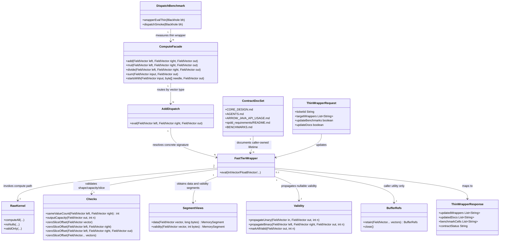

# Arrow-rs Peer Positioning and Caller-Owned Buffer Contract

## Requirements
Implement a thin-wrapper contract that aligns this JVM compute layer with arrow-rs/arrow-cpp by shifting buffer lifetime ownership to callers, removing structural wrapper overhead, and synchronizing architecture docs, Javadocs, and benchmarks around that contract without changing raw kernels.

## Entities

## Approach
1. Contract Realignment:
   - Reframe the wrapper layer from safety-owner to thin execution boundary matching arrow-rs/arrow-cpp lifetime semantics.
   - Preserve current facade/dispatch/wrapper/raw layering and move responsibility boundary only where required.
   - Keep existing data structures (`FieldVector` facade, concrete wrappers, shared helpers) and prohibit unnecessary entity redesign.

2. Technical Implementation:
   - Keep `Compute` and dispatch ergonomic at `FieldVector`, but enforce concrete typed `eval(...)` signatures for wrappers.
   - Remove wrapper-internal retain/release and all-valid eager writes on no-null paths; rely on Arrow lazy-validity semantics (`null_count == 0`) where validity bytes are unspecified.
   - Use allocation-free checks and amortized segment extraction at wrapper entry; ensure no `MemorySegment` escape.
   - Add global error consistency via existing `Errors` conventions and centralized wrapper boundary checks; no `GlobalExceptionHandler` is introduced in this JVM library layer.

3. Business Logic and Validation:
   - Enforce caller-owned lifetime as the single source of truth across Javadocs, foundation docs, and benchmark narratives.
   - Preserve valid-only behavior for domain-error kernels (precheck-before-loop on active rows) and nullable validity propagation.
   - Validate completion through benchmark cell updates (`wrapperEvalThin`/`dispatchSmoke`) and acceptance-criteria coverage across required docs.

## Structure

### Inheritance Relationships
1. `Compute` final class defines static public compute API facade behavior.
2. Dispatch classes (`AddDispatch`, `MulDispatch`, `DivideDispatch`, `AggregateDispatch`, `StartsWithDispatch`) provide explicit routing contracts.
3. Fast-tier wrapper classes (`AddInt32`, `MulFloat64`, `DivInt32`, `StartsWithUtf8`, `SumInt64`) remain final and own wrapper boundary logic.
4. `Errors` helper continues unchecked exception creation (`IllegalArgumentException`, `ArithmeticException`, `UnsupportedOperationException`) for boundary and domain violations.

### Dependencies
1. `Compute` calls dispatch classes and keeps external API stable.
2. Dispatch classes depend on Arrow vector type checks and invoke concrete wrappers.
3. Wrappers depend on `Checks`, `Validity`, `SegmentViews`, and raw kernels; wrappers no longer depend on `BufferRefs` on the hot path.
4. Benchmarks depend on wrappers/dispatch and measure thin-wrapper behavior explicitly.
5. Foundation docs depend on SPDD contract and must stay synchronized in one change set.

### Layered Architecture
1. Facade Layer: Exposes stable `Compute.*` APIs for engine/library callers.
2. Dispatch Layer: Converts polymorphic facade inputs into monomorphic wrapper entry calls.
3. Wrapper Layer: Validates inputs, manages null policy, builds short-lived segments, invokes raw kernels.
4. Raw Kernel Layer: Arrow-free primitive compute loops (`computeAll`, `noNulls`, `validOnly`) unchanged by this requirement.
5. Documentation/Governance Layer: Maintains architectural truth across SPDD docs, API Javadocs, and benchmark framing.

## Operations

### Update Facade API - `Compute`
1. Responsibility: Document caller-owned lifetime contract on all public methods while preserving current signatures.
2. Attributes:
   - `left/right/input/out`: `FieldVector` - caller-owned vectors that must remain live during call.
3. Methods:
   - `add(FieldVector, FieldVector, FieldVector): void`
   - `mul(FieldVector, FieldVector, FieldVector): void`
   - `divide(FieldVector, FieldVector, FieldVector): void`
   - `sum(FieldVector, FieldVector): void`
   - `startsWith(FieldVector, byte[], FieldVector): void`
     - Logic:
       - Keep null checks and current dispatch invocation behavior.
       - Add Javadoc contract: wrapper does not retain; caller owns buffer lifetime for full call.
       - Cite arrow-rs/arrow-cpp equivalent contract in each method-level Javadoc block.
4. Annotations: None required; keep existing static utility style.
5. Constraints: No signature change, no new options object, no safe-mode API introduced.

### Update Fast-Tier Wrappers - Concrete `eval(...)`
1. Responsibility: Convert wrappers to thin-path runtime behavior while preserving kernel semantics.
2. Attributes:
   - `n`: `int` - validated row count.
   - `byteSize`: `long` - computed data bytes per call.
3. Methods:
   - `eval(IntVector left, IntVector right, IntVector out): void` (and equivalent typed wrappers)
     - Logic:
       - Validate value counts and capacity with allocation-free checks.
        - Validate zero-slice offsets with arity-specific `Checks.zeroSliceOffset(...)` overloads (`unary`, `binary`, `ternary`) to avoid varargs allocations on wrapper hot paths.
       - Remove `try (var refs = BufferRefs.retain(...))` from wrapper hot path.
        - If all inputs have `null_count == 0`, skip validity writes (`Validity.markAllValid` and propagation are not invoked).
       - Else propagate validity with `Validity.propagateBinary/Unary`.
       - Extract segments once per call path and invoke raw kernel.
       - Set `out.setValueCount(n)` as the final wrapper step.
       - Keep precheck-before-loop behavior for valid-only kernels (divide, checked ops).
4. Annotations: None required.
5. Constraints: No raw-kernel API change, no per-call allocation in checks path, no segment escape.

### Update Shared Memory Utilities - `Checks`, `BufferRefs`, `Validity`, `SegmentViews`
1. Responsibility: Support thin wrapper contract with minimal structural changes and backward compatibility.
2. Attributes:
   - `vectors`: vector references for validation/retain usage.
   - `validityBytes`: integer byte size for bitmap operations.
3. Methods:
   - `Checks.zeroSliceOffset(...)`
     - Logic: replace varargs-only call patterns in wrappers with arity-specific overloads (`unary`, `binary`, optional `ternary`) to avoid temporary arrays.
   - `BufferRefs.retain(...)`
     - Logic: keep public utility behavior unchanged for callers and benchmarks requiring explicit retain/release pairing.
   - `Validity.markAllValid(...)`
     - Logic: keep utility available but ensure wrappers no longer invoke it on happy path.
   - `SegmentViews.data/validity(...)`
     - Logic: maintain centralized `MemorySegment.ofAddress(...).reinterpret(...)` usage and no-escape lifetime rule.
4. Annotations: None required.
5. Constraints: Preserve backward compatibility for existing external callers of `BufferRefs`.

### Update Benchmarks - Fast-Tier Dispatch Benchmarks
1. Responsibility: Measure thin-wrapper performance and preserve de-monomorphization tripwire coverage.
2. Attributes:
   - `rows`: benchmark row dimension.
   - `nullPercent`: null profile.
3. Methods:
   - `wrapperEvalThin(Blackhole bh): void`
     - Logic: execute thin-wrapper path under the same setup constraints as existing benchmark cells.
   - `dispatchSmoke(Blackhole bh): void`
     - Logic: keep one large-row no-null dispatch tripwire per dispatch benchmark.
4. Annotations: existing JMH annotations remain (`@Benchmark`, `@State`, `@Param`, etc.).
5. Constraints: Benchmark naming and reporting must distinguish thin-wrapper metric from legacy comparison cells when both exist.

### Update Foundation and Requirement Docs - Contract Alignment Set
1. Responsibility: Land all listed doc amendments atomically to keep architecture truth consistent.
2. Methods:
   - Update `CORE_DESIGN.md` sections named by acceptance criteria.
   - Update `AGENTS.md` caller-lifetime framing and invariants.
   - Update `ARROW_JAVA_API_USAGE.md` memory-management and slow-tier contract notes.
   - Update `spdd_requirements/README.md` core constraints bullets.
   - Update `spdd_requirements/requirements/11-bench-cleanup-and-cargo-reference.md` forward reference and framing footnote.
   - Keep `spdd_requirements/requirements/12-native-baseline.md` superseded notice unchanged.
3. Constraints: Raw kernels remain out of scope for behavior changes; wrapper and benchmark updates are allowed only to realize the thin-wrapper caller-owned-lifetime contract.

## Norms
1. Annotation Standards: Keep compute/wrapper/memory classes as plain final/static Java classes; use JMH annotations only in benchmark packages.
2. Dependency Injection: No DI framework; direct static dispatch and explicit helper invocation only.
3. Exception Handling:
   - Use existing `Errors` helper contracts and unchecked exceptions by category.
   - Include first-offender row index for domain errors where precheck determines row.
   - Do not expose allocator internals or memory addresses in public exception messages.
   - Enforce wrapper boundary checks before raw-kernel calls.
4. Data Validation: Always validate count parity, output capacity, and slice offset before compute; validate active-row domain constraints for valid-only kernels.
5. Logging: No logging in hot path; diagnostics remain benchmark reports and explicit test assertions.
6. Documentation Standards: Every `Compute.*` and fast-tier wrapper `eval(...)` must state caller-owned lifetime, non-retain behavior, null policy, and aliasing assumptions.
7. Wrapper Lifetime Discipline: Wrappers do not open per-call retain/release scopes; explicit retain/release pairing is caller-owned and optional via `BufferRefs` utility.

## Safeguards
1. Functional Constraints: Wrapper behavior must preserve current compute semantics and null propagation while shifting lifetime ownership to callers.
2. Performance Constraints: Wrapper path must remove per-call retain/release, avoid eager all-valid writes on no-null path, and remove varargs/collection allocations in checks.
3. Security Constraints: Contract docs and errors must avoid leaking sensitive allocator/system details; keep error detail to operation/type/row index only.
4. Integration Constraints: Public `Compute` signatures remain unchanged; external callers must not need refactor unless they relied on implicit wrapper retention side effects.
5. Business Rule Constraints: Project positioning remains arrow-rs peer and JVM-tax probe framing; do not introduce "Java faster than Rust/C++" claims.
6. Exception Handling Constraints:
   - Business/domain exceptions include deterministic first offender row when applicable.
   - Unsupported type combinations throw `UnsupportedOperationException` via dispatch helpers.
   - Validation failures throw `IllegalArgumentException`; checked numeric/domain failures throw `ArithmeticException`.
   - Wrappers perform precheck-before-loop and never throw per-row from hot inner loops.
7. Technical Constraints: Raw kernels are out of scope for modification; no registry/UDF/safe-mode API addition in this iteration.
8. Data Constraints: `null_count == 0` path relies on Arrow IPC lazy validity semantics; validity buffer contents are unspecified and must not be consumed without null-count guard.
9. API Constraints: Wrapper entry methods remain concrete vector typed; polymorphism is allowed at facade only and prohibited in wrapper-to-raw hot path.
