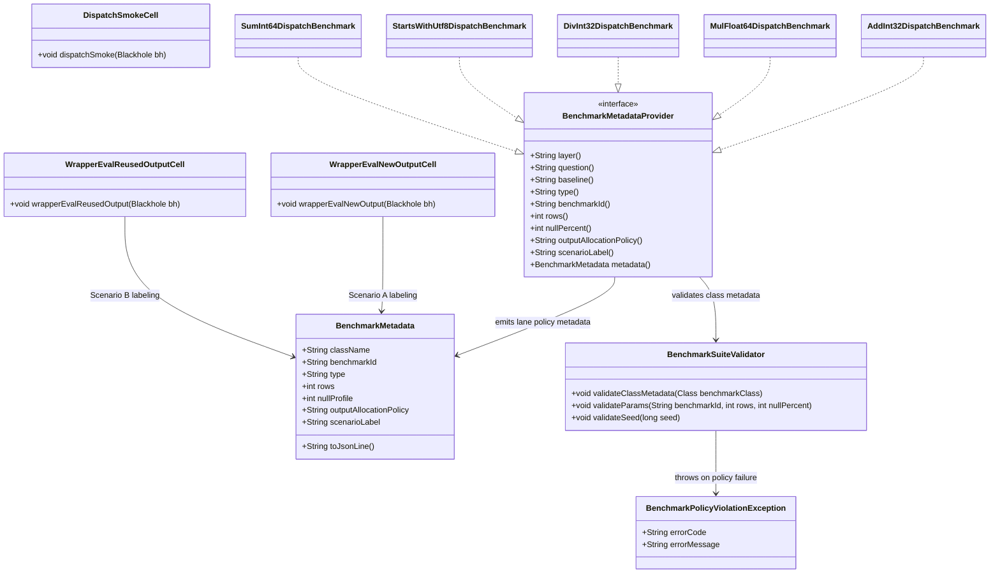

# Dual Output-Allocation Wrapper Benchmark Cells

## Requirements
Implement dual-scenario fast-tier wrapper benchmarking that reports both per-call output allocation fairness against arrow-rs and caller-reused output realism for JVM engine usage, while keeping benchmark architecture and non-benchmark compute code unchanged.

## Entities

## Approach
1. Benchmark Lane Standardization:
   - Convert each fast-tier `*DispatchBenchmark` from one generic wrapper lane (`wrapperEvalThin`) to two explicit lanes: `wrapperEvalNewOutput` and `wrapperEvalReusedOutput`.
   - Keep current JMH configuration (`@State`, `@Param`, warmup, measurement, fork) and input setup intact so allocation policy is the only measured variable.
   - Use naming as policy enforcement so future runs stay grep-friendly and interpretation-safe.

2. Technical Implementation:
   - Implement scenario A by allocating and closing output inside the measured method; implement scenario B by trial-level preallocation and per-invocation reuse.
   - Preserve identical `Blackhole` consumption and wrapper invocation shape across both lanes to avoid benchmark contamination.
   - Keep integration localized to benchmark classes and `BENCHMARKS.md`; do not change wrapper/raw/`Compute.*` behavior.
   - Handle benchmark governance exceptions through centralized policy documentation updates rather than ad-hoc class-level commentary; if benchmark validation tooling exists, route violations through the same global validation path used by benchmark metadata checks.

3. Business Logic:
   - Enforce fairness: only per-call allocation lane is compared directly to arrow-rs.
   - Enforce value proposition visibility: reused-output lane is always published for contract-realistic JVM usage.
   - Enforce semantics: reused lane must not call manual reset APIs; wrapper-defined `setValueCount`/null-state behavior is the source of truth.

## Structure

### Inheritance Relationships
1. `BenchmarkMetadataProvider` interface defines benchmark identity and reporting metadata contract.
2. Each `*DispatchBenchmark` class implements `BenchmarkMetadataProvider`.
3. Existing benchmark state classes remain concrete JMH `@State(Scope.Thread)` models; no new base class hierarchy is introduced.
4. Policy validation is centralized in `BenchmarkSuiteValidator`, and policy breaches flow through unchecked `BenchmarkPolicyViolationException`.

### Dependencies
1. `*DispatchBenchmark` calls wrapper entrypoints (`AddInt32.eval`, `MulFloat64.eval`, `DivInt32.eval`, `StartsWithUtf8.eval`, `SumInt64.eval`) in both wrapper lanes.
2. `dispatchSmoke` depends on `Compute.*` facade calls and reuses the same input vectors.
3. `*DispatchBenchmark` depends on Arrow allocators/vectors (`RootAllocator`, `BufferAllocator`, `FieldVector`) and `BufferRefs` lifetime management.
4. Benchmark report generation depends on `BenchmarkMetadataProvider.metadata()` / `BenchmarkMetadata.toJsonLine()` and `BENCHMARKS.md` reporting-rule contract including output allocation policy and scenario label fields.
5. Benchmark metadata and policy validation depend on `BenchmarkSuiteValidator.validateClassMetadata(...)`, `validateParams(...)`, and `validateSeed(...)`.

### Layered Architecture
1. Benchmark Entry Layer: JMH benchmark methods (`wrapperEvalNewOutput`, `wrapperEvalReusedOutput`, `dispatchSmoke`) define executable lanes.
2. Benchmark State Layer: `@Setup(Level.Trial)` (`setUp`) prepares input vectors and reused output state; `@TearDown(Level.Trial)` (`tearDown`) releases retained buffers and allocators.
3. Wrapper Invocation Layer: operation-specific wrapper classes execute core compute logic over prepared vectors.
4. Dispatch Validation Layer: `Compute.*` smoke lane verifies public dispatch path regression safety.
5. Benchmark Governance Layer: `BENCHMARKS.md` codifies scenario labels, reporting requirements, anti-pattern bans, and SPDD-14 traceability.

## Operations

### Update Benchmark Class Pattern - Fast-Tier `*DispatchBenchmark`
1. Responsibility: expose two explicit wrapper allocation-policy lanes per dispatch benchmark while preserving existing dimensions and setup behavior.
2. Attributes:
   - `rows`: `int` - JMH row-count parameter (`1024`, `16384`, `65536`, `1048576`).
   - `nullPercent`: `int` - JMH null-profile parameter (`0`, `30`).
   - `left`, `right`: operation-specific input vectors prepared in trial setup.
   - `reusedOut`: operation-specific output vector preallocated once for reused lane (`rows` for vector-vector/string startsWith; `1` for aggregate `sum-int64`).
3. Methods:
   - `setUp()`: `void` (`@Setup(Level.Trial)`)
      - Logic:
        - Initialize allocators and input vectors.
        - Populate deterministic values and validity according to existing `BenchmarkSupport.isValidAt` policy.
        - Run `BenchmarkSupport.validateTrial(this, SEED)` to enforce param and seed policy.
        - Retain input buffers via existing `BufferRefs` helper.
        - Allocate `reusedOut` once at trial scope for scenario B.
    - `wrapperEvalNewOutput(Blackhole bh)`: `void`
      - Logic:
        - Construct output vector inside method via `try-with-resources`.
        - Call `allocateNew(rows)` and wrapper `eval(...)`.
        - `bh.consume(out)` and close output in method scope.
        - No behavior differences besides allocation policy.
   - `wrapperEvalReusedOutput(Blackhole bh)`: `void`
     - Logic:
        - Reuse trial-scoped `reusedOut` without allocation/close in measured method.
        - Invoke same wrapper `eval(...)`.
        - `bh.consume(reusedOut)`.
        - Do not call `reset`, `clear`, manual zero-fill, or manual null-count correction.
    - `dispatchSmoke(Blackhole bh)`: `void`
      - Logic:
        - Execute only at `rows == 1048576 && nullPercent == 0`; otherwise return.
        - Allocate output in method scope and call corresponding `Compute.*` facade as a dispatch regression smoke check.
    - `tearDown()`: `void` (`@TearDown(Level.Trial)`)
      - Logic:
        - Close retained refs, vectors (including `reusedOut`), child allocator, root allocator.
4. Annotations: keep existing `@State`, `@BenchmarkMode`, `@OutputTimeUnit`, `@Param`, `@Setup(Level.Trial)`, `@TearDown(Level.Trial)`, `@Benchmark`.
5. Constraints: retire method name `wrapperEvalThin`; no benchmark class may keep generic `wrapperEval` naming.
6. Parameter Constraints: enforce `rows in {1024, 16384, 65536, 1048576}` and `nullPercent in {0, 30}` for dispatch benchmarks.

### Update Benchmark Documentation - `BENCHMARKS.md`
1. Responsibility: make output-allocation policy a mandatory reporting dimension with unambiguous scenario semantics.
2. Core Updates:
   - Wrapper benchmark section explicitly lists both lanes and policy definitions.
   - Add/maintain dedicated output-allocation policy subsection with fairness-vs-contract framing and SPDD-14 reference.
   - Reporting rules require `output allocation policy ({per-call|reused})` field in published results.
   - Anti-pattern section bans publishing a single unlabeled wrapper number when API supports reuse.
   - Roadmap phase references dual-lane claims and policy-dependent interpretation.
   - Native reference clarifies arrow-rs per-call-by-design and no scenario-B native equivalent.
3. Exception Handling: documentation inconsistency is treated as benchmark-governance failure and must block claim publication.
4. Return Value: updated benchmark policy doc that supports direct implementation and review.

### Implement Reporting Contract Update - Benchmark Result Artifacts
1. Interface Definition: benchmark reporting output (table, markdown, JSON, CI artifact) must carry lane-level metadata.
2. Core Fields:
   - `className`, `benchmarkId`, `layer`, `type`, `rows`, `nullProfile`, `question`, `baseline`, `outputAllocationPolicy`, `scenarioLabel`.
   - `outputAllocationPolicy` / `scenarioLabel` defaults for dispatch benchmarks are `per-call|reused` and `Scenario A + Scenario B`.
3. Validation Logic:
   - Reject publication if one of the two required wrapper lanes is missing for a fast-tier dispatch benchmark.
   - Reject publication if lane names are ambiguous or deviate from locked naming.
   - Validate metadata and lane policy via `BenchmarkSuiteValidator` before generating headline claim text.
4. Transaction Boundary: apply checks at report-generation stage before headline claim text is emitted.

### Create Governance Exception Mapping - Benchmark Policy Violations
1. Inheritance: use existing unchecked benchmark policy exception flow with `BenchmarkPolicyViolationException`.
2. Attributes:
   - `errorCode`: `String` - policy code such as `BENCH_POLICY_AMBIGUOUS_WRAPPER_LANE`, `BENCH_POLICY_MISSING_NEW_OUTPUT_LANE`, `BENCH_POLICY_MISSING_REUSED_OUTPUT_LANE`, `BMK-NAMING-001`, `BMK-SEED-004`.
   - `errorMessage`: `String` - clear policy breach description with benchmark id.
3. Usage Scenarios:
   - Missing `wrapperEvalReusedOutput` lane.
   - Missing output-allocation metadata field in report.
   - Non-compliant method naming that hides scenario semantics.

## Norms
1. Annotation Standards: benchmark classes keep current JMH annotation model; no lane-specific forks/warmup divergence.
2. Dependency Injection: none; construct Arrow allocators/vectors explicitly in trial setup for deterministic state.
3. Exception Handling:
   - Use unchecked policy/validation failures in benchmark tooling via `BenchmarkPolicyViolationException`.
   - Include `errorCode` and `errorMessage` and map them through a single benchmark-report failure path.
   - Do not expose internal filesystem or environment-sensitive details in published errors.
4. Data Validation: validate rows/null params and enforce both lane presence for every fast-tier dispatch benchmark class.
5. Logging: emit concise lane-level metadata (`benchmarkId`, `rows`, `nullPercent`, `outputAllocationPolicy`) for every reported result.
6. Documentation Standards: every benchmark policy change touching scenario interpretation must reference SPDD 14 and update both wrapper benchmark and reporting-rule sections.

## Safeguards
1. Functional Constraints: fast-tier dispatch benchmarks must expose exactly two wrapper allocation-policy lanes plus existing `dispatchSmoke` lane.
2. Performance Constraints: in reused lane, zero output allocation and zero output close operations are allowed inside measured method; per-call lane must allocate each invocation.
3. Security Constraints: benchmark outputs and policy exceptions must not leak host-specific secrets, credentials, or internal paths beyond repo-relative identifiers.
4. Integration Constraints: no changes to raw kernels, wrapper internals, `Compute.*` facade, or slow-tier benchmark policy under this requirement.
5. Business Rule Constraints: apples-to-apples external claims must use scenario A; contract-value claims must use scenario B; both must be published together.
6. Exception Handling Constraints:
    - Policy-validation failures must include explicit error code and actionable message.
    - Exception classification must distinguish benchmark-policy violations from runtime compute errors.
    - Error text must avoid sensitive internal details.
    - All policy failures must be handled by unified validation (`BenchmarkSuiteValidator`) before publication.
7. Technical Constraints: keep dimension grid fixed (`rows` set and `nullPercent` set unchanged) and keep identical JMH settings between lanes.
8. Data Constraints: input vectors are trial-prepared and reused identically across lanes; reused output state relies exclusively on wrapper semantics (`setValueCount`, null-state updates).
9. API Constraints: method names must be `wrapperEvalNewOutput` and `wrapperEvalReusedOutput`; ambiguous aliases are prohibited.
