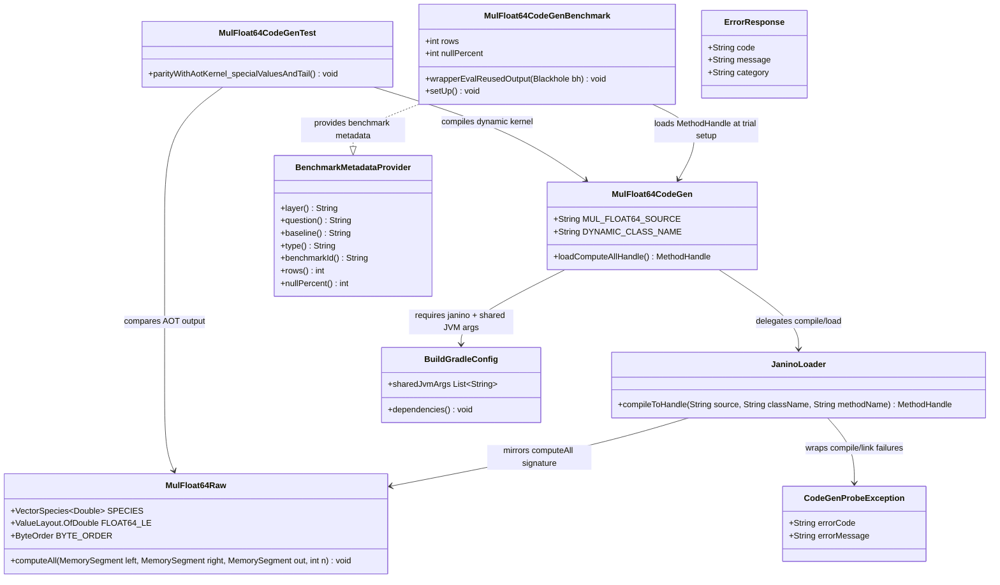

# Janino Runtime-Codegen Feasibility Probe for MulFloat64

## Requirements
Implement a probe-only runtime codegen path that compiles and executes a VectorAPI-backed `MulFloat64` kernel in-process, so the team can make an evidence-based fusion-architecture decision (Janino vs alternatives) without changing current AOT compute behavior.

## Entities

## Approach
1. Probe-Scope Runtime Codegen:
   - Add `compute.codegen` as an isolated package parallel to `raw`/`wrapper` to avoid touching public `Compute.*` and existing dispatch paths.
   - Keep the dynamic class source as a verbatim `MulFloat64Raw` body copy to test Janino+VectorAPI compatibility directly, not a template engine.
   - Use a single narrow loader contract returning `MethodHandle` for hot-path-friendly invocation and minimal architectural surface.

2. Technical Implementation:
   - Use `org.codehaus.janino.SimpleCompiler` (`cook(String)`) in `@Setup(Level.Trial)` so compile/classload cost is excluded from throughput measurement.
   - Add Janino in `testRuntimeOnly` and JMH runtime scope first; keep shipping surface unchanged; do not move to `implementation` unless a later SPDD introduces a main-scope codegen API.
   - Reuse existing `sharedJvmArgs` for Vector API module readability continuity; no probe-specific JVM flags.
   - Exception handling strategy: route probe failures through existing project global exception pattern (`GlobalExceptionHandler` + `ErrorResponse`), while hot-path wrappers continue using unchecked `Errors.*` factories.

3. Business Logic and Decision Signal:
   - Validate two outcomes independently: (a) binary feasibility (Janino accepts `jdk.incubator.vector` imports and class links) and (b) steady-state throughput delta vs AOT baseline.
   - Enforce fidelity with a parity test on special float values (`NaN`, `+Inf`, `-Inf`, `-0.0`) and tail length cases to detect source-string drift.
   - Report decision-grade outputs: explicit yes/no feasibility line and one comparable throughput row (`rows=1048576`, `nullPercent=0`, reused output).

## Structure

### Inheritance Relationships
1. `BenchmarkMetadataProvider` interface defines benchmark metadata contract.
2. `MulFloat64CodeGenBenchmark` implements `BenchmarkMetadataProvider`.
3. `RuntimeException` is the base class for domain exceptions (`SystemException`, `BuildConstraintException`, `StartsWithBusinessException`), and probe failures follow this unchecked model.
4. `DefaultGlobalExceptionHandler` implements `GlobalExceptionHandler` for unified error mapping into `ErrorResponse`.
5. `CodeGenProbeException` extends `RuntimeException` and carries stable `errorCode` + `errorMessage` for compile/link diagnostics.

### Dependencies
1. `MulFloat64CodeGen` calls `JaninoLoader` to compile source and resolve `computeAll` handle.
2. `MulFloat64CodeGenBenchmark` depends on `MulFloat64CodeGen`, Arrow vectors/allocators, benchmark support utilities, and memory precheck/segment helpers (`Checks`, `SegmentViews`, `BufferRefs`).
3. `MulFloat64CodeGenTest` depends on `MulFloat64CodeGen` and `MulFloat64Raw` for byte-level output parity assertions.
4. Build layer depends on `janino` in non-shipping scopes (`testRuntimeOnly` + `jmhRuntimeOnly`), with `compileOnly` used for main-source compile wiring.

### Layered Architecture
1. API Surface Layer: existing `Compute` facade remains unchanged (no codegen integration in this probe).
2. Codegen Probe Layer: `MulFloat64CodeGen` + `JaninoLoader` compile and expose dynamic kernel entry point.
3. Raw Kernel Layer: `MulFloat64Raw` remains the canonical AOT baseline and source-of-truth behavior.
4. Benchmark/Test Layer: JMH probe benchmark and parity test validate feasibility and correctness.
5. Exception Handling Layer: existing `GlobalExceptionHandler`/`DefaultGlobalExceptionHandler` maps probe/build-time failures for diagnostic consistency.

## Operations

### Create Codegen Component - `MulFloat64CodeGen`
1. Responsibility: own immutable Java source string and expose a single public loader entry point.
2. Attributes:
   - `MUL_FLOAT64_SOURCE`: `String` - verbatim dynamic class source containing `SPECIES`, `FLOAT64_LE`, `BYTE_ORDER`, and `computeAll`.
   - `DYNAMIC_CLASS_NAME`: `String` - distinct class name from `MulFloat64Raw`.
3. Methods:
    - `loadComputeAllHandle()`: `MethodHandle`
      - Logic:
        - Validate source contains expected class declaration and `computeAll` signature.
        - Delegate compile/load to `JaninoLoader`.
        - Return handle for `computeAll(MemorySegment, MemorySegment, MemorySegment, int)`.
        - Verify handle type matches exact expected `MethodType`.
        - Fail fast with unchecked exception carrying actionable diagnostics when source/compile/link checks fail.
4. Constraints:
   - Source must be kept in sync with `MulFloat64Raw` compute logic.
   - No framework/general code template abstraction.

### Create Loader Component - `JaninoLoader`
1. Responsibility: compile source in-process and resolve executable `MethodHandle`.
2. Methods:
    - `compileToHandle(String source, String className, String methodName)`: `MethodHandle`
      - Logic:
        - Instantiate `SimpleCompiler`.
        - Invoke `cook(source)`.
        - Resolve class via compiler classloader.
        - Locate static `computeAll` method with exact parameter types.
        - Return `MethodHandles.lookup().findStatic(...)` result.
        - Wrap/normalize compiler/link failures into `CodeGenProbeException` with stable `CODEGEN-*` error codes and non-sensitive messages.
3. Constraints:
   - Exactly one narrow API; no registry, cache, or expression DSL in this scope.
   - Runs under existing `sharedJvmArgs` only.

### Create Benchmark - `MulFloat64CodeGenBenchmark`
1. Responsibility: measure runtime-compiled kernel steady-state throughput with reused output.
2. Attributes:
    - `rows`: `int` with params `{1024, 16384, 65536, 1048576}`.
    - `nullPercent`: `int` with params `{0}`.
    - `computeAllHandle`: `MethodHandle` cached at trial setup.
    - `left`, `right`, `reusedOut`: `Float8Vector` plus retained buffer refs.
3. Methods:
    - `setUp()`: compile/load dynamic handle once per trial and allocate vectors.
    - `wrapperEvalReusedOutput(Blackhole bh)`: validate counts/capacity/slice-offset, invoke handle against segment views via `invokeExact`, set value count, and consume reused output.
    - `metadata methods`: `layer="codegen"`, `question="Does Janino accept VectorAPI imports?"`, `baseline="raw"`, `type="float64-mul"`, `benchmarkId="mul-float64-codegen"`, plus `rows()`/`nullPercent()`.
4. Constraints:
   - No compile/classload in measured benchmark methods.
   - Keep allocation/lifecycle semantics aligned with existing reused-output benchmark conventions.

### Create Parity Test - `MulFloat64CodeGenTest`
1. Responsibility: guarantee dynamic source fidelity to AOT kernel behavior.
2. Methods:
   - `parityWithAotKernel_specialValuesAndTail()`: `void`
     - Logic:
       - Build deterministic left/right arrays with `NaN`, `+Inf`, `-Inf`, `-0.0`, and tail-length row count.
       - Run AOT `MulFloat64Raw.computeAll` into one output segment.
       - Run Janino handle into second output segment.
       - Assert byte-equality over full output byte range.
       - Include failure message pinpointing first mismatched byte/row when possible.
3. Constraints:
   - Test must fail on any drift between source string and AOT kernel semantics.

### Update Build Configuration - `build.gradle.kts`
1. Responsibility: add probe dependency without expanding shipped API surface.
2. Changes:
    - Add `org.codehaus.janino:janino` to `testRuntimeOnly` and `jmhRuntimeOnly`.
    - Add `org.codehaus.janino:janino` to `compileOnly` for main-source compilation of probe classes while keeping it out of shipped runtime scopes.
    - Preserve existing Java 25 toolchain and shared JVM args wiring for test/JMH.
3. Constraints:
    - Do not add Janino to `implementation` in this iteration.

### Create Probe Exception - `CodeGenProbeException`
1. Responsibility: provide stable, unchecked probe diagnostics for source validation, compile, and link failures.
2. Attributes:
   - `errorCode`: `String`.
   - `errorMessage`: `String`.
3. Methods:
   - Constructors with and without cause.
   - Accessors: `errorCode()`, `errorMessage()`.
4. Constraints:
   - Messages remain actionable but non-sensitive.
   - Used by codegen probe components only in this SPDD scope.

### Documentation Update - Design/Benchmark Gating Notes
1. Responsibility: keep architecture traceability for fusion decision path.
2. Targets:
   - `CORE_DESIGN.md` expression fusion section references SPDD 15 as codegen path gate.
   - `BENCHMARKS.md` phase-5 section references probe prerequisite status.
3. Constraints:
   - Keep updates additive and concise; no redesign commitments.

## Norms
1. Annotation standards: JMH components use existing `@State(Scope.Thread)`, `@Setup(Level.Trial)`, `@Benchmark`, `@TearDown(Level.Trial)` patterns.
2. Dependency injection: no DI framework; construct collaborators explicitly in setup or static factories.
3. Exception handling:
    - Keep unchecked exception model (`IllegalArgumentException`, `UnsupportedOperationException`, `ArithmeticException`, `RuntimeException` subclasses).
    - Probe-specific compile/link failures use `CodeGenProbeException` with stable `errorCode` + `errorMessage` fields.
    - Use existing `GlobalExceptionHandler`/`DefaultGlobalExceptionHandler` for unified `ErrorResponse` mapping outside hot loops.
4. Data validation: validate value counts, output capacity, and zero slice offsets before segment access; preserve caller-owned lifetime assumptions.
5. Logging: avoid logging in raw hot loops; benchmark/test diagnostics should be deterministic and minimal.
6. Documentation standards: each new class documents operation scope, null policy assumptions, lifecycle/aliasing assumptions, and non-goals.

## Safeguards
1. Functional constraints: probe adds only `compute.codegen` artifact(s), one benchmark lane, and one parity test; no mutation of `Compute`, dispatch, wrapper behavior.
2. Performance constraints: codegen throughput comparison captured at `rows=1048576`, `nullPercent=0`, reused output; target parity band is ±10% vs AOT (outside band is a reportable finding, not automatic failure).
3. Security constraints: dynamic compilation source is project-owned static string only; no user-provided source ingestion in this scope.
4. Integration constraints: execution must work under existing `sharedJvmArgs`; no probe-only JVM flags allowed.
5. Business rule constraints: feasibility decision is binary on compile/link success for VectorAPI imports; performance delta is a secondary architectural signal.
6. Exception handling constraints:
   - All exposed probe failures provide explicit error code/message context.
   - Exception messages must not leak sensitive runtime internals.
   - Runtime exceptions remain classified by validation/business/system categories where mapped.
   - Global handling path remains `GlobalExceptionHandler` for non-benchmark call sites.
7. Technical constraints: no expression tree, no SSA/template DSL, no registry/framework additions, no out-of-process compilation.
8. Data constraints: parity test asserts full byte-equality including special values and scalar-tail lanes; benchmark input generation remains deterministic.
   - Codegen benchmark lane follows existing suite convention: row params `{1024, 16384, 65536, 1048576}` and `nullPercent=0`.
9. API constraints: loader surface is one method returning `MethodHandle` for exact `computeAll(MemorySegment, MemorySegment, MemorySegment, int)` signature.
