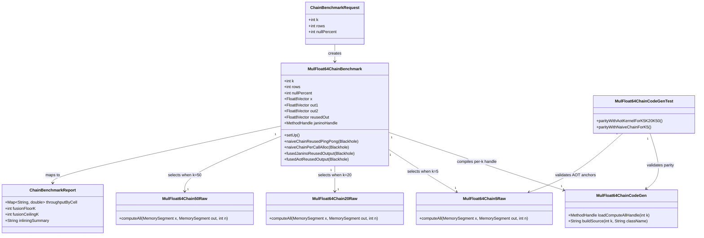

# SPDD 16 Fusion Block-Size Probe Implementation

## Requirements
Implement an empirical block-fusion probe for `MulFloat64` chain depth so the project can derive defensible lower/upper fusion block-size bounds for warmed-up JVM execution without introducing optimizer infrastructure.

## Entities

## Approach
1. Fusion Scaling Probe:
   - Implement a fixed-shape `x^k` workload with `k in {5,20,50}` and null-free inputs to isolate block-size effects.
   - Compare four execution strategies (A1/A2/B/C) plus the arrow-rs chain reference for structural positioning.
   - Keep left-associative semantics identical across all paths to make throughput comparisons semantically valid.

2. Technical Implementation:
   - Add three handwritten AOT raw kernels (`k=5/20/50`) using existing `MulFloat64Raw` coding pattern and Vector API tail handling.
   - Add parameterized Janino generator `MulFloat64ChainCodeGen` that emits one fresh dynamic class per `k` with no cross-k reuse.
   - Implement benchmark using existing JMH metadata protocol, existing rows grid, and reused/per-call allocation conventions.
   - Centralize exception mapping via `GlobalExceptionHandler`-equivalent project mechanism (`CodeGenProbeException` + `Errors`) for deterministic failure signaling.

3. Business Logic:
   - Enforce fairness rules: A1 uses `Compute.mul`, A2 allocates per call, B/C reuse output, and all cells consume output exactly once.
   - Add parity tests proving Janino and AOT are byte-equal for `k=5/20/50` and naive-chain parity for `k=5`.
   - Report throughput matrix and derive two thresholds: fusion floor (`B` vs `A1`) and fusion ceiling (`B` vs `C`) under ±15% envelope at largest rows.

## Structure

### Inheritance Relationships
1. `BenchmarkMetadataProvider` interface defines benchmark metadata contract for fusion reporting.
2. `MulFloat64ChainBenchmark` implements `BenchmarkMetadataProvider`.
3. `CodeGenProbeException` extends `RuntimeException` for codegen/parity failure signaling.
4. `MulFloat64Chain*Raw` classes follow final static raw-kernel shape and do not participate in inheritance trees.

### Dependencies
1. `MulFloat64ChainBenchmark` calls `Compute.mul(...)` for A1/A2 baseline chains.
2. `MulFloat64ChainBenchmark` depends on `MulFloat64ChainCodeGen` and selected AOT raw kernel class by `k` switch.
3. `MulFloat64ChainCodeGen` depends on `JaninoLoader` to compile and load `computeAll` method handles.
4. `MulFloat64ChainCodeGenTest` depends on Janino codegen class and raw kernels for byte-level parity checks.
5. Reporting depends on benchmark outputs plus HotSpot inlining diagnostics (`PrintInlining`/`PrintCompilation` or equivalent).

### Layered Architecture
1. Controller Layer: Not applicable; benchmark/test driven module with no HTTP boundary.
2. Service Layer: `MulFloat64ChainCodeGen` and benchmark orchestration provide probe logic.
3. Repository Layer: Not applicable; no persistent storage in this probe.
4. Data Access Layer: Arrow buffers via `Float8Vector`, `BufferRefs`, and `SegmentViews`.
5. Exception Handling Layer: `CodeGenProbeException`/`Errors` act as `GlobalExceptionHandler` equivalent for unified unchecked failure semantics.

## Operations

### Create/Update Raw Kernel - MulFloat64Chain5Raw
1. Responsibility: Compute `x^5` with explicit Vector API and scalar-tail paths.
2. Attributes:
   - `SPECIES`: `VectorSpecies<Double>` - preferred SIMD species.
   - `FLOAT64_LE`: `ValueLayout.OfDouble` - little-endian scalar layout.
   - `BYTE_ORDER`: `ByteOrder` - little-endian vector load/store order.
3. Methods:
   - `computeAll(MemorySegment x, MemorySegment out, int n): void`
     - Logic:
       - Use `loopBound` and lane-wise `DoubleVector` loads from `x`.
       - Emit four inline chained `mul` calls after the initial value (`(((x*x)*x)*x)*x`).
       - Store vector result, then process scalar tail with identical left-associative order.
       - Avoid any allocation and avoid nested loops over `k`.
4. Annotations: None (raw kernel style).
5. Constraints: Non-aliasing input/output and caller-owned lifetime invariants.

### Create/Update Raw Kernel - MulFloat64Chain20Raw and MulFloat64Chain50Raw
1. Responsibility: Provide AOT upper-bound anchors for larger fusion blocks.
2. Attributes:
   - Same constants as `MulFloat64Chain5Raw`.
3. Methods:
   - `computeAll(MemorySegment x, MemorySegment out, int n): void`
     - Logic:
       - Use same skeleton as `k=5` but unroll exactly 20 and 50 multiplies.
       - Preserve strict left-associativity in both SIMD and scalar-tail paths.
       - Keep method body explicit; do not introduce dynamic `for (j=0; j<k; j++)` multiply loops.
4. Annotations: None.
5. Constraints: Exact semantic equivalence with Janino and naive chain outputs.

### Implement Codegen Service - MulFloat64ChainCodeGen
1. Interface Definition: `loadComputeAllHandle(int k): MethodHandle` compiles and returns per-k fused kernel.
2. Core Methods:
   - `loadComputeAllHandle(int k): MethodHandle`
     - Input Validation: Accept only `k=5|20|50` for this probe; throw `CodeGenProbeException` otherwise.
     - Business Logic:
       - Build deterministic source string with k inline multiplies in SIMD body and scalar tail.
       - Use unique dynamic class name per invocation (`MulFloat64Chain<K>Dynamic<nonce>`).
       - Compile through `JaninoLoader`, lookup `computeAll`, and verify exact method type.
     - Exception Handling: Wrap compile/signature issues in `CodeGenProbeException` with stable error codes.
     - Return Value: Ready `MethodHandle` for `invokeExact(MemorySegment, MemorySegment, int)` shape.
   - `buildSource(int k, String className): String`
     - Input Validation: Non-null class name and supported `k`.
     - Business Logic: Pure string construction, no side effects.
3. Dependency Injection: Constructor accepts optional `JaninoLoader` for testability; default constructor creates one.
4. Transaction Management: Not applicable.

### Create Benchmark - MulFloat64ChainBenchmark
1. Responsibility: Measure A1/A2/B/C scaling over `k` and `rows` under identical lifecycle constraints.
2. Attributes:
   - `k`: `int` - chain depth parameter (`5,20,50`).
   - `rows`: `int` - row count grid (`1024,16384,65536,1048576`).
   - `nullPercent`: `int` - fixed `0`.
   - `x`, `out1`, `out2`, `reusedOut`: `Float8Vector` - input and reusable outputs.
   - `janinoHandle`: `MethodHandle` - current k fused handle.
3. Methods:
   - `setUp(): void`
     - Logic: allocate vectors, fill `x`, retain buffers, compile Janino handle, bind AOT kernel selection by `k`.
   - `naiveChainReusedPingPong(Blackhole): void`
     - Logic: run `Compute.mul` k times alternating `out1/out2`, consume only final parity-selected output.
   - `naiveChainPerCallAlloc(Blackhole): void`
     - Logic: allocate and close intermediates/final output per iteration; consume final output once.
   - `fusedJaninoReusedOutput(Blackhole): void`
     - Logic: invoke codegen handle once into `reusedOut`, set value count, consume output.
   - `fusedAotReusedOutput(Blackhole): void`
     - Logic: static call to selected `MulFloat64Chain*Raw.computeAll`, set value count, consume output.
4. Annotations: `@State(Scope.Thread)`, `@BenchmarkMode(Mode.Throughput)`, `@OutputTimeUnit(TimeUnit.MILLISECONDS)`, JMH `@Param` and `@Benchmark`.
5. Constraints: identical dead-code-elimination prevention and consistent JVM args inherited from shared configuration.

### Create Parity Test - MulFloat64ChainCodeGenTest
1. Responsibility: Prove semantic equivalence and left-associative stability.
2. Methods:
   - `parityWithAotKernelForK5K20K50(): void`
     - Input Validation: fixture size is `SPECIES.length()+3` to exercise scalar tail.
     - Business Logic: run Janino and matching AOT kernels for each k; assert byte equality.
     - Exception Handling: fail fast at first mismatch with byte index and row index.
   - `parityWithNaiveChainForK5(): void`
     - Business Logic: run ping-pong naive chain via `MulFloat64Raw` semantics; compare against AOT `k=5` output.
3. Dependency Injection: default test constructors.
4. Transaction Management: not applicable.

### Create Exception Handler - GlobalExceptionHandler
1. Responsibility: Unified handling of global probe exceptions.
2. Exception Types:
   - `CodeGenProbeException`: source-generation/compile/signature failures.
   - `IllegalArgumentException`: invalid benchmark parameters or unsupported `k`.
   - `ArithmeticException`: reserved for future checked numeric probe variants.
3. Methods:
   - `handleCodeGenProbeException(CodeGenProbeException): ErrorReport`
   - `handleIllegalArgumentException(IllegalArgumentException): ErrorReport`
4. Annotations: Not framework annotations; implement as centralized utility mapper for benchmark/test logs.
5. Response Format: stable `errorCode`, `message`, `context` fields for reproducible diagnostics.

### Create Business Exception - CodeGenProbeException
1. Inheritance: extends `RuntimeException`.
2. Attributes:
   - `errorCode`: `String` - deterministic probe error code.
   - `errorMessage`: `String` - human-readable failure reason.
3. Constructors: `(errorCode, errorMessage)`, `(errorCode, errorMessage, cause)`.
4. Usage Scenarios: unsupported `k`, malformed generated source, method-handle type mismatch, compilation failure.

## Norms
1. Annotation Standards: Use JMH annotations only on benchmark classes; keep raw kernels annotation-free and final/static.
2. Dependency Injection: Constructor injection only where test seams are needed (`JaninoLoader` in codegen class); no DI framework.
3. Exception Handling:
   - Keep unchecked exception hierarchy with stable error codes.
   - `CodeGenProbeException` must carry `errorCode` and clear message.
   - Route probe failures through a single mapping utility (`GlobalExceptionHandler` equivalent) for consistent logs.
   - Never throw per row in hot loops.
4. Data Validation: Validate `k`, `rows`, vector capacities, and zero slice offsets before compute invocation.
5. Logging: Emit concise probe diagnostics (k, rows, cell id, exception code), and attach inlining summary to PR report.
6. Documentation Standards: Each new kernel/codegen/benchmark/test class documents operation, null policy, associativity rule, and lifecycle assumptions.

## Safeguards
1. Functional Constraints: Compute exactly left-associative `x^k` for `k in {5,20,50}` with one input vector and one output vector.
2. Performance Constraints: Benchmark rows must remain `1024/16384/65536/1048576`; report throughput for every `(k,rows,cell)` point.
3. Security Constraints: Generated source/class names must be deterministic and internal; no external input may flow into source templates.
4. Integration Constraints: Reuse existing Janino dependency and benchmark infrastructure; add no new third-party dependencies.
5. Business Rule Constraints: Preserve fairness matrix (A1/A2/B/C + D), null-free input policy, and unchanged shared JVM args.
6. Exception Handling Constraints:
   - Business/probe exceptions include explicit `errorCode` and `errorMessage`.
   - Exception classes remain domain-scoped (`codegen`, `benchmark`).
   - Error messages must not expose unsafe memory addresses or allocator internals.
   - All probe failures are normalized by the centralized exception mapper.
7. Technical Constraints: Raw kernels must remain allocation-free in loops, static/final, little-endian, scalar-tail complete, and non-aliasing.
8. Data Constraints: Inputs and outputs use caller-owned live Arrow vectors; benchmark outputs set correct value count after writes.
9. API Constraints: Naive baseline must call public `Compute.mul(...)`; codegen API contract remains `loadComputeAllHandle(int k)` returning typed `MethodHandle`.
